# What is Flink SQL

## The problem Flink was created to solve

Before understanding Apache Flink, it's important to understand the problem space it was designed for. Traditional systems were built around batch processing. For decades, most companies worked like this:

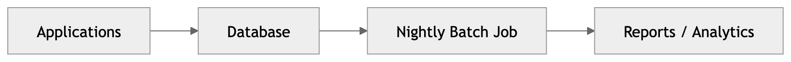

This model worked because businesses could tolerate delay.

For example:

- Banks generated fraud reports overnight
- Retail companies generated sales analytics daily
- Telecom providers processed call logs hours later
- Warehouses updated inventory periodically

The world changed. Modern systems require:

- live fraud detection
- live recommendations
- live telemetry
- live logistics tracking
- live anomaly detection
- live dashboards
- real-time AI enrichment
- instant notifications

Users now expect systems to react immediately. Example:

| Industry     | Real-time expectation                 |
| ------------ | ------------------------------------- |
| Banking      | Detect fraud within seconds           |
| Ride sharing | Update driver locations continuously  |
| Healthcare   | Monitor patient telemetry live        |
| Retail       | Personalise recommendations instantly |
| Gaming       | Process player telemetry live         |
| IoT          | Detect sensor failures immediately    |

Batch systems fundamentally struggle here because they process data after the fact.

Flink was built for systems where data never stops arriving. It processes data as it comes in, allowing you to build applications that react to events in real time.

## What stream processing actually means

Stream processing means processing events continuously as they happen.

Instead of waiting for a full dataset:


Stream processing continuously reacts to incoming events:
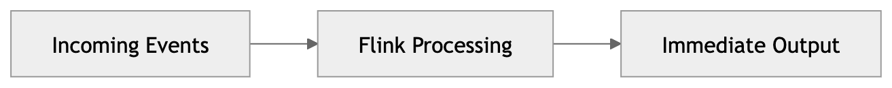

This sounds simple initially. In reality, it is extremely difficult. Because real systems have:

- infinite data
- late events
- out-of-order events
- duplicates
- machine failures
- scaling challenges
- network partitions
- inconsistent clocks
- distributed coordination problems

Flink exists to solve these problems reliably at scale.

## What Apache Flink fundamentally is

Apache Flink is: ***A distributed stateful stream processing engine.***

### "Distibuted"

Apache Flink runs across a cluster of machines, not just a single server. This is important because modern data streams can be extremely large and fast-moving. By distributing work across multiple machines, Flink can process massive volumes of data in parallel, enabling high scalability, fault tolerance, and real-time performance.

Examples:

| System  | Possible event volume            |
| ------- | -------------------------------- |
| Uber    | Millions of location updates/sec |
| Netflix | Huge playback telemetry streams  |
| Banking | Massive transaction streams      |
| IoT     | Billions of sensor events        |

One machine cannot process this reliably forever. Flink distributes work across a cluster.

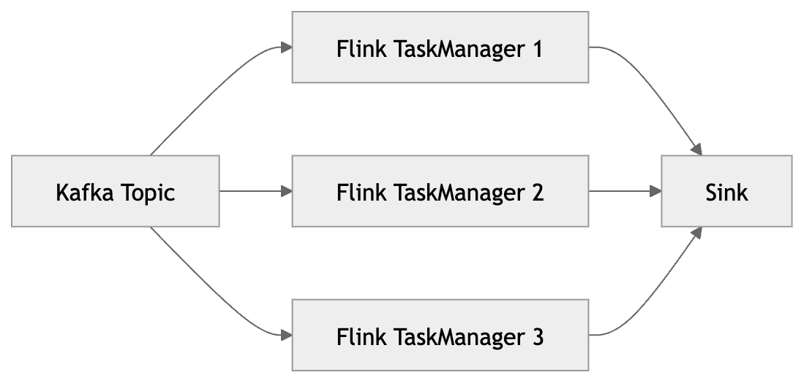

| Component   | Purpose                              |
| ----------- | ------------------------------------ |
| Kafka Topic | Source event stream                  |
| TaskManager | Worker node running processing tasks |
| Sink        | Final output destination             |

### "Stateful"

Flink is not just filtering rows. It remembers things. This memory is called state. State allows Flink to do things like:

| Operation        | Why state is required                    |
| ---------------- | ---------------------------------------- |
| COUNT            | Must remember current count              |
| SUM              | Must remember running total              |
| JOIN             | Must remember matching records           |
| WINDOW           | Must remember events until window closes |
| DEDUPLICATION    | Must remember previously seen IDs        |
| SESSION TRACKING | Must remember user activity              |

Without state Flink can process this without state because it just filters rows. For example:

```SQL
SELECT *
FROM orders
WHERE amount > 100;
```

But for more complex operations, Flink needs to remember information across events. For example, to count orders per customer:

With state:

```SQL
SELECT customer_id, COUNT(*)
FROM orders
GROUP BY customer_id;
```

Flink must continuously remember counts per customer. Internally, state may resemble:

| customer_id | running_count |
| ----------- | ------------: |
| 101         |            43 |
| 102         |            19 |
| 103         |            88 |

#### Analogy #2

**Stateless:**

Imagine someone standing at a conveyor belt. They pick up packages and only care about the current package. They do not remember anything about previous packages.

Orders arrive one at a time:

```text
Order #1 -> $50
Order #2 -> $200
Order #3 -> $80
```

Your only task is:

```SQL
SELECT *
FROM orders
WHERE amount > 100;
```

The worker simply checks: Is amount > 100?

- Yes → keep it
- No → ignore it

That worker does NOT need memory. It only looks at the current event.

**Stateful:**

Now imagine the task changes:

```SQL
SELECT customer_id, COUNT(*)
FROM orders
GROUP BY customer_id;
```

Now Flink must remember previous events. Suppose events arrive like this:

| Event   | Customer |
| ------- | -------- |
| Order 1 | 101      |
| Order 2 | 102      |
| Order 3 | 101      |
| Order 4 | 101      |
| Order 5 | 102      |

If Flink had no memory, then when: `Order 4 arrives for customer 101` …it would have no idea that customer 101 already placed earlier orders. So Flink stores information internally. Something like:

| customer_id | order_count |
| ----------- | ----------- |
| 101         | 3           |
| 102         | 2           |

Think of state like Flink's continuously updating notebook. Every new event updates the notebook. Example:

```text
Customer 101 placed another order
```

Flink internally does:

```text
101 -> previous count = 2
101 -> new count = 3
```

This allows Flink to do things like:

| Capability          | Why state is needed                           |
| ------------------- | --------------------------------------------- |
| Fraud detection     | Remember previous transactions                |
| Session tracking    | Remember user activity                        |
| Window aggregations | Remember events inside time windows           |
| Deduplication       | Remember already-seen IDs                     |
| Streaming joins     | Remember matching records from another stream |
| Running metrics     | Remember totals and averages                  |

Without state, Flink would just be:

```text
Event comes in
Event goes out
Forget everything
```

With state, Flink becomes:

```text
Event comes in
Compare against history
Update memory
Produce intelligent result
```

#### Analogy #3

Imagine a supermarket cashier.

**Stateless:**
Every customer is treated independently. The cashier sees:

```text
"Buy milk"
```

Process it. Then forgets it immediately.

**Stateful:**

Now imagine the cashier must apply:

```text
"Every 10th coffee is free"
```

Now the cashier must remember:

```text
Thai has bought 9 coffees already
```

That remembered information is state. Without memory, loyalty programs would be impossible. Flink works the same way

### "Stream processing engine:"

streams are often unbounded and queries may never terminate because new data keeps arriving. Flink continuously processes events. Unlike databases:

| Database query       | Flink query                  |
| -------------------- | ---------------------------- |
| Usually finishes     | May run forever              |
| Works on stored data | Works on live streams        |
| Finite dataset       | Potentially infinite dataset |
| Static tables        | Dynamic tables               |

## Why Kafka and Flink are commonly paired

Flink is a stream processing engine. It needs a source of streaming data. Kafka is a distributed event log that stores and moves streams of events.

Kafka and Flink solve different problems.

| Technology | Primary responsibility              |
| ---------- | ----------------------------------- |
| Kafka      | Durable event storage and transport |
| Flink      | Stateful event processing           |

Kafka stores streams. Flink processes streams. Think of Kafka as the source of truth for events, and Flink as the engine that continuously reacts to those events.

## The modern streaming architecture

This is the architecture you will see almost everywhere.

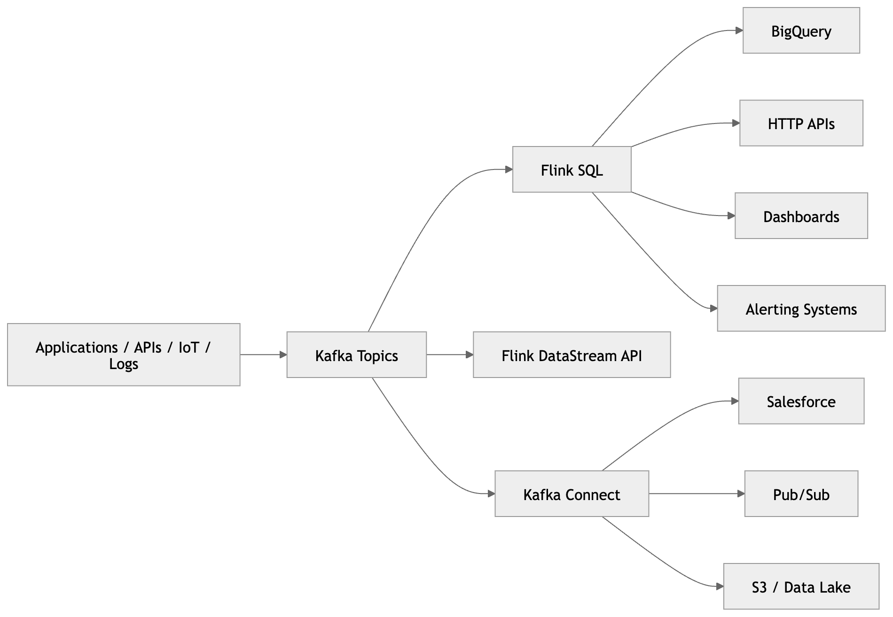

Explanation of the architecture

**Producers**

Applications generate events. Examples:

- order placed
- payment completed
- page viewed
- sensor updated
- patient telemetry received

**Kafka**

Kafka stores event streams durably. It acts as the central event backbone. Kafka is designed for:

- durability
- replayability
- scalability
- decoupling systems

Kafka does NOT process business logic. This is a major misconception beginners have. Kafka is storage + transport. Not processing.

**Flink**

Flink consumes Kafka streams and performs:

- filtering
- aggregation
- joins
- enrichment
- windowing
- deduplication
- anomaly detection
- machine learning inference

**Kafka Connect**

Kafka Connect moves data between Kafka and external systems. This directly relates to the URLs you were given.

| Connector         | Purpose             |
| ----------------- | ------------------- |
| Salesforce Source | Salesforce → Kafka  |
| Pub/Sub Source    | GCP Pub/Sub → Kafka |
| BigQuery Sink     | Kafka → BigQuery    |
| HTTP Sink         | Kafka → REST API    |

## Key engineering strengths of Flink

**True stream-native architecture**

Some older systems fake streaming using tiny batches. Flink processes events individually.

This gives:

- lower latency
- better time semantics
- more accurate state handling

**Advanced state management**

Flink’s state system is one of its greatest engineering achievements.

It supports:

- huge distributed state
- fault tolerance
- checkpointing
- recovery
- exactly-once semantics

This is why Flink is heavily used in finance, telecom, and large-scale platforms.

**Event time processing**

This is critical. Real systems have delayed events.

| Event   | Actual event time | Arrival time |
| ------- | ----------------- | ------------ |
| Payment | 10:00:01          | 10:00:01     |
| Payment | 10:00:02          | 10:00:08     |

Flink processes events based on their actual event time, not arrival time. This allows for correct handling of late and out-of-order events. Without proper event-time handling:

- windows become incorrect
- analytics become wrong
- fraud systems fail
- aggregations become inaccurate

Flink was designed deeply around event-time correctness.

## What is Flink SQL?

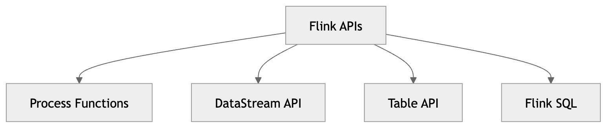

**Process Functions**

- Lowest-level API.
- Maximum flexibility.
- Maximum complexity.
- Used by advanced stream processing engineers.

**DataStream API**

- Java or Scala stream programming API.
- Very powerful.
- More engineering-oriented.

**Table API**

- Relational API using Java/Python syntax.
- Bridges SQL and programming.

**Flink SQL**

- SQL interface over streams.
- SQL is the fastest way to understand stream processing concepts.
- Flink SQL provides a declarative SQL engine over streaming and batch data and compiles SQL into Flink jobs.

Flink is a real-time processing engine and lets you write SQL over streams. While Kafka stores event streams, Kafka Connect moves data between Kafka and external systems, Flink reads Kafka topics as dynamic tables, processes them continuously using SQL or Table API, maintains state for operations like joins and aggregations, and writes results back to Kafka or downstream systems such as BigQuery or HTTP APIs.

| Traditional database SQL       | Flink SQL                          |
| ------------------------------ | ---------------------------------- |
| Data is usually already stored | Data keeps arriving                |
| Query usually finishes         | Query may run forever              |
| Table is mostly static         | Table is dynamic                   |
| Result is returned once        | Result keeps updating              |
| Storage is owned by database   | Storage is external, usually Kafka |
| Good for historical lookup     | Good for real-time processing      |

### Dynamic Table

Flink SQL is not a database. It does not own the data. It processes data stored elsewhere, such as Kafka topics or data lakes. Flink SQL is a query processor for streaming and batch data, using continuous queries over streams and dynamic tables.

```SQL
INSERT INTO clean_orders
SELECT
  order_id,
  customer_id,
  amount,
  CURRENT_TIMESTAMP AS processed_at
FROM raw_orders
WHERE amount > 0;
```

Flink SQL treats streams as dynamic tables, continuously applies SQL logic to new events, maintains state where needed, and emits append-only or changelog outputs depending on the query.

A dynamic table is a table that changes over time. Imagine a Kafka topic called orders.

At 10:00:

| order_id | customer_id | amount |
| -------- | ----------: | -----: |
| 1        |         101 |     50 |

At 10:01, another event arrives:

| order_id | customer_id | amount |
| -------- | ----------: | -----: |
| 1        |         101 |     50 |
| 2        |         102 |     90 |

At 10:02, another event arrives:

| order_id | customer_id | amount |
| -------- | ----------: | -----: |
| 1        |         101 |     50 |
| 2        |         102 |     90 |
| 3        |         101 |     30 |

That is the dynamic table view. But underneath, Kafka is still just an event log:

```
event 1: order_id=1, customer_id=101, amount=50
event 2: order_id=2, customer_id=102, amount=90
event 3: order_id=3, customer_id=101, amount=30
```

### Changelog Streams

When aggregation results change:

```SQL
SELECT customer_id, COUNT(*)
FROM orders
GROUP BY customer_id;
```

Flink emits updates:

```text
INSERT customer=101 count=1
UPDATE customer=101 count=2
UPDATE customer=101 count=3
```

| Changelog event | Meaning                          |
| --------------- | -------------------------------- |
| `+I`            | Insert                           |
| `-U`            | Update before, retract old value |
| `+U`            | Update after, insert new value   |
| `-D`            | Delete                           |

### Why state becomes dangerous

State is powerful. But state is also operationally dangerous.

Large state means:

- more memory
- more disk
- slower checkpoints
- longer recovery
- more network traffic

This becomes critical in joins and windows.

```sql
SELECT *
FROM stream_a a
JOIN stream_b b
ON a.user_id = b.user_id;
```

Flink may need to remember huge amounts of unmatched data waiting for future joins. Bad joins can destroy clusters.

### Backpressure

Backpressure occurs when a downstream operator cannot keep up with the rate of events produced by an upstream operator. Rather than dropping events, Flink propagates pressure back through the pipeline, slowing the source to match what downstream can handle.

In other words, backpressure is a natural flow control mechanism in Flink. It signals that the system is overwhelmed and needs to slow down. Ignoring backpressure can lead to cascading failures and out-of-memory errors. Properly handling backpressure is critical for building robust streaming applications.

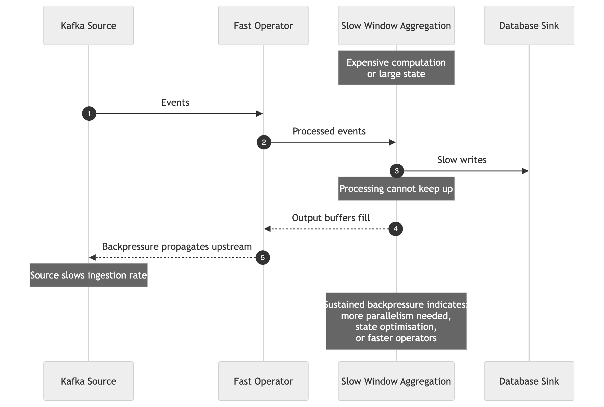

Analogy #1: Imagine a water pipe system. If the pipe narrows at some point, water will back up behind it. The flow slows down to prevent overflow. This is like backpressure in Flink.

Analogy #2: Imagine a restaurant kitchen. If the chef is overwhelmed with orders, they will ask the waiter to slow down taking new orders until they catch up. This is like backpressure in Flink.

| Cause | Effect |
| --- | --- |
| Slow operator | Upstream queue fills up |
| Large state | Processing slows down |
| Insufficient parallelism | Tasks become bottlenecks |
| Expensive computation | Throughput drops |

Backpressure is not always a problem — it is a signal. Sustained backpressure indicates that the job needs more parallelism, a faster operator implementation, or state size reduction. Ignoring it leads to cascading delays and eventually out-of-memory failures.

### Checkpointing

Flink periodically snapshots state. If a machine fails, Flink can restore from the last checkpoint. This is critical for reliability. Checkpointing allows Flink to provide exactly-once processing guarantees even in the face of failures.

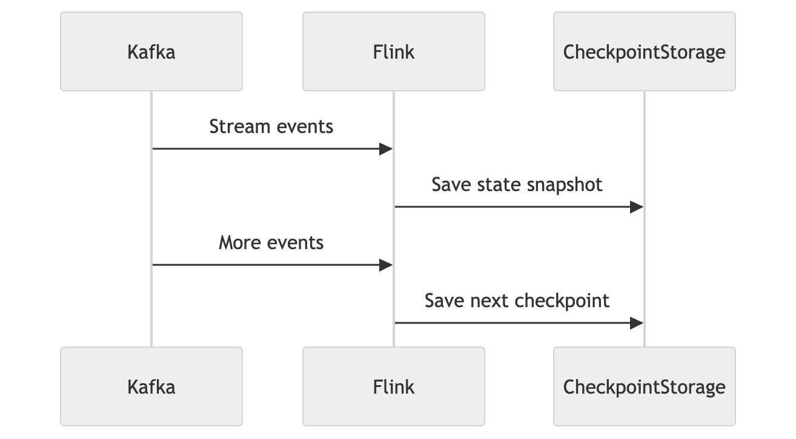

If Flink crashes:

- restore checkpoint
- replay Kafka events
- continue processing

This is how Flink achieves fault tolerance.

### Exactly-once processing

Exactly-once processing is a core Flink guarantee: **every event updates the final state exactly one time, no more and no less.**

In other words:

- Not zero times (no events are lost)
- Not twice (no duplicates are counted)
- Not inconsistently (all outcomes are deterministic)

Most distributed systems struggle to provide this guarantee. Exactly-once requires three components working together:

| Component | Purpose |
| --- | --- |
| Checkpoints | Snapshot state at consistent points in time |
| Source replay | Kafka can re-read events from any offset |
| Transactional sinks | Results are written atomically, all-or-nothing |

Together, these components ensure that if a machine fails mid-processing, recovery produces the exact same results as if no failure had occurred.

### Watermarks

Watermarks are Flink's mechanism for tracking progress in event time. Because events can arrive late or out of order, Flink cannot know when all events for a given time period have arrived. Watermarks solve this by asserting: *all events up to this point in event time have now arrived.*

Analogy #1: Imagine you are waiting for all the guests to arrive before starting a party game. You don't know when the last guest will show up, but you can set a rule: "Once I haven't seen any new guests for 5 minutes, I'll assume everyone has arrived and start the game." That 5-minute mark is like a watermark in Flink.

Analogy #2: Imagine you are tracking user sessions on a website. You want to know when a session has ended so you can calculate how long it lasted. However, users may be inactive for a while before they return or leave. You could set a rule: "If I haven't seen any activity from this user for 30 minutes, I'll consider the session ended." That 30-minute threshold is like a watermark in Flink.

| Concept | Explanation |
| --- | --- |
| Event time | The timestamp embedded in the event itself |
| Processing time | The wall-clock time when Flink processes the event |
| Watermark | A signal that event time has advanced to a certain point |
| Late events | Events that arrive after the watermark has passed their timestamp |

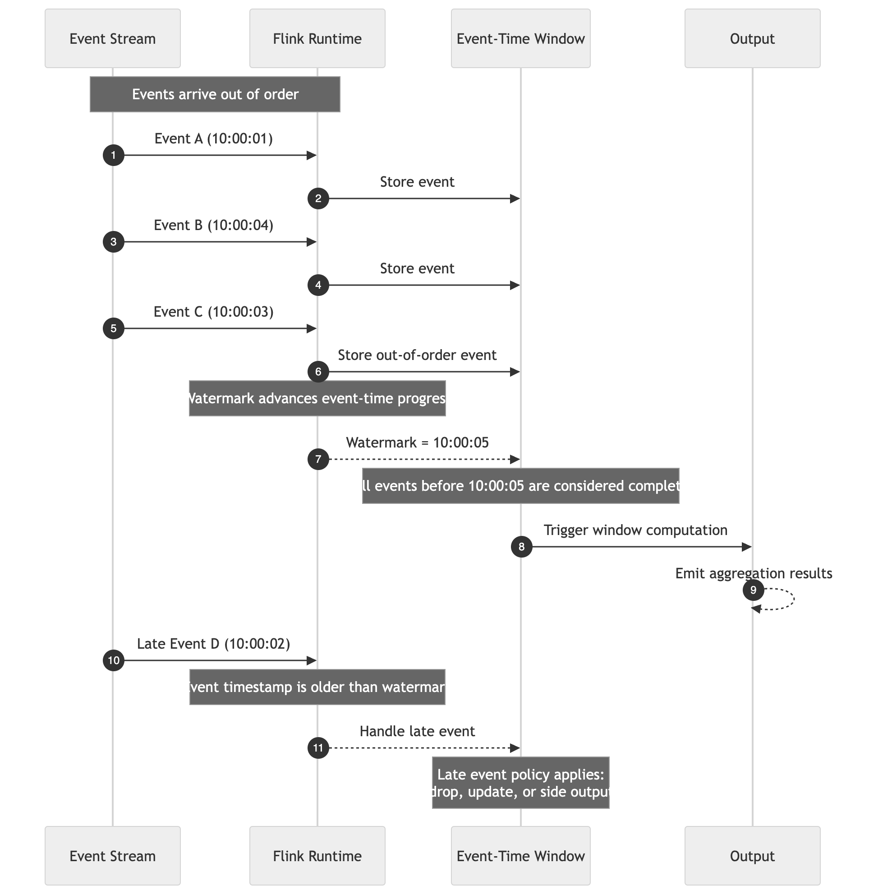
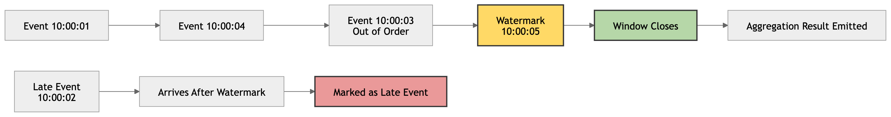

For example, if a watermark of `10:00:05` is emitted, Flink considers all windows ending before `10:00:05` as complete and triggers their computation. Events arriving after the watermark with an earlier timestamp are treated as late and handled according to the configured late data policy.

Without watermarks:

- time windows would never close
- aggregations would never complete
- results would be indefinitely delayed

Watermarks are the foundation of correct event-time processing in Flink.

## Real production architecture example

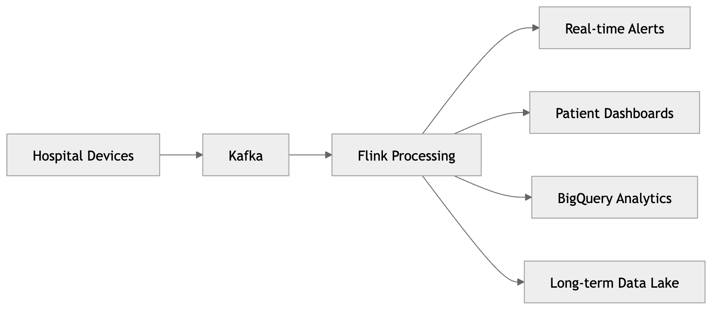.

**Flink can:**

- detect anomalies instantly
- aggregate telemetry in real time
- enrich patient events
- correlate device streams
- handle late events
- recover after failure
- scale horizontally

This is exactly the type of environment where Flink shines.

| Concept       | Explanation                                                            |
| ------------- | -------------------------------------------------------------------------- |
| Stream        | An ongoing sequence of events                                              |
| Topic         | Kafka’s storage unit for events                                            |
| Source        | Where data enters Flink                                                    |
| Sink          | Where processed data goes                                                  |
| Table         | A structured view over a stream                                            |
| Dynamic table | A table that changes as new events arrive                                  |
| Changelog     | A stream of inserts, updates, and deletes                                  |
| State         | Memory Flink keeps so it can aggregate, join, deduplicate, or recover      |
| Watermark     | Flink’s way of deciding how far event time has progressed                  |
| Window        | A time-bounded grouping, such as 5-minute totals                           |
| Connector     | Kafka Connect component that moves data between Kafka and external systems |

| Tool                               | What it does                                                                         |
| ---------------------------------- | ------------------------------------------------------------------------------------ |
| Kafka                              | Stores and moves event streams                                                       |
| Kafka Connect                      | Moves data into and out of Kafka                                                     |
| Flink                              | Processes, joins, filters, enriches, aggregates, and transforms streams in real time |
| BigQuery, API, Salesforce, Pub/Sub | External systems connected to Kafka

## Common Misconceptions

| Misconception | Reality |
| --- | --- |
| Kafka processes data | Kafka stores and transports data. Flink processes data. |
| Flink is just SQL | SQL is one interface. Flink itself is a distributed execution engine. |
| Streaming is just faster batch | Streaming introduces fundamentally different challenges: infinite data, partial information, time semantics, state management, backpressure, and event disorder. |
| Queries always finish | Streaming queries may run forever. |

## Mental Model


Workflow of a streaming application

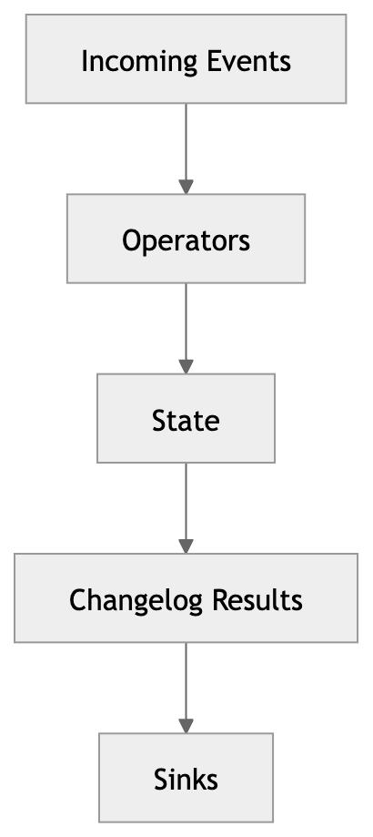

Flink is fundamentally:

- a distributed engine
- for stateful stream processing
- operating continuously
- over infinite event streams
- with strong correctness guarantees
- at massive scale

That is the core foundation.
