## What are we building?

Initial architecture diagram:


Architecture diagram will evolve into this as we build the application:
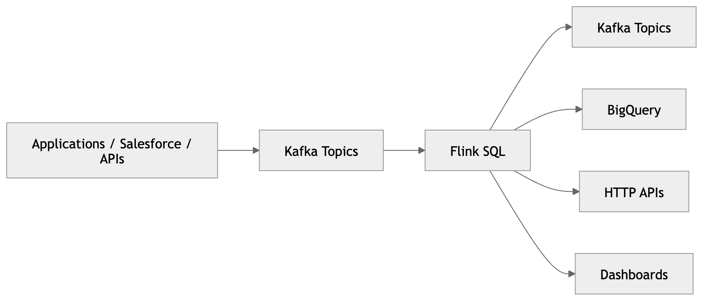

## 1. Install Prerequisites

### Install Docker Desktop

Install Docker Desktop. This is required because:

- Flink runs as containers
- Kafka runs as containers
- The SQL client runs as containers

Docker provides a reproducible way to run a distributed system locally. Without Docker, local distributed system setup is difficult.

### Verify Docker

| Check | Command | Expected Output |
| --- | --- | --- |
| Docker version | `docker --version` | `Docker version x.x.x` |
| Docker Compose version | `docker compose version` | `Docker Compose version v2.x.x` |

## 2. Install Git

| Check | Command | Expected Output |
| --- | --- | --- |
| Git version | `git --version` | `git version x.x.x` |

Git is needed because Confluent provides the training environment as a repository.

## 3. Clone the Flink exercises

| Step | Command |
| --- | --- |
| Clone the exercises repository | `git clone https://github.com/confluentinc/learn-apache-flink-101-exercises.git` |
| Enter the repository directory | `cd learn-apache-flink-101-exercises` |

## 4. Understand what the repository contains

List files:

| Environment | Command |
| --- | --- |
| macOS/Linux | `ls` |
| Windows PowerShell | `dir` |

Docker-related files appear in the repository root. These define:

- Kafka broker
- Flink JobManager
- Flink TaskManagers
- SQL client
- Supporting services

This is an initial exposure to distributed streaming architecture.

## 5. Start the local cluster

| Action | Command |
| --- | --- |
| Start the local cluster | `docker compose up --build -d` |

This command is extremely important.

| Part             | Meaning                           |
| ---------------- | --------------------------------- |
| `docker compose` | Start multi-container environment |
| `up`             | Create/start services             |
| `--build`        | Rebuild images                    |
| `-d`             | Detached/background mode          |

### Process

Docker now starts multiple distributed system components.

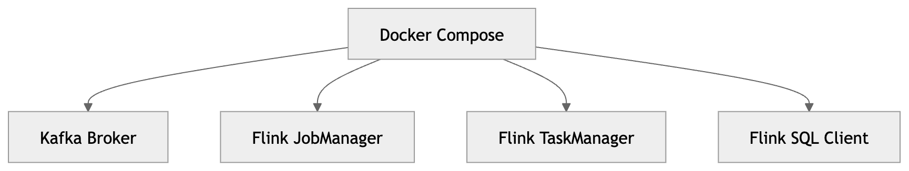

### Understanding these components deeply

| Component | Role | Responsibilities | Analogy/Notes |
| --- | --- | --- | --- |
| Kafka Broker | Event backbone | Stores streams durably | N/A |
| JobManager | Flink coordinator | Query planning; scheduling; checkpoint coordination; recovery coordination; cluster management | Brain of the cluster |
| TaskManager | Workers | Executing operators; maintaining state; processing events; performing transformations | Distributed processing engines |
| SQL Client | Interactive shell | Submitting Flink SQL | N/A |

## 6. Verify the containers are running

Run:

```text
docker ps
```

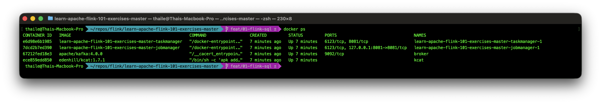

Multiple containers are running:

| Name | Container | Purpose |
| --- | --- | --- |
| `learn-apache-flink-101-exercises-master-jobmanager-1` | `jobmanager` | Coordinates the Flink cluster, schedules jobs, manages checkpoints, and handles recovery |
| `learn-apache-flink-101-exercises-master-taskmanager-1` | `taskmanager` | Executes distributed Flink operators and maintains state |
| `broker` | `broker` | Kafka broker responsible for storing and streaming events |
| `kcat` | `kcat` | Lightweight Kafka CLI tool used for debugging and inspecting topics |

## 7. Start the Flink SQL CLI

| Action | Command | Expected Prompt |
| --- | --- | --- |
| Start Flink SQL CLI | `docker compose run sql-client` | `Flink SQL>` |

This is the gateway into Flink SQL. This command opens the Flink SQL Client CLI.

## 8. First real stream

Now create a stream-backed table.

Paste this:

```sql
CREATE TABLE pageviews (
    user_id STRING,
    page_id STRING,
    view_time TIMESTAMP(3)
) WITH (
    'connector' = 'faker',
    'fields.user_id.expression' = '#{Internet.uuid}',
    'fields.page_id.expression' = '#{Number.numberBetween ''1'',''5''}',
    'fields.view_time.expression' = '#{date.past ''10'',''SECONDS''}',
    'rows-per-second' = '2'
);
```

This is not creating a traditional database table that stores fixed rows on disk. Instead, it creates a **streaming source definition** inside Flink.

A streaming source definition is a logical abstraction that tells Flink:

- what the incoming data should look like (the schema)
- where the data comes from
- how the stream should be generated or connected

In this example, the source uses the faker connector, which continuously generates synthetic events for testing purposes.

The `WITH` clause contains the connector configuration. These settings tell Flink how to generate each field value and how quickly new events should arrive. For example:

| Configuration                 | Purpose                              |
| ----------------------------- | ------------------------------------ |
| `fields.user_id.expression`   | Generates fake user IDs              |
| `fields.page_id.expression`   | Generates page IDs between 1 and 5   |
| `fields.view_time.expression` | Generates recent timestamps          |
| `rows-per-second = '2'`       | Produces two new events every second |


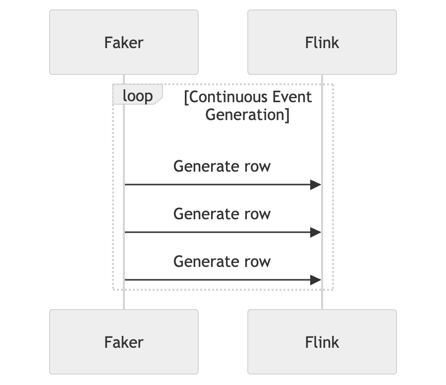

The faker connector continuously generates fake events. Each event has a user ID, page ID, and view time. New events arrive at a rate of 2 per second.

## 9. Observe live streaming

Run:

```sql
SELECT *
FROM pageviews;
```

This query continuously outputs new events as they arrive in the `pageviews` stream. New rows appear in real time, demonstrating the streaming nature of the data.

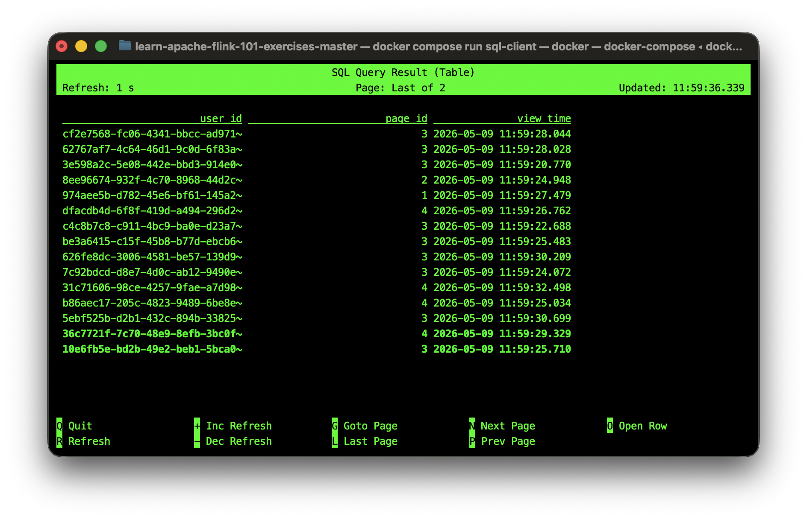


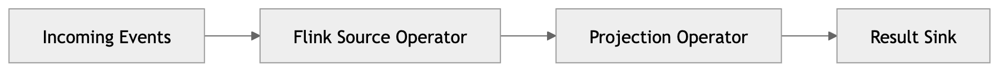

Each event flows through operations continuously. The query is always active, processing new events as they arrive. This is the essence of stream processing: continuous computation on unbounded data streams.

**Stop the query**

| Action | Purpose |
| --- | --- |
| `Ctrl + C` | Cancels the running Flink job. |

Every SQL query becomes an actual distributed Flink job. When a query runs, Flink compiles it into a job graph and executes it on the cluster. This means that even simple queries are distributed computations running across multiple nodes. Stopping the query cancels the underlying Flink job.

## 10. Stateless processing

Run:

```sql
SELECT *
FROM pageviews
WHERE page_id = '1';
```

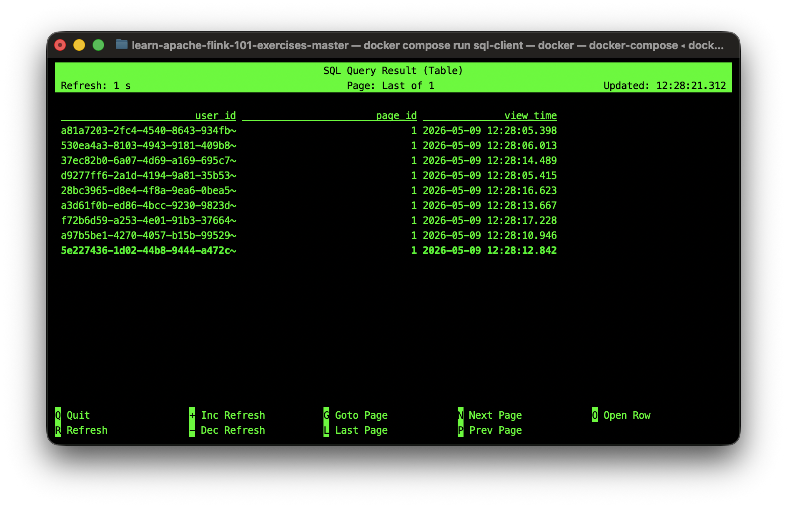

This introduces filtering. The query now only outputs events where the `page_id` is '1'. This is an example of stateless processing, where each event is processed independently without any memory of past events. The filter operator simply checks the condition for each incoming event and decides whether to pass it through or not.

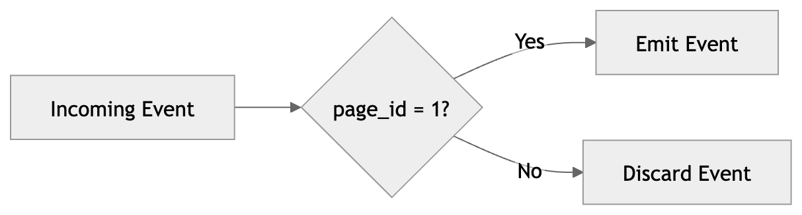

Why is this stateless? Because each event is processed independently, Flink doesn't need to remember anything about past events. The filtering decision for each event depends only on that event itself.

## 11. Stateful processing

Now run:

```sql
SELECT
    page_id,
    COUNT(*) AS view_count
FROM pageviews
GROUP BY page_id;
```

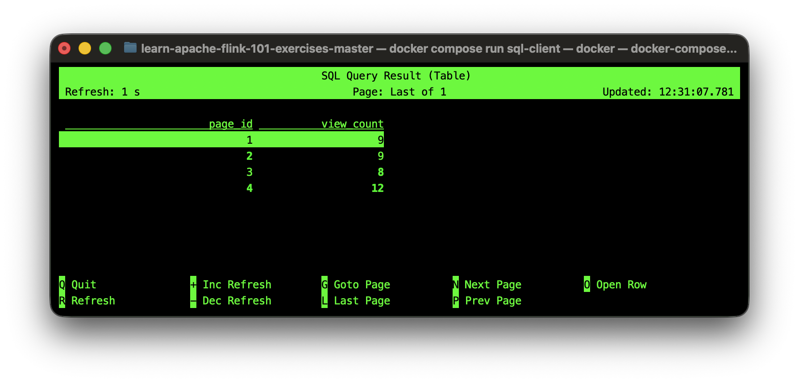

What changed fundamentally? This query is now stateful because `GROUP BY page_id` requires Flink to keep track of a running count for each page ID. Instead of treating each event independently, Flink stores and continuously updates per-key state as new events arrive.

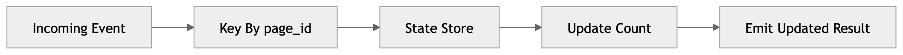

State introduces major distributed systems challenges:

- checkpointing
- recovery
- scaling
- network shuffle
- memory pressure
- state corruption risk
- backpressure

This is why Flink engineering becomes difficult at scale.

## 12. Observe changelog updates

Enable changelog mode:

```sql  
SET 'sql-client.execution.result-mode' = 'changelog';
```

Run the aggregation again:

```sql
SELECT
    page_id,
    COUNT(*) AS view_count
FROM pageviews
GROUP BY page_id;
```

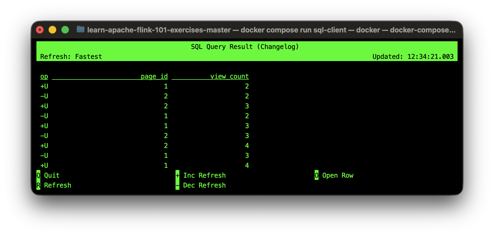

| Symbol | Meaning           |
| ------ | ----------------- |
| `+I`   | Insert            |
| `-U`   | Remove old value  |
| `+U`   | Add updated value |
| `-D`   | Delete            |

The changelog mode shows how the results evolve over time. When a new event arrives, Flink updates the count for the corresponding `page_id`. This results in a sequence of changelog events that reflect the incremental changes to the aggregated results. For example, when a new event with `page_id = '1'` arrives.

## 13. Batch vs Streaming

Create a bounded dataset:

```sql
CREATE TABLE bounded_pageviews (
    user_id STRING,
    page_id STRING,
    view_time TIMESTAMP(3)
) WITH (
    'connector' = 'faker',
    'fields.user_id.expression' = '#{Internet.uuid}',
    'fields.page_id.expression' = '#{Number.numberBetween ''1'',''5''}',
    'fields.view_time.expression' = '#{date.past ''10'',''SECONDS''}',
    'rows-per-second' = '100',
    'number-of-rows' = '500'
);
```

This creates a finite stream of 500 events. Once all events are generated, the stream ends. Bounded data has a defined start and end. In this case, the `number-of-rows` configuration tells Flink to generate exactly 500 events. Once all 500 events are produced, the stream automatically terminates. This enables queries that process a finite dataset, similar to traditional batch processing, while still using the same streaming architecture and APIs.

## 14. Run in Batch Mode

First, try running the query immediately:

```sql
SELECT COUNT(*)
FROM bounded_pageviews;
```

An error similar to the following typically appears:

```text
[ERROR] Could not execute SQL statement. Reason:
org.apache.flink.table.client.gateway.SqlExecutionException:
Results of batch queries can only be served in table or tableau mode.
```

This happens because batch queries require a different result display mode in the Flink SQL Client.

Set the SQL Client result mode to `tableau`:

```sql
SET 'sql-client.execution.result-mode' = 'tableau';
```

Now enable batch runtime mode:

```sql
SET 'execution.runtime-mode' = 'batch';
```

Run the query again:

```sql
SELECT COUNT(*)
FROM bounded_pageviews;
```

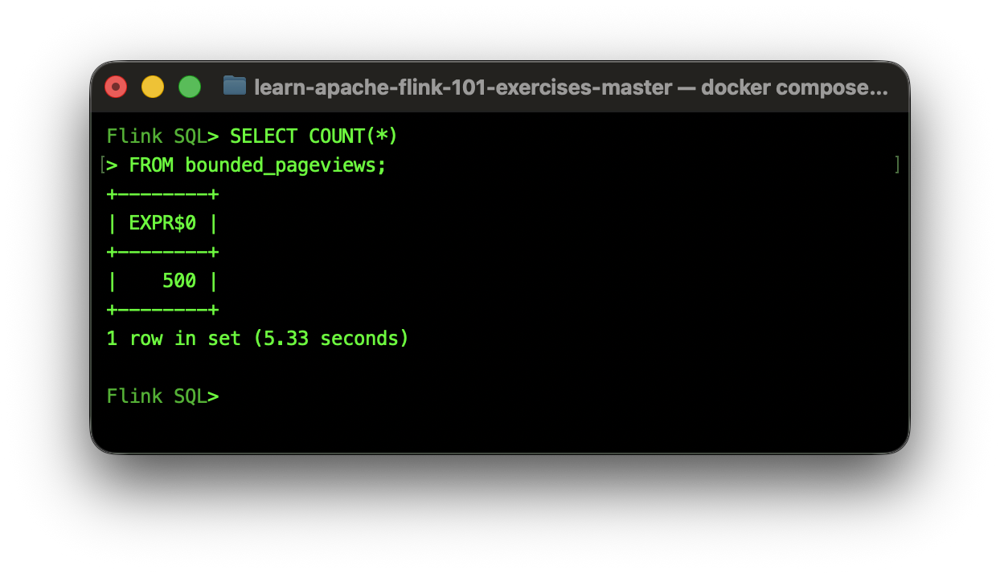

### What just happened?

The `bounded_pageviews` table is a finite stream because the Faker connector was configured with:

```sql
'number-of-rows' = '500'
```

This tells Flink to generate exactly 500 events and then stop.

Unlike unbounded streams that run forever, bounded streams have a clear beginning and end. Because the dataset is finite, Flink can execute the query using batch processing semantics and produce a final result.

This demonstrates one of the most important concepts in modern Flink:

| Processing Style | Characteristics |
| --- | --- |
| Streaming | Infinite/unbounded data that continuously arrives |
| Batch | Finite/bounded data with a defined end |


Batch processing is a special case of stream processing where the stream has a defined end. Flink's unified architecture supports both streaming and batch workloads using the same APIs and execution engine, simply by changing the runtime mode and result display settings.

## 15. Run in Streaming Mode

Now switch the runtime mode back to streaming:

```sql
SET 'execution.runtime-mode' = 'streaming';
```

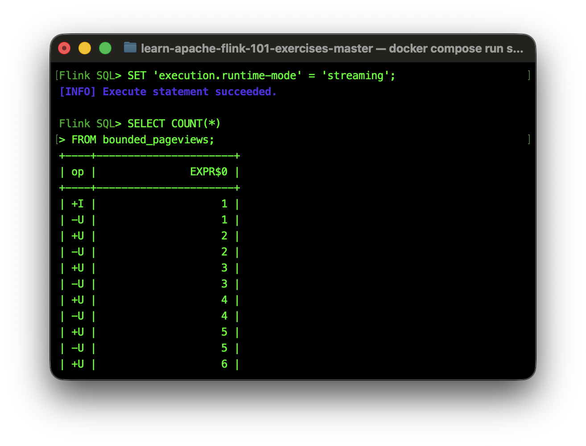

Run the same query again:

```sql
SELECT COUNT(*)
FROM bounded_pageviews;
```

| Observation | Expected behavior |
| --- | --- |
| Intermediate updates | The count is updated incrementally as events are processed. |
| Final value | The count eventually reaches `500`. |
| Job completion | The query still finishes because `bounded_pageviews` is finite. |

### What just happened?

In streaming mode, Flink emits evolving results as data arrives, rather than waiting only for the final answer. However, because the input is still bounded (`number-of-rows = '500'`), the stream eventually ends and the job terminates after producing the final count.


Streaming assumes data may continue arriving forever.

## 16. Parallelism

Real Flink jobs process data in parallel. 

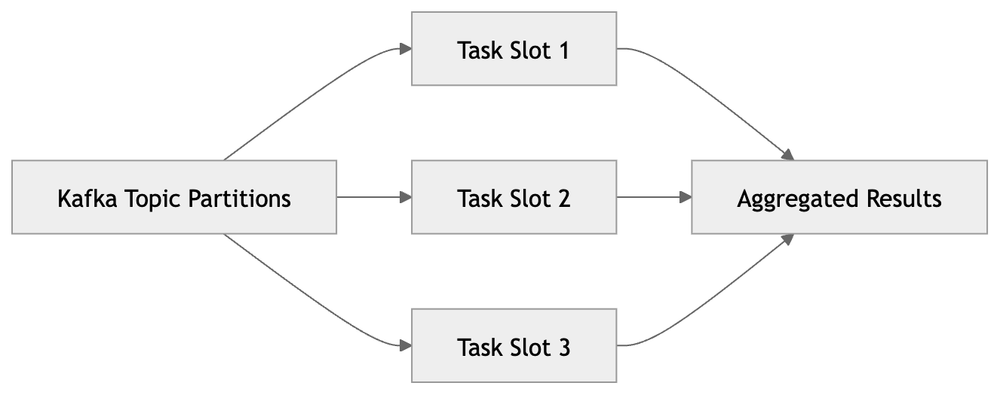

Why partitioning matters

Partitioning determines:

- scalability
- state locality
- network overhead
- correctness

Poor partitioning destroys performance.

Real-world production implications Large production jobs may have:

| Metric           | Possible scale |
| ---------------- | -------------- |
| Kafka partitions | Thousands      |
| TaskManagers     | Hundreds       |
| State size       | Terabytes      |
| Events/sec       | Millions       |
| Checkpoints      | Gigabytes      |

This is why Flink engineering is genuinely advanced distributed systems engineering.

## 17. Observe Flink Jobs

Open the Flink Web UI at `http://localhost:8081` (or a local IP address, for example `http://127.0.0.1:8081`) to inspect running jobs.

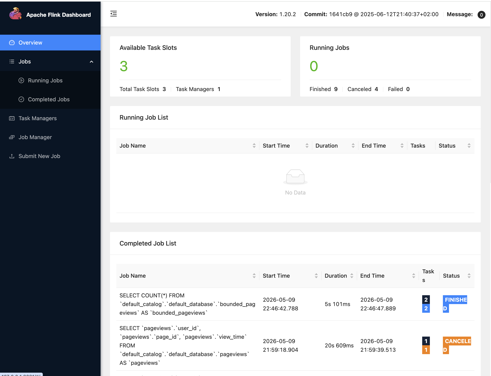

## 18. Shut down environment

After completion, cleanly stop the SQL client and local cluster.

Exit the Flink SQL CLI:

```sql
QUIT;
```

Then stop all containers and remove attached volumes:

```bash
docker compose down -v
```

| Option | Effect |
| --- | --- |
| `down` | Stops and removes the containers created by Compose. |
| `-v` | Removes associated Docker volumes, including local checkpoint state. |

This provides a clean environment for the next run and avoids accidental reuse of old checkpoint data.


## Glossary

| Concept               | Observed behavior                   |
| --------------------- | ----------------------------------- |
| Stream processing     | Continuous event flow               |
| Unbounded streams     | Queries that never end              |
| Dynamic tables        | Streams viewed as tables            |
| Stateless operations  | Filtering                           |
| Stateful operations   | Aggregation                         |
| Changelog streams     | Update-before/update-after          |
| Batch vs streaming    | Final results vs continuous updates |
| Distributed execution | JobManager + TaskManagers           |
| Operators             | Actual execution pipeline           |
| State                 | Running aggregation memory          |
| Flink jobs            | SQL becomes distributed jobs        |