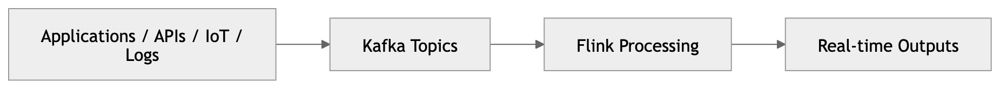
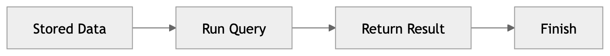
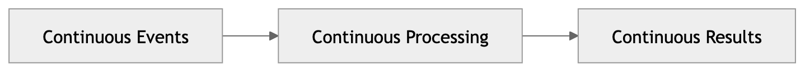
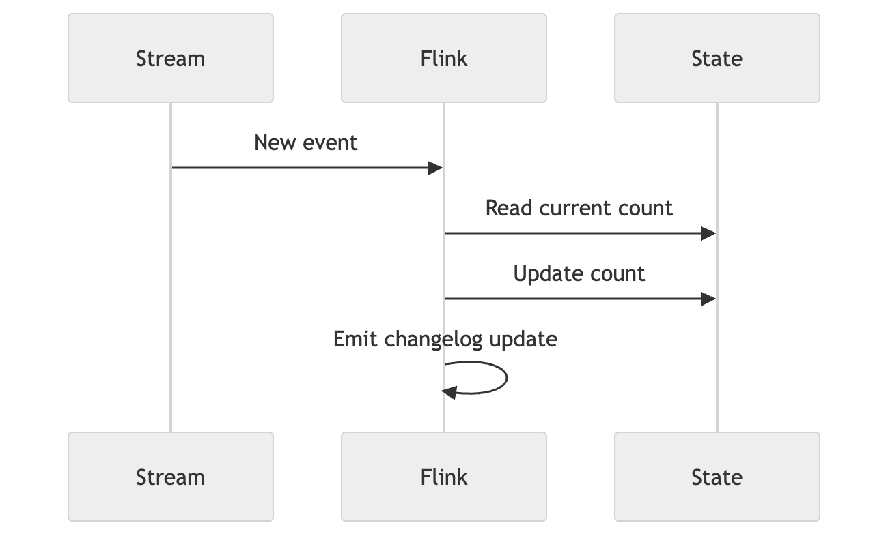
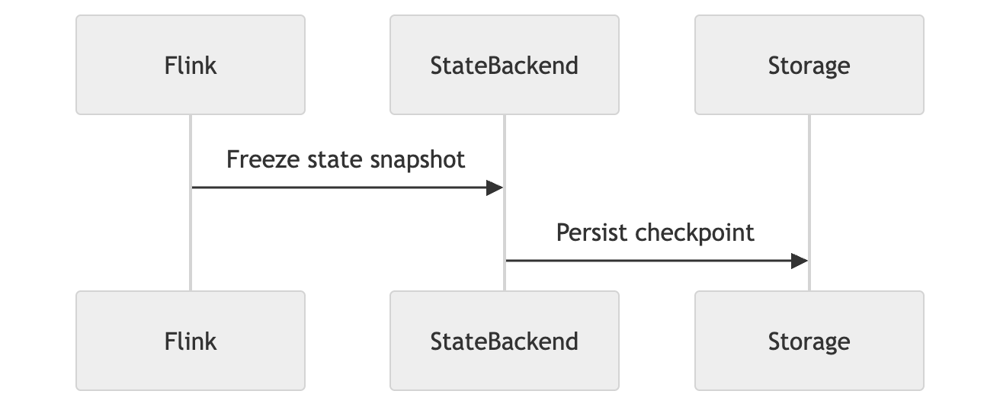
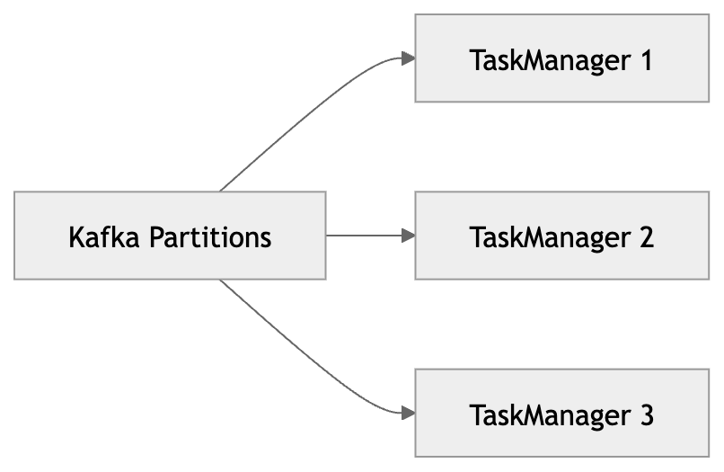
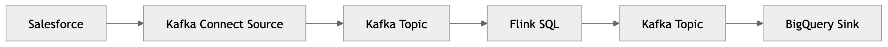
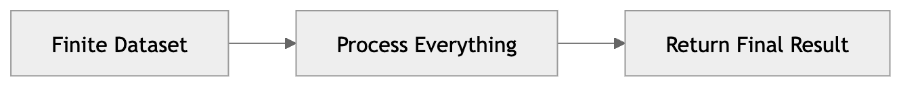
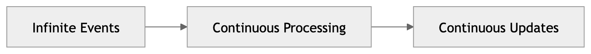

# Notes

Apache Flink is a distributed stateful stream processing engine that continuously processes infinite event streams while maintaining correctness, scalability, and fault tolerance. Flink can use SQL as one of its interfaces.



| Component | Core responsibility         |
| --------- | --------------------------- |
| Producers | Generate events             |
| Kafka     | Store and transport streams |
| Flink     | Process streams             |
| Sinks     | Persist or react to results |


## Database vs Stream

Database and stream are two different paradigms for processing data. 

A database is a collection of data that is stored and organised in a way that allows for efficient retrieval and manipulation. 



A stream, on the other hand, is a continuous flow of data that is generated in real-time and can be processed as it arrives and may never terminate.



## Dynamic Tables

A dynamic table is a table that can change over time. It is a logical representation of a stream of data that can be queried using SQL. Dynamic tables are used in Flink to represent the state of a stream processing application. They allow you to query the current state of the stream at any point in time, and they can be updated as new data arrives.

| Event Time | user_id | page_id  |
| ---------- | ------- | -------- |
| 10:00:01   | user-1  | home     |
| 10:00:02   | user-2  | products |
| 10:00:03   | user-1  | checkout |
| 10:00:04   | user-3  | home     |
| 10:00:05   | user-1  | pricing  |

## Changelog

A changelog is a record of all the changes that have been made to a dynamic table over time. It is used to track the history of the table and to understand how it has evolved. A changelog can be represented as a stream of events that describe the changes that have been made to the table.



## Stateless vs Stateful

A stateless operation is an operation that does not maintain any state between events. It processes each event independently and does not rely on any previous events. Examples of stateless operations include filtering, mapping, and projecting.

```sql  
SELECT *
FROM orders
WHERE amount > 100;
```

This code filters the orders table to return only the orders where the amount is greater than 100. Each order is processed independently, and there is no state maintained between events.

A stateful operation, on the other hand, is an operation that maintains state between events. It processes each event in the context of previous events and relies on that state to produce results. Examples of stateful operations include aggregations, joins, and windowing.

```sql
SELECT customer_id, COUNT(*)
FROM orders
GROUP BY customer_id;
```

This code counts the number of orders for each customer. The state is maintained for each customer, allowing the aggregation to be updated as new orders arrive. Flink must remember the count for each customer as new orders are processed, making this a stateful operation.

| State Capability | Why state is needed         |
| ---------------- | --------------------------- |
| Aggregation      | Remember totals             |
| Joins            | Remember matching records   |
| Windows          | Remember events temporarily |
| Deduplication    | Remember previous IDs       |
| Session tracking | Remember user activity      |

Large state introduces:

- memory pressure
- checkpoint overhead
- recovery delays
- scaling challenges
- network shuffle costs

## Checkpointing

Checkpointing is a mechanism used in stream processing systems to periodically save the state of the application. This allows the application to recover from failures and continue processing from where it left off. Checkpointing is typically done by taking a snapshot of the state of the application at regular intervals and storing it in a durable storage system.



If failure occurs:

- restore checkpoint
- replay Kafka events
- continue processing

This is how Flink achieves fault tolerance.

## Exactly-once processing

Exactly-once processing is a core Flink guarantee: **every event updates the final state exactly one time, no more and no less.**

In other words:

- Not duplicated (no events are counted twice)
- Not skipped (no events are lost)
- Not inconsistently applied (all outcomes are deterministic)

This is extremely difficult in distributed systems. Flink achieves this through:

| Mechanism           | Purpose             |
| ------------------- | ------------------- |
| Checkpointing       | Consistent recovery |
| Kafka replay        | Reprocess safely    |
| Transactional sinks | Prevent duplicates  |

## Parallelism

Parallelism is the ability to process multiple events simultaneously. Flink achieves parallelism by partitioning the data and processing it across multiple tasks. Each task can run on a different machine, allowing for horizontal scaling.



**Partitioning** allows Flink to distribute the workload across multiple tasks, enabling it to process large volumes of data efficiently. Each partition can be processed independently, allowing for high throughput and low latency.

Partitioning determines:

- scalability
- workload balance
- state locality
- network overhead

Poor partitioning can destroy performance.


## Kafka & Flink

Kafka and Flink solve different problems.

| Technology | Responsibility |
| --- | --- |
| Kafka | Durable event storage and transport |
| Flink | Stateful event processing |

Kafka stores. Flink computes.

### Kafka Connect is separate from Flink

Kafka Connect is a framework for moving data between Kafka and external systems. It is not part of Flink. Connectors such as Salesforce Source, BigQuery Sink, or HTTP Sink are Kafka Connect components, not Flink components.

### Why this architecture exists



Separating data movement, storage, and computation into distinct layers keeps each concern independently scalable and operable.

| Layer | Purpose |
| --- | --- |
| Connectors | Move data into and out of Kafka |
| Kafka | Event backbone and durable log |
| Flink | Stateful computation over streams |
| Sinks | Consume or persist processed results |

This separation improves:

- scalability
- reliability
- decoupling
- operational independence

## Batch vs Stream
Batch processing is a paradigm where data is processed in large, finite chunks. It is typically used for processing historical data or performing complex computations that can be done offline. Batch processing systems read data from a source, process it, and write the results to a sink.



Stream processing, on the other hand, is a paradigm where data is processed in real-time as it arrives. It is typically used for processing continuous data streams or performing computations that require low latency. Stream processing systems read data from a source, process it, and write the results to a sink continuously.



Challenges of stream processing:

| Problem             | Why difficult           |
| ------------------- | ----------------------- |
| Infinite data       | Cannot scan everything  |
| Late events         | Time becomes uncertain  |
| Out-of-order events | Results may change      |
| State growth        | Memory pressure         |
| Failures            | Recovery correctness    |
| Backpressure        | Distributed congestion  |
| Watermarks          | Event-time coordination |

## Backpressure

Backpressure is a mechanism used in stream processing to handle situations where the rate of incoming events exceeds the processing capacity of the system. When backpressure occurs, the system signals upstream components to slow down the rate of event production, allowing downstream components to catch up and preventing overload.

Analogy: Imagine you are at a busy restaurant, and the kitchen is overwhelmed with orders. The chef might ask the waitstaff to slow down taking new orders until they catch up with the current ones. This is similar to backpressure in Flink, where the system signals to slow down the flow of events when it cannot keep up.

## Watermarks

Watermarks are a mechanism used in stream processing to track the progress of event time. They are used to determine when a certain point in event time has been reached, allowing the system to trigger computations based on event time rather than processing time. Watermarks are typically emitted by the source operator and are used by downstream operators to determine when to emit results or trigger window computations. They help handle out-of-order events and late arrivals by providing a way to track the progress of event time in a distributed system

Analogy: Imagine you are waiting for all the guests to arrive before starting a party game. You don't know when the last guest will show up, but you can set a rule: "Once I haven't seen any new guests for 5 minutes, I'll assume everyone has arrived and start the game." That 5-minute mark is like a watermark in Flink. It allows you to make progress even if some guests arrive late or out of order.