# Kafka

| Topic           | Description                       |
| --------------- | --------------------------------- |
| Kafka           | Distributed append-only event log |
| Topics          | Named event streams               |
| Partitions      | Independent ordered logs          |
| Keys            | Determine partition placement     |
| Ordering        | Guaranteed only within partitions |
| Consumer groups | Horizontal scaling mechanism      |
| Offsets         | Positions in partition logs       |
| Replayability   | Re-reading historical events      |
| Retention       | Controls replay window            |
| Partition skew  | Uneven workload distribution      |
| Kafka Connect   | Integration framework             |
| Kafka vs Flink  | Storage vs processing             |

---


In order to learn Flink, it's important to understand Kafka. Kafka is the most widely used streaming platform and serves as the backbone for many Flink applications. It provides a distributed, fault-tolerant, and scalable messaging system that allows you to publish and subscribe to streams of records.

In most streaming architectures, Kafka is the center. Flink is the processing layer built around it. If Kafka's fundamentals are unclear, many advanced concepts become confusing:

| Concept | Why Kafka understanding matters |
| --- | --- |
| Partitioning | Determines how data physically distributes |
| Scaling | Depends on partition count and replication |
| State locality | Flink collocates state with partitions |
| Joins | Require matching partition keys across streams |
| Watermark behavior | Affected by how Kafka tracks offsets |
| Ordering guarantees | Kafka provides order per partition; Flink inherits this |
| Backpressure | Caused by downstream lag relative to Kafka write rate |

This is critical because Kafka's physical data flow directly determines Flink's architectural possibilities. Understand Kafka first; Flink's design patterns will then become obvious.

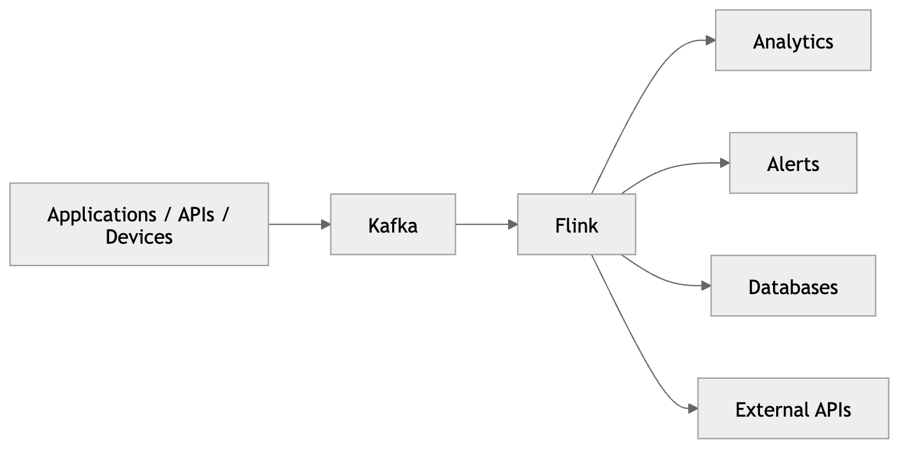

## What Kafka fundamentally is

Kafka is A distributed append-only event log. It provides a durable, ordered, and scalable way to store and transport streams of records. Kafka organises data into topics, which are further divided into partitions. Each partition is an ordered, immutable sequence of records that can be read independently.

## The Append-only Log Model

Kafka topics are fundamentally designed as append-only logs. This means new events are continuously added to the end of the log, rather than updating or overwriting existing records.

Each event is written sequentially and assigned an ever-increasing position called an offset. 

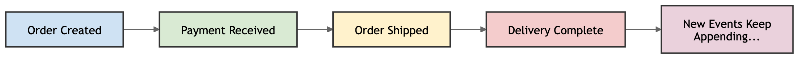

Kafka avoids expensive random writes by using an append-only model. Instead of modifying existing records, Kafka simply appends new records to the end of the log. This design allows Kafka to achieve high throughput and low latency, making it ideal for handling large volumes of streaming data.

```text
append
append
append
append
```

The append-only model enables several critical capabilities:

| Capability      | Why append-only helps                         |
| --------------- | --------------------------------------------- |
| High throughput | Sequential writes are extremely efficient     |
| Replayability   | Consumers can re-read historical events       |
| Durability      | Events remain stored safely on disk           |
| Scalability     | Partitions can distribute logs across brokers |
| Fault tolerance | Replicated logs protect against failures      |

### Event

An event is a record of something that happened. It represents a change in state or an occurrence in the real world. In Kafka, events are the fundamental units of data that producers write to topics and consumers read from topics.

| Domain     | Example event              |
| ---------- | -------------------------- |
| Banking    | Payment processed          |
| Healthcare | Heart rate changed         |
| Retail     | Order submitted            |
| Gaming     | Player joined              |
| Logistics  | Package scanned            |
| IoT        | Sensor temperature updated |


### Event Replay

The append-only log allows consumers to replay events by simply re-reading from a specific offset. This is crucial for fault tolerance and state recovery in Flink. If a Flink job fails, it can restart and reprocess events from the last checkpointed offset, ensuring no data is lost.

## Immutable Records

In Kafka, once a record is written to a partition, it cannot be modified or deleted. This immutability ensures data integrity and simplifies the design of distributed systems. It also allows Kafka to efficiently manage storage and replication without worrying about concurrent updates.

## Record

A record is what producers write to Kafka and what consumers read from Kafka. It contains the actual data payload (value) along with an optional key and metadata. It is the basic unit of data in Kafka. It consists of a key, a value, and metadata such as a timestamp and headers. Records are produced by producers and consumed by consumers. Each record is appended to the end of a partition log and assigned an offset. The offset is a unique identifier for the record within its partition and is used by consumers to track their position in the log.

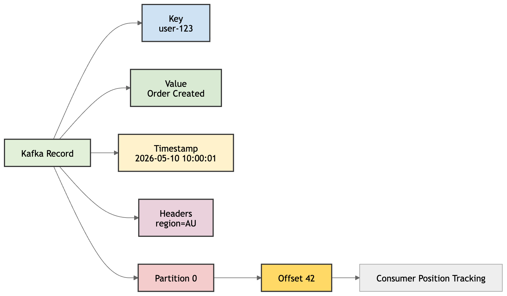

## Topics

A Kafka topic is a named logical stream of records. It acts as the category (or feed) to which producers publish events and from which consumers read them. You can think of a topic as a dedicated channel for related events flowing continuously through Kafka. Topics are the core abstraction Kafka uses to organise and manage streaming data.

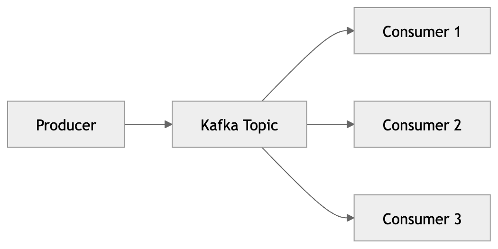
Producers do not care who consumes data. Consumers do not care who produces data. This decoupling is a fundamental design principle of Kafka. It allows for flexible and scalable architectures where producers and consumers can evolve independently without tight coupling.


In the diagram, each topic groups together a specific category of events:

| Topic            | Purpose                           |
| ---------------- | --------------------------------- |
| `website-clicks` | Stores website interaction events |
| `payments`       | Stores payment-related events     |
| `iot-sensors`    | Stores sensor telemetry           |

## Decoupling

Without Kafka topics, producers and consumers would have to be directly connected, leading to tight coupling and scalability issues. Kafka topics provide a clean abstraction that allows for flexible data flow and decoupling between producers and consumers.

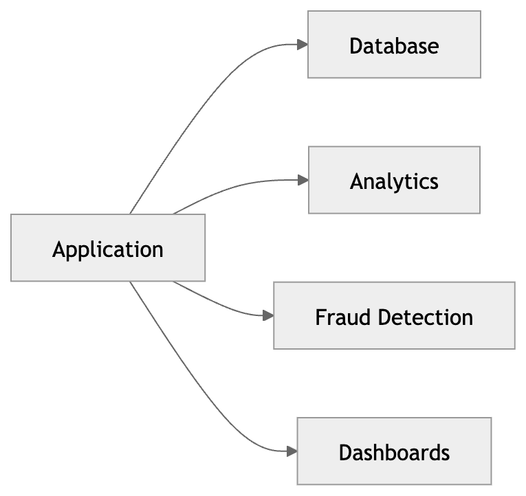

With Kafka, systems become independent. Producers can write to topics without knowing who will consume the data, and consumers can read from topics without knowing who produced the data. This decoupling allows for greater flexibility and scalability in building streaming applications.

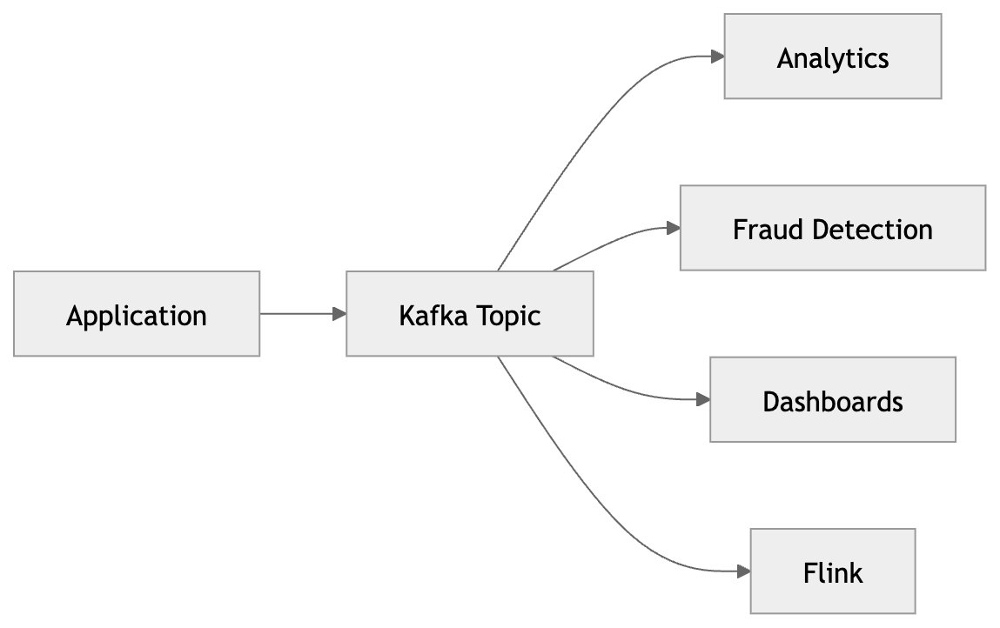


## Producers

Producers are applications that publish events to Kafka topics. They send records to specific topics, which are then stored in partitions. Producers can choose which partition to write to based on a key, allowing for data to be grouped logically. For example, a producer might send all events related to a specific user to the same partition by using the user ID as the key.

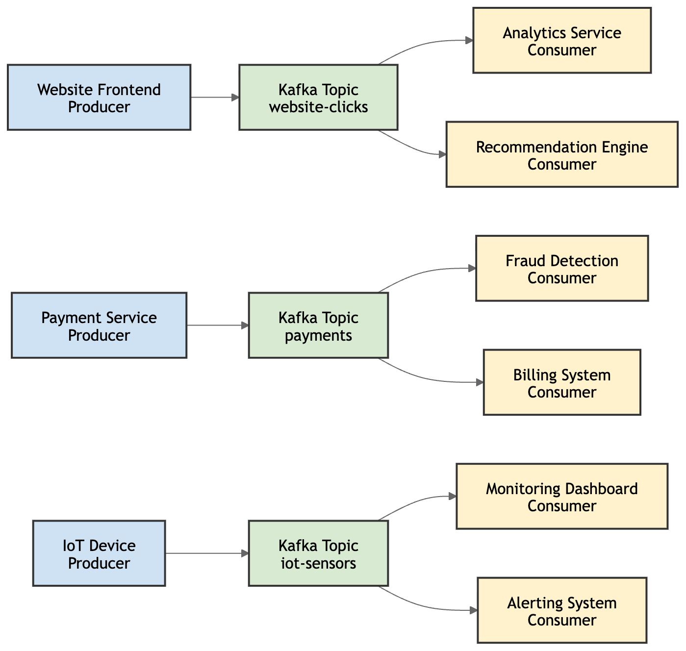

| Producer         | Event               |
| ---------------- | ------------------- |
| Website frontend | User click          |
| Payment service  | Payment completed   |
| IoT device       | Temperature reading |

## Consumers

Consumers are applications that subscribe to Kafka topics and read events from them. They can read from one or more partitions of a topic, and they maintain their own offset to track which events they have processed. 

| Consumer           | Why it reads `payments`    |
| ------------------ | -------------------------- |
| Fraud detection    | Detect suspicious activity |
| Billing system     | Generate invoices          |
| Analytics platform | Calculate revenue metrics  |

### Consumers Group

A consumer group is a collection of consumers that work together to consume events from a topic. Each consumer in the group reads from a subset of the partitions, allowing for parallel processing and load balancing. This enables horizontal scaling of consumers, as you can add more consumers to the group to handle increased load. Each partition is consumed by only one consumer in the group, ensuring that events are processed in order within each partition.

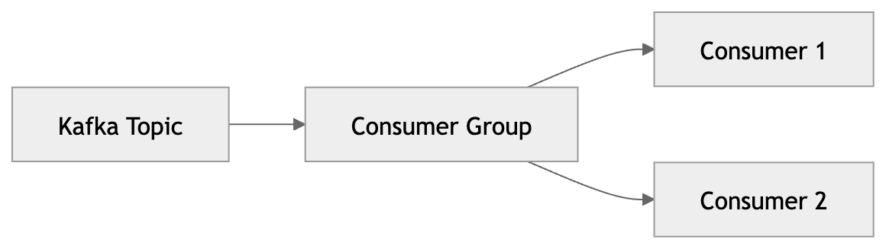

## Partitions

A topic is split into one or more partitions, which are independent ordered logs. Each partition is an append-only sequence of records that can be read independently. Partitions allow Kafka to scale horizontally by distributing data across multiple brokers and enabling parallel processing by consumers.

### Offset

Each record in a partition is assigned a unique sequential ID called an offset. The offset is a simple integer that represents the position of the record within the partition. It starts at 0 for the first record and increments by 1 for each subsequent record. Offsets are critical for consumers to track their progress in reading from a partition. Consumers can commit their offsets to Kafka, allowing them to resume from the last committed offset in case of failure.

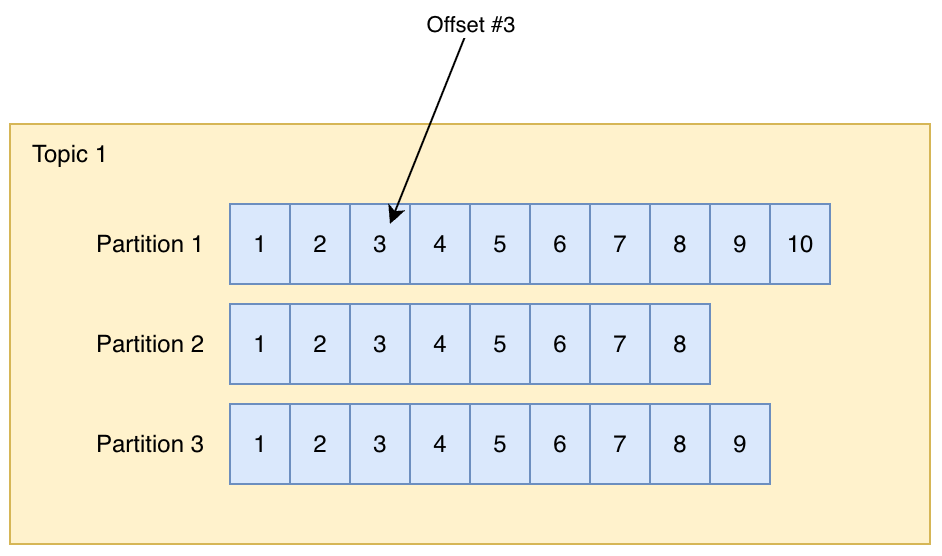

Partitions are the fundamental unit of parallelism in Kafka. A topic is not stored as one single stream. Instead, Kafka splits a topic into one or more partitions. Each partition is its own ordered, append-only log of records.

This means a topic can scale beyond one machine because different partitions can be stored, replicated, and processed independently across the Kafka cluster.

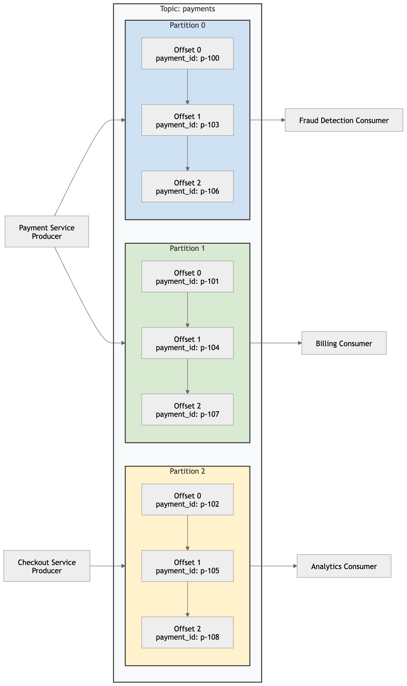

This diagram zooms into the `payments` topic from the previous section.

A topic is the logical stream, but the actual records inside the topic are spread across partitions. Each partition is its own ordered append-only log.

In this example, the `payments` topic has three partitions:

| Partition | What it contains |
| --- | --- |
| Partition 0 | Some payment events |
| Partition 1 | Other payment events |
| Partition 2 | More payment events |

Each partition has its own offset sequence. This means `Offset 0` in Partition 0 is different from `Offset 0` in Partition 1. Partition starts at offset 0, but each partition maintains its own independent offset sequence.

### Ordering
This is important because Kafka only guarantees ordering within a partition, not across the whole topic.

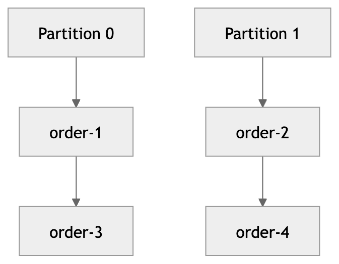

Partitions are what allow Kafka to scale. Instead of one consumer processing the entire `payments` topic, multiple consumers can process different partitions in parallel.
Each partition maintains ordering only within itself. Kafka guarantees order inside a partition, not across the entire topic.

This is why partitioning is so important:

| Benefit | Explanation |
| --- | --- |
| Parallelism | Multiple consumers can read from different partitions at the same time |
| Scalability | Kafka can spread partitions across multiple brokers |
| Throughput | Producers and consumers can process more records concurrently |
| Fault tolerance | Partitions can be replicated across brokers |
| Ordering | Records with the same key can be sent to the same partition to preserve order |

Flink consumes kafka partitions in parallel. Each Flink task can read from one or more partitions, allowing for high throughput and scalability. However, if you need to maintain order across all events in a topic, you must ensure that all related events are sent to the same partition by using a consistent key.

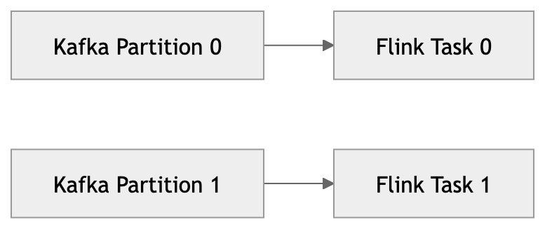

### Keys

Kafka routes records by key. Same key → same partition. This is critical for maintaining order of related events. If you want all events for a specific user to be processed in order, you would use the user ID as the key when producing records. Kafka will then ensure that all events with that key go to the same partition, preserving their order.

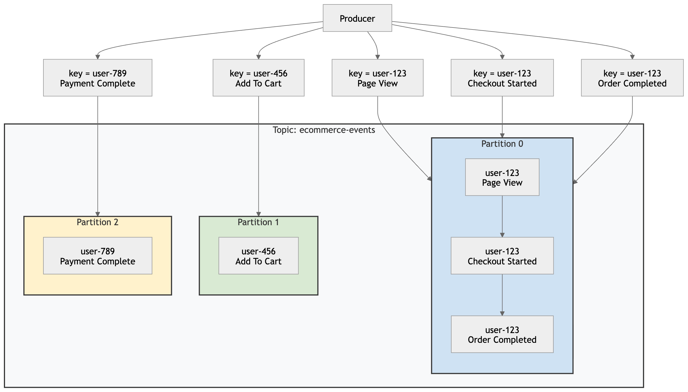

Kafka uses the record key to decide which partition an event should be written to. Records with the same key are always routed to the same partition.

In this example:

| Key        | Partition   |
| ---------- | ----------- |
| `user-123` | Partition 0 |
| `user-456` | Partition 1 |
| `user-789` | Partition 2 |

Notice that all events for `user-123` are written into Partition 0. Because these events are stored in the same partition, Kafka preserves their ordering.

This is extremely important for systems that depend on ordered event processing, such as:

- user activity tracking
- financial transactions
- shopping carts
- session processing
- fraud detection

If related events were randomly distributed across partitions, event order could become inconsistent.

Kafka solves this by using the key to guarantee:

```Same key → same partition → preserved ordering```

### Partition Skew

Partition skew occurs when the distribution of keys is uneven, causing some partitions to receive significantly more records than others. This can lead to performance bottlenecks and increased latency for consumers reading from the overloaded partitions.

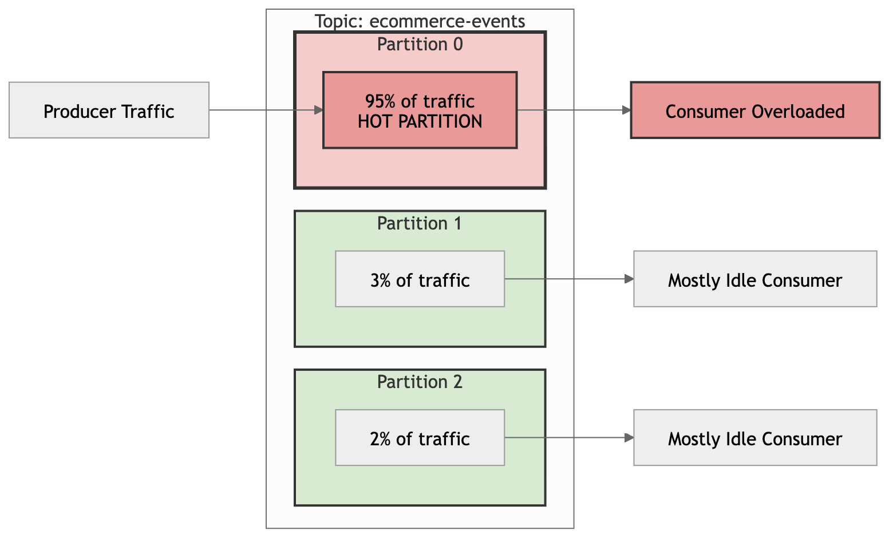

More partitions does not always mean better performance. If your key distribution is skewed, adding more partitions may not help because the same keys will still be routed to the same partitions. In fact, it can make things worse by increasing the overhead of managing more partitions without improving load distribution.

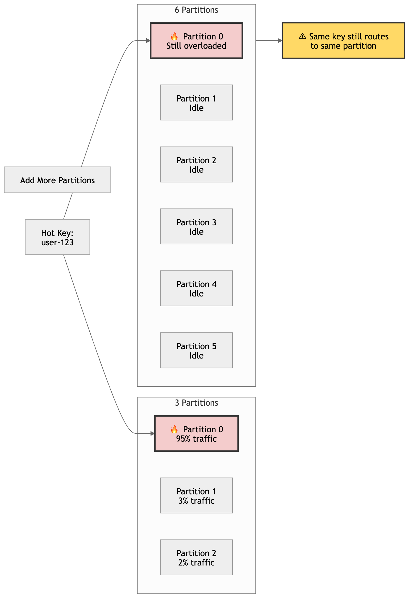

Too few partitions can lead to bottlenecks because all records are funneled through a limited number of partitions.  While too many partitions can increase overhead without improving performance if the key distribution is skewed. It's important to choose the right number of partitions based on your workload and key distribution to achieve optimal performance.

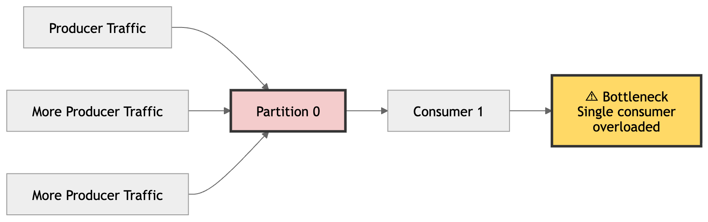

## Brokers

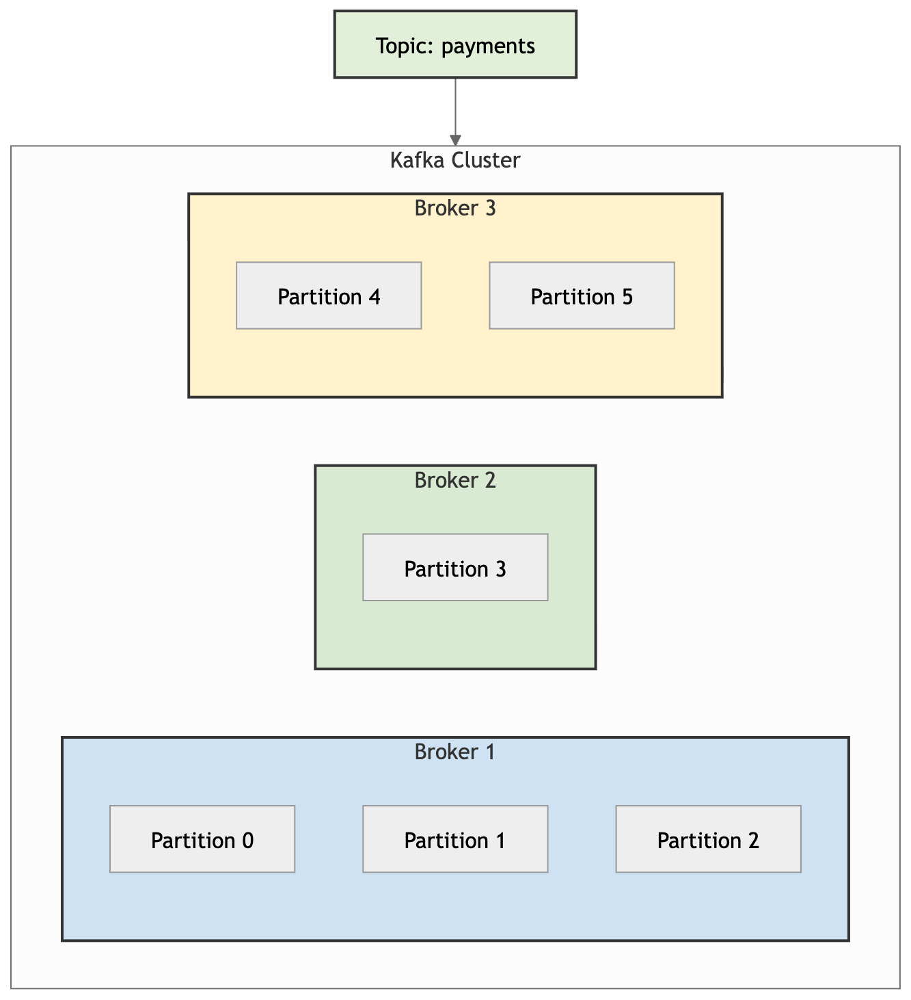

A broker is a Kafka server that stores partitions and serves reads and writes for clients. A Kafka cluster is made up of multiple brokers working together.

When a topic has multiple partitions, Kafka distributes those partitions across brokers. This is what allows both horizontal scaling and fault tolerance.

In practice:

| Broker role | What it means |
| --- | --- |
| Storage | Persists partition logs on disk |
| Serving traffic | Handles producer writes and consumer reads |
| Replication | Keeps replica copies of partitions on different brokers |
| Recovery | Lets the cluster continue if one broker fails |

So the relationship is: 

- topics are logical streams
- partitions are the parallel units
- brokers are the machines that host those partitions.

## Retention

Kafka retains records for a configurable amount of time or until a certain size limit is reached. This allows consumers to re-read historical data if needed. Once the retention period expires, Kafka automatically deletes old records to free up storage space.

| Retention | Use case                   |
| --------- | -------------------------- |
| 1 hour    | Temporary operational data |
| 7 days    | Common streaming retention |
| 30+ days  | Backfills and recovery     |

## Kafka Connect

Kafka Connect is a framework for connecting Kafka with external systems such as databases, key-value stores, search indexes, and file systems. It provides a scalable and fault-tolerant way to stream data between Kafka and other data sources or sinks without writing custom code.

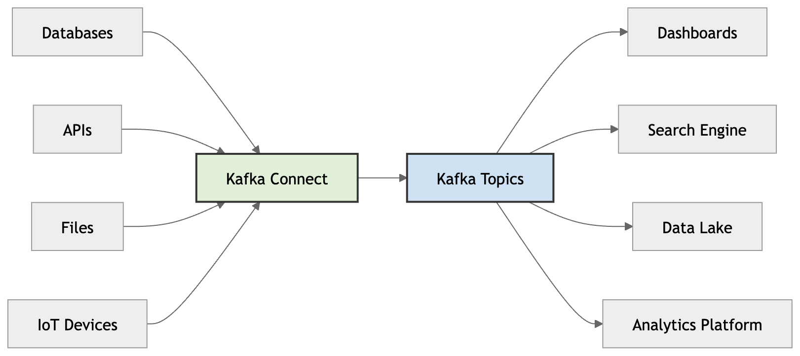

## Kafka Lag

Kafka lag means consumers are slower than producers. It indicates that the consumer is falling behind in processing the incoming data. Lag can lead to increased latency and potential data loss if not addressed. This is the same as backpressure in Flink. If your Flink job cannot keep up with the rate of incoming events from Kafka, it will experience backpressure, which can cause increased latency and potential data loss if not addressed. Monitoring Kafka lag is crucial for maintaining the health and performance of your streaming applications.