# Hands-On

| Concept              | Practical understanding           |
| -------------------- | --------------------------------- |
| Kafka topics         | Distributed append-only logs      |
| Partitions           | Independent ordered logs          |
| Offsets              | Positions within logs             |
| Replayability        | Re-reading historical data        |
| Producer keys        | Determine partition placement     |
| Ordering guarantees  | Only within partitions            |
| Consumer groups      | Horizontal scaling                |
| Partition assignment | Work distribution                 |
| Flink Kafka source   | Dynamic table abstraction         |
| State locality       | Related events processed together |

## 1. Start the local environment

Go into your exercise directory:

```bash
cd learn-apache-flink-101-exercises-master
```

Start containers:

```bash
docker compose up --build -d
```

Verify containers:

```bash
docker ps
```

You should see containers similar to:

| Container | Purpose |
| --- | --- |
| `broker` | Kafka broker that stores and serves topic partitions |
| `jobmanager` | Flink coordinator that schedules jobs and manages the cluster |
| `taskmanager` | Flink worker that executes processing tasks |
| `kcat` | Kafka command-line tool used to inspect topics and messages |

### What is running internally

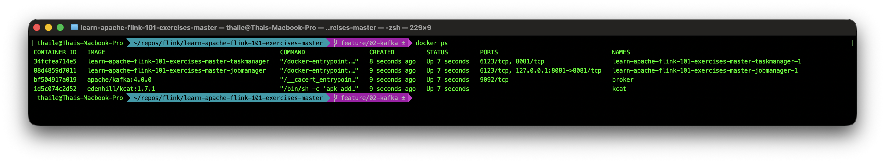

| Component | Status |
| --- | --- |
| Kafka | Running |
| Flink JobManager | Running |
| Flink TaskManager | Running |
| Kafka topics | Not created yet |
| Events/messages | Not flowing yet |

## 2. Enter the Kafka broker container

Run:

```bash
docker exec -it broker bash
```

You are now interacting directly with Kafka itself, not Flink.

## 3. Create your first Kafka topic

Run:

```bash
/opt/kafka/bin/kafka-topics.sh \
    --create \
    --topic orders \
    --bootstrap-server localhost:9092 \
    --partitions 3 \
    --replication-factor 1
```

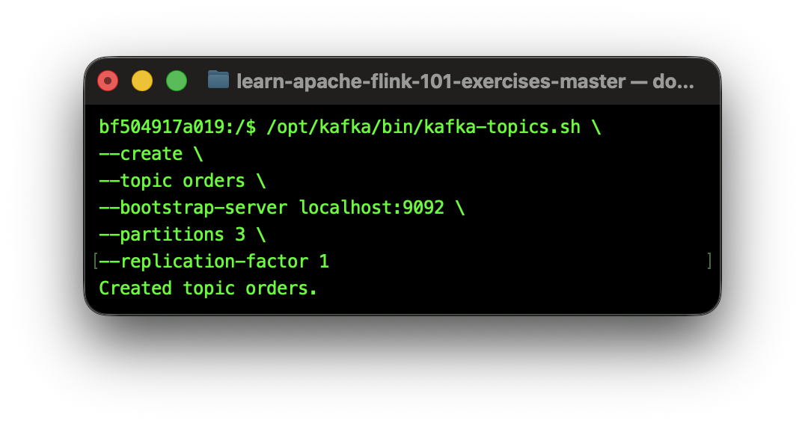

What this command means:

| Argument | Meaning |
| --- | --- |
| --topic orders | Topic name |
| --bootstrap-server | Kafka broker endpoint |
| --partitions 3 | Three parallel logs |
| --replication-factor 1 | One replica only |

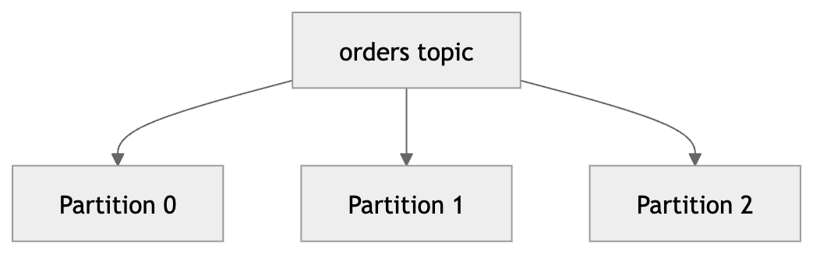

Internal topic architecture:

- This is not one file.
- This is three independent append-only logs.

## 4. Describe the topic

Run:

```bash
/opt/kafka/bin/kafka-topics.sh \
    --describe \
    --topic orders \
    --bootstrap-server localhost:9092
```

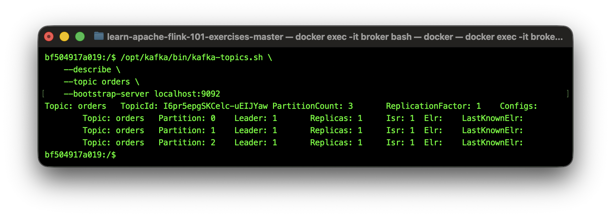

This output shows that the `orders` topic contains three partitions.

Each partition has:

- a leader broker responsible for reads and writes
- replica assignments
- in-sync replica tracking

| Field | Example Value | What it does |
| --- | --- | --- |
| Topic | `orders` | Logical stream used to organise related records |
| PartitionCount | `3` | Splits the topic into 3 parallel logs for scalability and throughput |
| ReplicationFactor | `1` | Maintains 1 copy of each partition across the cluster |
| Partition | `0`, `1`, `2` | Individual ordered append-only logs inside the topic |
| Leader | `1` | Broker responsible for handling reads and writes for the partition |
| Replicas | `1` | Brokers storing copies of the partition for durability and failover |
| In Sync Replicas (ISR) | `1` | Replicas currently fully caught up with the leader |

Even though this is a single-broker local setup, Kafka is still exposing the same distributed system concepts used in production clusters.

## 5. Produce events manually

Run:

```bash
/opt/kafka/bin/kafka-console-producer.sh \
    --topic orders \
    --bootstrap-server localhost:9092
```

Now type events manually:

```text
order-1
order-2
order-3
```

Press Enter after each.

## What is happening internally:

Kafka appends each event to a partition log. The producer does not specify which partition to write to, so Kafka uses a default partitioner that distributes events across partitions (often round-robin or based on key hashing if keys are used).

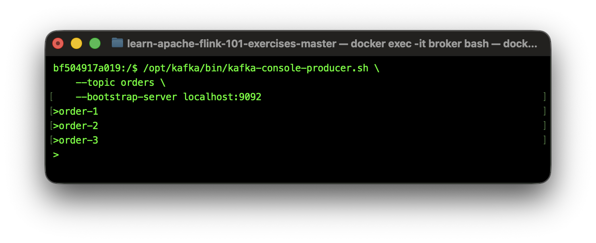
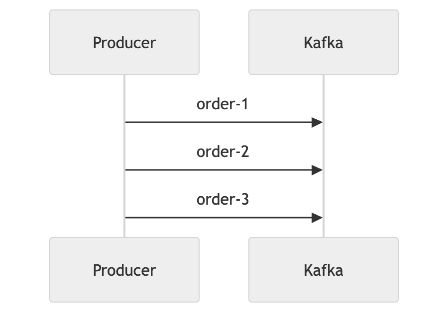

## 6. Consume events manually

Open a second terminal, then enter broker again:

```bash
docker exec -it broker bash
```

Run:

```bash
/opt/kafka/bin/kafka-console-consumer.sh \
    --topic orders \
    --from-beginning \
    --bootstrap-server localhost:9092
```
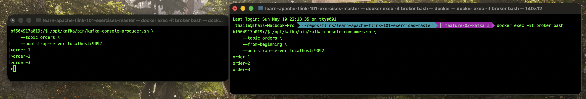

To stop the consumer, press `Ctrl+C` in the terminal.

Kafka retained those events. The consumer was able to replay history because Kafka is designed as a durable log. This is a fundamental difference from traditional messaging systems that often delete messages immediately after consumption.

Why replayability matters:

| Use case | Why important |
| --- | --- |
| Recovery | Rebuild state |
| Analytics | Recompute pipelines |
| ML retraining | Reprocess historical events |
| Debugging | Reproduce issues |
| Backfills | Rebuild derived datasets |

## 7. Observe offsets

Consume with metadata:

```bash
/opt/kafka/bin/kafka-console-consumer.sh \
    --topic orders \
    --from-beginning \
    --property print.offset=true \
    --bootstrap-server localhost:9092
```

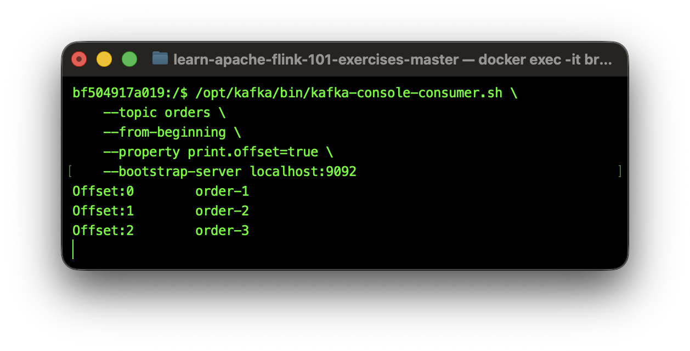

What offsets are:

- Offsets are positions within partition logs.
- Offsets are fundamental to replay, fault tolerance, checkpoints, and exactly-once processing.

## 8. Understand partitions practically

Create another topic:

```bash
/opt/kafka/bin/kafka-topics.sh \
    --create \
    --topic partition_demo \
    --bootstrap-server localhost:9092 \
    --partitions 3 \
    --replication-factor 1
```

Example output:

```text
Created topic partition_demo.
```

This creates a Kafka topic named `partition_demo` with:

| Setting | Value |
| --- | --- |
| Partitions | `3` |
| Replication factor | `1` |

The topic now contains three independent partitions that Kafka can use for parallelism and ordering.

### Produce keyed events

Now start a producer:

```bash
/opt/kafka/bin/kafka-console-producer.sh \
    --topic partition_demo \
    --bootstrap-server localhost:9092 \
    --property parse.key=true \
    --property key.separator=:
```

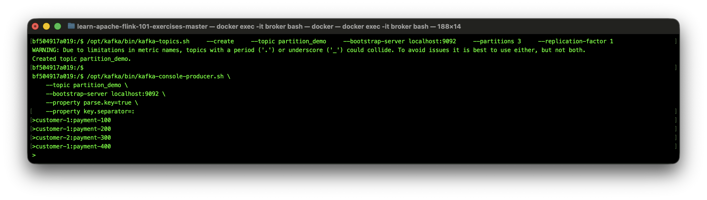

This producer is configured to parse messages in the format: `key:value`


Now enter these events:

```text
customer-1:payment-100
customer-1:payment-200
customer-2:payment-300
customer-1:payment-400
```

Each message contains:

| Part | Example | Purpose |
| --- | --- | --- |
| Key | `customer-1` | Used to determine the target partition |
| Value | `payment-100` | Actual event payload |

Kafka hashes the key to decide which partition should store the record.

This means:

```text
Same key → same partition
```

So all records for:

```text
customer-1
```

will always be routed to the same partition.

This is one of Kafka’s most important guarantees because it preserves ordering for related events.

For example:

```text
customer-1:payment-100
customer-1:payment-200
customer-1:payment-400
```

will remain ordered inside the partition log.

## 9. Observe partition placement

Now consume the records and display Kafka metadata.

Open a new terminal and enter:

```bash
docker exec -it broker bash
```

Then run:

```bash
/opt/kafka/bin/kafka-console-consumer.sh \
    --topic partition_demo \
    --from-beginning \
    --property print.partition=true \
    --property print.key=true \
    --property print.offset=true \
    --bootstrap-server localhost:9092
```

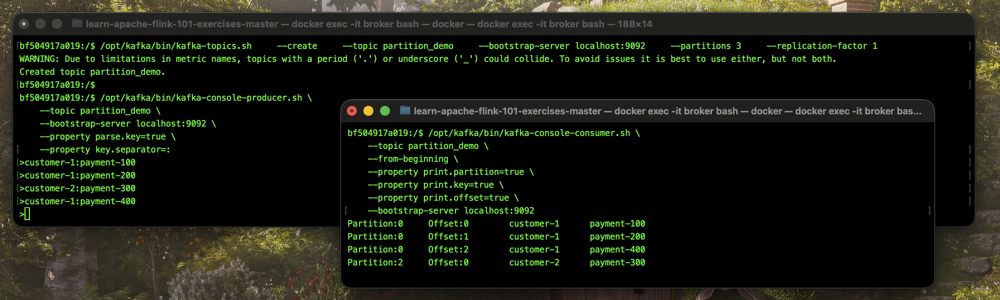

### What are we observing?

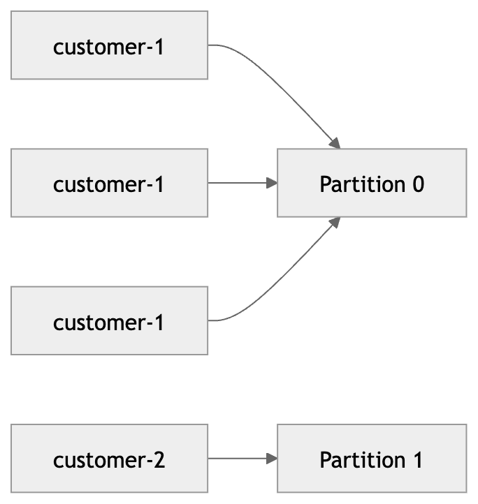

Kafka is showing:

| Metadata | Meaning |
| --- | --- |
| Partition | Which partition stored the record |
| Offset | Position of the record inside the partition |
| Key | Value used to determine partition placement |
| Value | Actual event payload |

All records with the key:

```text
customer-1
```

were routed to:

```text
Partition 0
```
This is because partition starts at offset 0, so the events for `customer-1` were stored in order and assigned offsets sequentially within that partition.

Meanwhile:

```text
customer-2
```

was routed to a different partition:

```text
Partition 2
```

This demonstrates one of Kafka’s most important guarantees:

```text
Same key → same partition → ordered processing
```

Kafka preserves ordering only within a partition.

This behaviour is foundational for:

- Flink stateful processing
- session tracking
- aggregations
- joins
- fraud detection
- user activity streams

Without consistent partition placement, distributed stream processors would not be able to reliably maintain ordered state for related events.

## 10. Understand ordering guarantees

Kafka guarantees that records with the same key will always be routed to the same partition, ensuring that they are stored in a specific order within that partition. This means that if you produce multiple records with the same key, they will be appended to the same partition log in the order they were produced.

This ordering guarantee is critical for many stream processing applications, as it allows you to maintain state and perform operations that depend on the order of events, such as aggregations, joins, and session tracking. However, it’s important to note that Kafka does not guarantee ordering across different partitions. If you produce records with different keys that are routed to different partitions, there is no guarantee of the order in which those records will be processed relative to each other.

## 11. Understand consumer groups

Kafka consumer groups allow multiple consumers to work together and share the workload of consuming a topic.

Open two terminals and run the same consumer group.

### Terminal 1 (consumer group: demo-group)

```bash
/opt/kafka/bin/kafka-console-consumer.sh \
    --topic partition_demo \
    --group demo-group \
    --bootstrap-server localhost:9092
```

### Terminal 2 (consumer group: demo-group)

```bash
/opt/kafka/bin/kafka-console-consumer.sh \
    --topic partition_demo \
    --group demo-group \
    --bootstrap-server localhost:9092
```

### Terminal 3 (producer)

```bash
/opt/kafka/bin/kafka-console-producer.sh \
    --topic partition_demo \
    --bootstrap-server localhost:9092 \
    --property parse.key=true \
    --property key.separator=:
```

Send these events in Terminal 3 (producer):

```text
customer-1:payment-500
customer-2:payment-600
customer-3:payment-700
customer-1:payment-800
```

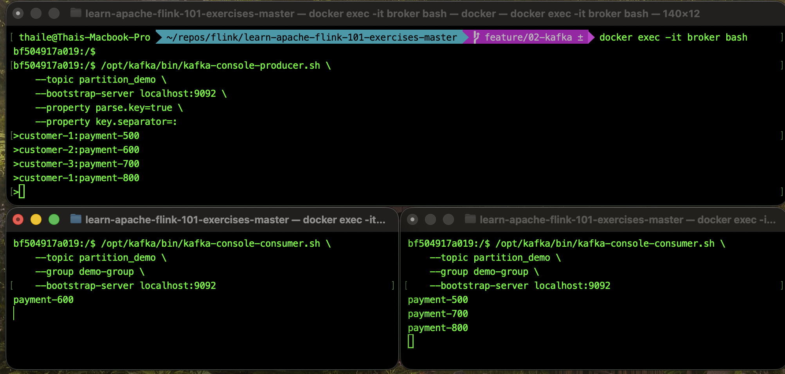

Example output:

### Consumer terminal 1

```text
payment-600
```

### Consumer terminal 2

```text
payment-500
payment-700
payment-800
```

### What are we observing?

Notice that:

- the events were distributed across the two consumers
- not every consumer received every message
- Kafka automatically balanced partitions between the consumers

This is because both consumers belong to the same consumer group:

```text
demo-group
```

Kafka distributes partitions across consumers inside the group.

### Extremely important rule

Within a consumer group:

```text
One partition → one active consumer
```

This preserves ordering guarantees inside each partition.

Kafka will never allow multiple consumers in the same group to simultaneously consume the same partition.

### Why this matters

Consumer groups are one of Kafka’s most important scaling mechanisms.

They enable:

| Capability | Explanation |
| --- | --- |
| Parallel processing | Multiple consumers process data simultaneously |
| Horizontal scaling | Workload distributed across machines |
| Fault tolerance | Another consumer can take over if one fails |
| Ordered processing | Ordering preserved within each partition |

### Scaling limitation

Parallelism is limited by the number of partitions.

Rule:

```text
Maximum useful consumers <= number of partitions
```

For example:

| Partitions | Maximum active consumers |
| --- | --- |
| 1 | 1 |
| 3 | 3 |
| 10 | 10 |

If there are more consumers than partitions, the extra consumers will remain idle because there are no partitions available for them to consume.

## 12. Understand replayability

Consume from beginning again:

```bash
/opt/kafka/bin/kafka-console-consumer.sh \
    --topic orders \
    --from-beginning \
    --bootstrap-server localhost:9092
```

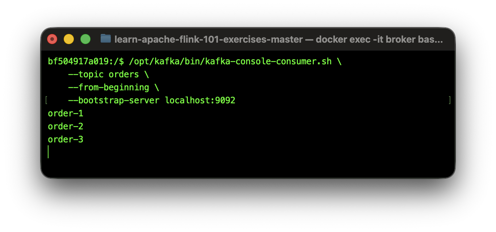

Even old events replay. This is because Kafka is designed as a durable log that retains all events for a configurable period of time (or until storage limits are reached). This allows consumers to replay history, which is critical for recovery, debugging, backfills, and recomputation.

Why replayability changes architecture:

- Traditional systems often lose old events.
- Kafka preserves them temporarily.
- This supports recovery, debugging, and backfills.

## 13. Connect Flink SQL to Kafka

Enter Flink SQL CLI:

```bash
docker compose run sql-client
```

Create a Kafka-backed Flink table:

```sql
CREATE TABLE kafka_orders (
        order_id STRING
) WITH (
        'connector' = 'kafka',
        'topic' = 'orders',
        'properties.bootstrap.servers' = 'broker:9092',
        'scan.startup.mode' = 'earliest-offset',
        'format' = 'raw'
);
```


This does not copy data into Flink. This creates a table abstraction over a Kafka topic. Flink will read from Kafka in real time when you query this table. 

Flink does not ingest data into its own storage. Instead, it reads directly from Kafka as the source of truth for streaming data. This allows Flink to process data in real time without needing to manage its own data storage or replication.

## 14. Query Kafka stream in Flink

Run:

```sql
SELECT *
FROM kafka_orders;
```

Also run: `SET 'sql-client.execution.result-mode' = 'changelog';` to enable changelog see the Flink internally represents the stream of events as a changelog, which captures the continuous updates from Kafka. 

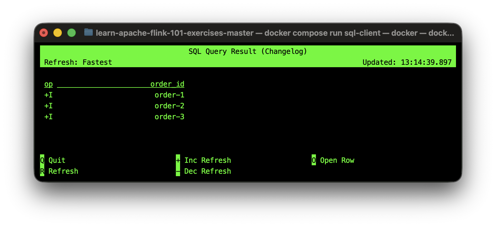

Now produce more events in the producer terminal. They appear live in Flink.

## 15. Observe parallelism relationship

Kafka partitions often determine:

- Flink parallelism
- state locality
- workload distribution

Flink can only achieve parallelism up to the number of Kafka partitions. If you have 3 partitions, you can have at most 3 parallel Flink tasks consuming from that topic. This is because each partition can only be consumed by one Flink task at a time to preserve ordering guarantees. If you need more parallelism, you must increase the number of Kafka partitions.

## 16. Understand why bad partitioning hurts Flink

Imagine one Flink task becomes overloaded.

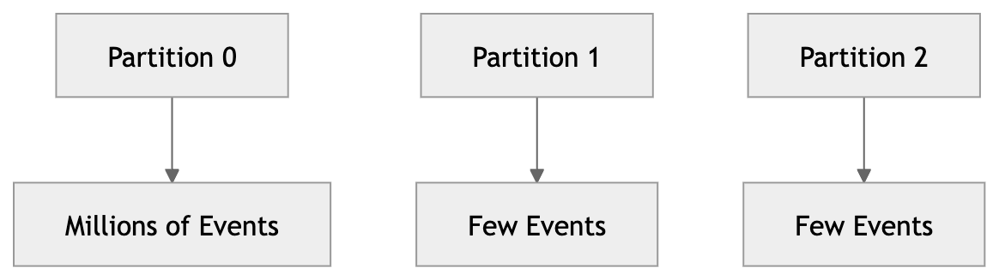

Possible results:

- backpressure
- checkpoint slowdown
- memory pressure
- uneven CPU
- instability

This is partition skew, one of the most common production problems.

## 17. Understand state locality

Because the same keys go to the same partition, this reduces:

- network traffic
- shuffle overhead
- state fragmentation

Good partitioning improves performance significantly. For example, if you are doing a key-based aggregation in Flink, having all events for the same key routed to the same partition allows Flink to maintain state locally without needing to shuffle data across the network. This leads to much faster processing and lower latency.

## 18. Shut down cleanly

Exit SQL CLI:

```sql
quit;
```

Exit broker shell:

```bash
exit
```

Stop containers:

```bash
docker compose down -v
```

