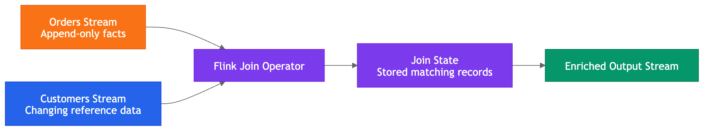
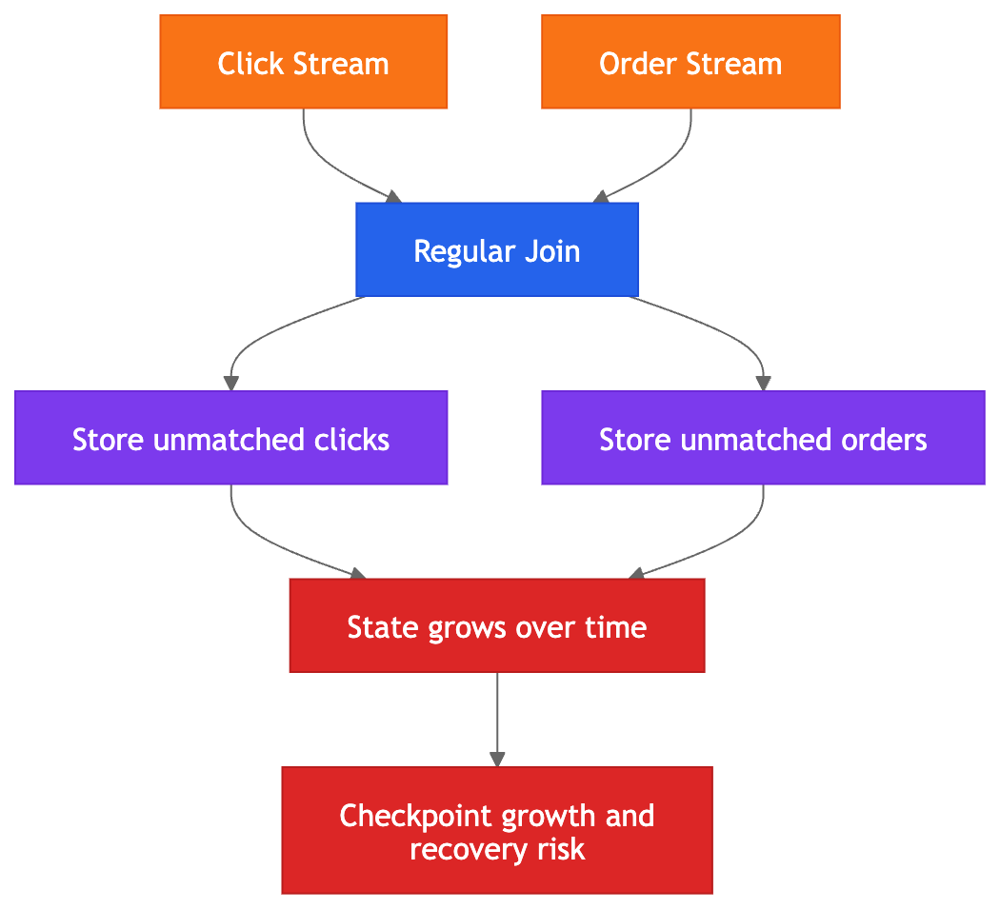
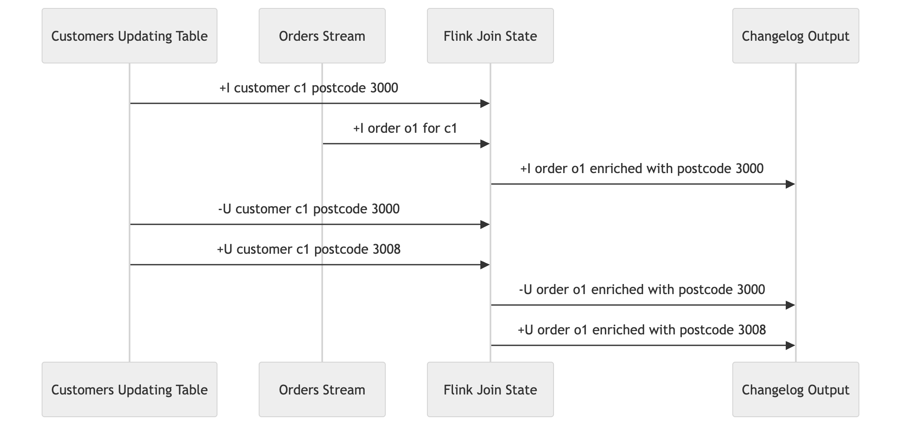
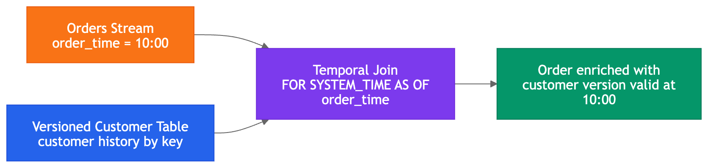
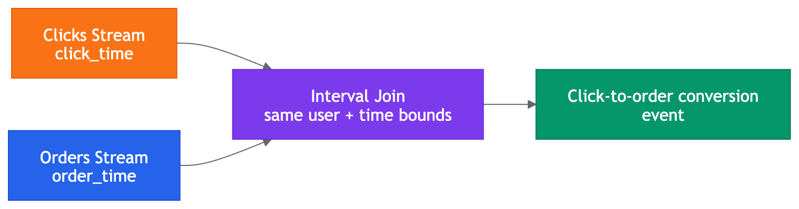
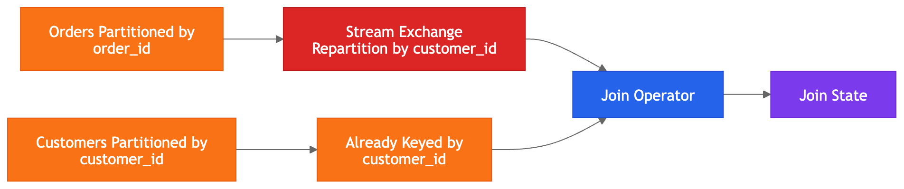
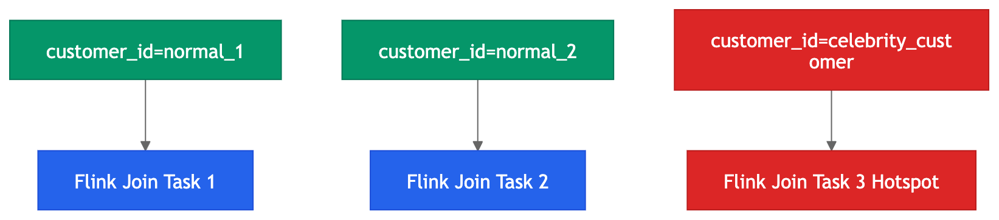
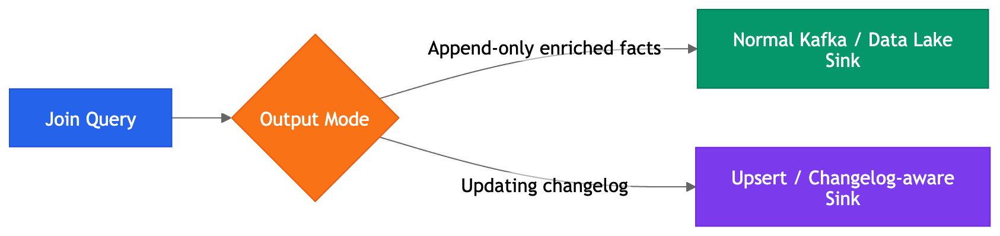
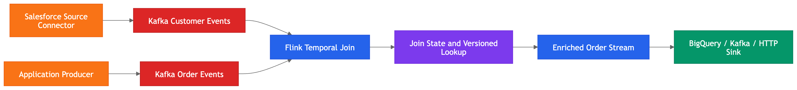
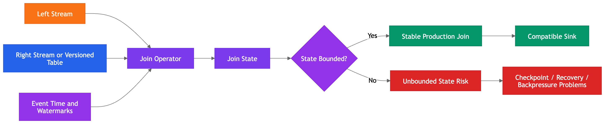

# Streaming Joins, Temporal Joins, Interval Joins, and Why Joins Are Dangerous in Flink

## Overview

Joins are where Flink starts becoming genuinely serious. Up to this point, the material has covered streams, Kafka partitions, event time, watermarks, dynamic tables, changelog streams, state, and sink compatibility. Joins combine those ideas into one of the hardest areas of stream processing.

In a normal database, a join is usually manageable. In Flink, a join may happen between two infinite streams. That changes everything.

For example, consider joining orders with customers. In a database, that is a simple lookup. In Flink, orders may arrive before the customer record, or the customer record may update after the order arrives. That can lead to incorrect results if not handled carefully.

| Database join | Streaming join |
| --- | --- |
| Runs over finite tables | May run over unbounded streams |
| Returns a result and finishes | Produces a continuous result stream |
| Can rely on stored indexes and scans | Must manage distributed state |
| Usually bounded in execution time | Often runs indefinitely |

Regular joins require large state, and state stores historical records for matching. Temporal joins and interval joins are usually safer and more production-friendly patterns.

## Why Joins Are Different in Streaming Systems

In a database, a join combines two stored datasets.

```sql
SELECT
	o.order_id,
	o.customer_id,
	c.customer_name,
	o.amount
FROM orders o
JOIN customers c
ON o.customer_id = c.customer_id;
```



In streaming, the same shape of query becomes more complicated because orders may be infinite and customers may also change over time.

| Situation | Risk |
| --- | --- |
| Customer record updates after order placement | Historical enrichment may be rewritten incorrectly |
| Order arrives before customer update | Output may depend on arrival order rather than event time |
| Late order arrives after customer changed | Older facts may be enriched with newer reference data |

That can corrupt analytics, compliance reporting, ML features, fraud investigation, and audit trails.

## The Core Problem: Incomplete Information

At any moment, Flink only knows the events that have arrived so far. It does not know whether another matching event will arrive in one second, one hour, or never.

```json
{
  "order_id": "o-100",
  "customer_id": "c-123",
  "amount": 250,
  "order_time": "10:00:00"
}
```

| Unknown | Why it matters |
| --- | --- |
| Customer row not arrived yet | The order may need to wait in state |
| Customer row delayed | The join may complete later |
| Customer row replayed | The join may need to re-evaluate |
| Customer has historical versions | The correct version depends on event time |

This is the heart of why joins are stateful and expensive.

## Why Regular Streaming Joins Can Explode State

Consider joining two append-only streams:

```sql
SELECT *
FROM clicks c
JOIN orders o
ON c.user_id = o.customer_id;
```



At first glance, that looks harmless. In streaming, it is not.

| Event | Flink response |
| --- | --- |
| Click arrives with no order yet | Store the click in state |
| More clicks arrive | Store more unmatched rows |
| Orders arrive later | Match against stored clicks |
| No time boundary exists | State can grow indefinitely |

That state must be checkpointed, restored after failure, and managed across distributed workers.


## Regular Joins

A regular join is the closest form to standard SQL join behavior.

```sql
SELECT
	c.customer_id,
	c.customer_name,
	o.order_id,
	o.amount
FROM customers c
JOIN orders o
ON c.customer_id = o.customer_id;
```

| Input pattern | Risk |
| --- | --- |
| Two bounded tables | Low |
| Append-only streams | Medium |
| Updating streams | High |

If both sides are updating, Flink may need to retract and correct previously emitted join results. Every update can cascade through the join result.

## Why Joins with Updating Tables Create Cascading Changes

Updating tables already produce changelog streams. When updating streams are joined, changes can propagate through the join result.



| Step | Effect |
| --- | --- |
| Customer initially has postcode `3000` | Joined output uses `3000` |
| Customer postcode updates to `3008` | Earlier joined output may become incorrect |
| Join semantics require correction | Previous result may be retracted and replaced |

If the sink cannot handle retractions, the output becomes wrong.

## The Golden Rule for Streaming Joins

The senior-engineer rule is simple:

**Never design a streaming join without thinking about state lifetime.**

| Control mechanism | What it does |
| --- | --- |
| Time bounds | Limits how long records can match |
| Watermarks | Allow safe cleanup based on event time |
| State TTL | Removes dormant state after inactivity |
| Primary keys | Support versioned lookup and upsert semantics |
| Temporal joins | Enrich with the correct version at event time |
| Interval joins | Restrict matching to a bounded time range |

## Temporal Joins



Temporal joins are one of the most important production patterns in Flink SQL.

They answer this question:

> For this event, what was the correct reference-data value at the time the event happened?

That is different from asking for the latest customer record.

## Temporal Join Semantics



| Aspect | Temporal join behavior |
| --- | --- |
| Reference side | Versioned updating table |
| Lookup key | Primary key |
| Time reference | Event time from the left stream |
| Result | Historically correct enrichment |
| Typical output | Often append-only |

```sql
SELECT
	o.order_id,
	o.customer_id,
	c.postcode,
	o.amount,
	o.order_time
FROM orders o
JOIN customers FOR SYSTEM_TIME AS OF o.order_time AS c
ON o.customer_id = c.customer_id;
```

Temporal joins are preferred for enrichment because they preserve historical correctness.

## Temporal Join Constraints

Temporal joins are powerful, but they are not magic.

| Requirement | Why it matters |
| --- | --- |
| Versioned updating table | The lookup target must have history |
| Primary key | The lookup target must have stable identity |
| Event-time reference | The correct historical version must be selected |

Without those pieces, the correct value at event time cannot be determined.

## Interval Joins

An interval join matches two event streams when their timestamps fall within a defined time relationship.

```sql
SELECT
	c.user_id,
	c.click_time,
	o.order_time
FROM clicks c
JOIN orders o
ON c.user_id = o.customer_id
AND o.order_time BETWEEN c.click_time AND c.click_time + INTERVAL '30' MINUTE;
```

| Use case | Time rule |
| --- | --- |
| Click to purchase | Purchase occurs within 30 minutes of click |
| Order to shipment | Shipment occurs within 24 hours of order |
| Login to fraud alert | Alert occurs within 5 minutes of login |
| Sensor reading to alarm | Alarm follows abnormal reading within 10 seconds |

Interval joins are often more state-efficient than unconstrained joins because the time range gives Flink a cleanup boundary.

## Regular Join vs Temporal Join vs Interval Join

| Join type | Best used when | State risk | Output complexity |
| --- | --- | --- | --- |
| Regular join | Broad matching across changing tables is required | High unless constrained | Often updating and complex |
| Temporal join | Facts need historical enrichment | Controlled by versioned table semantics | Often append-only |
| Interval join | Two streams must match within a time window | Bounded by interval and watermark | Usually manageable |

The right join type depends on the business question, not just the SQL syntax.

## Why Time Is the Safest Way to Control Join State

Time gives Flink a cleanup boundary.

| Concept | Purpose |
| --- | --- |
| Event time | Identifies when the event occurred |
| Watermarks | Indicate event-time progress |
| Join interval | Defines how long records remain eligible for matching |
| State cleanup | Removes records that are no longer needed |

## State TTL and Why It Is Not the Same as Correctness

State TTL deletes stored state after a configured period of inactivity.

| Mechanism | Meaning |
| --- | --- |
| State TTL | Delete state after a configured timeout |
| Event-time bound | Keep records valid only within the business-defined matching window |

If TTL expires too early, a valid late match may be lost. TTL should therefore be treated as an operational safeguard, not the primary correctness mechanism.

## Stream Exchange and Shuffle in Joins



Joins often require Flink to redistribute data across the network so that matching keys arrive at the same task.

| Term | Meaning |
| --- | --- |
| Stream exchange | Repartitioning records across tasks |
| Shuffle | Network redistribution by key |
| Keyed join state | Local state for a specific join key |

If the upstream data is poorly keyed, more shuffle is required, which increases latency, cost, and checkpoint size.

## Join Skew



Join skew occurs when some keys are much hotter than others.

| Symptom | Effect |
| --- | --- |
| Hot key | One task receives disproportionate traffic |
| Uneven state | One task stores much more join data |
| Backpressure | One overloaded task slows the job |
| Slow checkpoints | State-heavy tasks take longer to snapshot |

Key distribution should be considered before the join is implemented, not after it fails in production.

## Joining Streams and Sink Compatibility



Join output may be append-only or changelog-based depending on the input table types and join semantics.

| Join behavior | Output type | Sink requirement |
| --- | --- | --- |
| Temporal enrichment | Often append-only | Insert-only sink is usually sufficient |
| Regular join with updates | Often changelog | Sink must support updates/retractions |
| Interval join | Often append-only or bounded changelog | Sink depends on exact query mode |

The same word “join” does not imply a single output shape.

## How Joins Fit Into the Broader Streaming Ecosystem



Joins are usually used for enrichment, correlation, attribution, and validation.

| Pattern | Example |
| --- | --- |
| Enrichment | Orders joined with customer data |
| Correlation | Clicks joined with purchases |
| Attribution | Ad impressions joined with conversions |
| Validation | Transactions joined with risk data |

In a Confluent-style architecture, Kafka stores the streams, Flink joins them, and sinks write the enriched or correlated results into Kafka, BigQuery, HTTP APIs, or serving layers.

## Common Misconceptions About Streaming Joins

| Misconception | Correction |
| --- | --- |
| A join is just a join | Streaming joins have different semantics, state requirements, and output modes |
| If the SQL compiles, the join is safe | A query can compile and still retain unbounded state or emit incompatible changelog output |
| State TTL solves join growth | TTL can remove valid state too early if it is not aligned with business time |
| Latest reference data is always correct | Historical correctness often requires the version that was valid at event time |

## Core Mental Model

A streaming join is a stateful, time-sensitive, distributed matching process over incomplete information.

That means every join design should answer four questions:

| Question | Why it matters |
| --- | --- |
| What is being matched? | Defines the business relationship |
| How long can records match? | Defines state lifetime |
| Which event time matters? | Defines historical correctness |
| What output mode is produced? | Defines sink compatibility |

## Final Architecture Model



1. The left and right inputs feed the join operator.
2. Event time and watermarks define which matches are still valid.
3. The join operator maintains keyed state.
4. Time bounds or versioned semantics control state retention.
5. The output may be append-only or changelog-based.
6. The sink must support the output mode that the join produces.

That is the practical view of streaming joins in Flink.