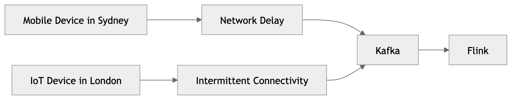
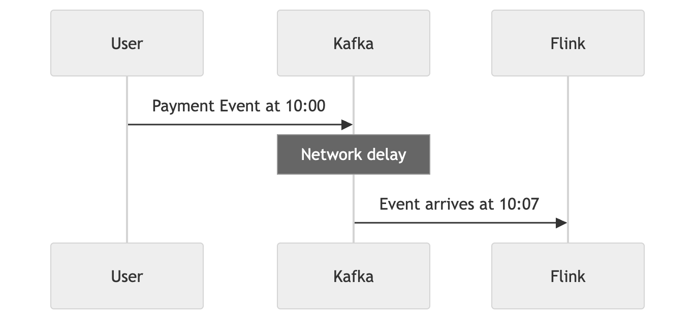
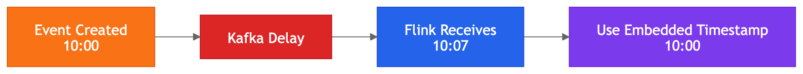

# Event Time

Most engineers coming from traditional app development, databases, APIs, or batch systems assume time is simple:

- events arrive immediately
- events arrive in order
- events arrive close to real-world time

In distributed streaming systems, that assumption breaks. Events can arrive late, out of order, or with timestamps that differ from processing time.

## Why Time Becomes Hard In Distributed Systems

In local and mostly synchronous systems, time feels straightforward.


Streaming systems are different. Events can:

- originate globally
- travel through variable network paths
- queue in Kafka
- retry during failures
- replay after outages
- arrive out of order
- arrive minutes or hours late

Once events stop arriving in neat chronological order, time becomes a core architecture problem.


With this example, events no longer arrive in neat chronological order. 

## Time Models In Flink

A common beginner mistake is assuming "time" means one thing. In reality, there are multiple time models in Flink, each with different semantics and use cases:

In Flink, there are multiple time models:

- processing time
- event time
- ingestion time (historically important, less common in modern production setups)

Each time model has different semantics, trade-offs, and use cases. Understanding these differences is critical for designing correct and efficient streaming applications.

## Processing Time

Processing time is the time when Flink processes an event. It is the simplest time model, as it does not require any coordination or tracking of event timestamps. Flink simply uses the system clock to determine the processing time for each event.

### Example


Suppose an event happened at `10:00:00`, but due to delays it reaches Flink at `10:07:00`.

With processing time, Flink treats that event as happening at `10:07:00`, because that is when Flink saw it.

### Why It Exists

Processing time is attractive because it is:

- simple
- fast
- low overhead
- operationally lightweight

It does not require watermark coordination, event-time tracking, or late-data handling. This makes it easier to implement and operate, especially for use cases where timing precision is not critical.

### Why It Can Be Dangerous

Processing time sacrifices correctness when arrival time differs from occurrence time. 



For example, in fraud detection:

- analytics become inaccurate
- windows become inconsistent
- dashboards drift
- fraud patterns may be missed

Processing time reflects when the system observed the event, not when the event actually occurred. This can lead to incorrect results if there are delays, out-of-order events, or if the timing of events is critical to the application logic.

### Where It Is Still Useful

| Use case | Why acceptable |
| --- | --- |
| Internal metrics | Minor timing inaccuracies are acceptable |
| Infrastructure monitoring | Near-real-time operational visibility matters most |
| Temporary dashboards | Simplicity is preferred |
| Lightweight alerting | Low latency is prioritized |
| Non-critical analytics | Operational simplicity is more important than precision |

## Event Time



Event time is the most important model in modern streaming systems. It is the timestamp inside the event itself, representing when the event actually happened in the real world. Event time allows Flink to process events based on their true occurrence time, rather than when they were observed by the system.

Event time is the timestamp inside the event itself:

- not when Flink saw it
- not when Kafka stored it
- not when processing happened
- but when the event actually happened in the real world

### Why Event Time Matters

Event time preserves correctness, which is essential for:

- financial systems
- IoT analytics
- telemetry
- anomaly detection
- fraud detection
- clickstream analytics
- observability pipelines
- ML feature generation

Without event time, delayed events can corrupt results. For example, if an event arrives late but has an old timestamp, it can cause windows to produce incorrect aggregates or miss important patterns.

### Why Event Time Is Hard

Event time introduces a hard distributed-systems question: `How long should the system wait for delayed events?` This is the core problem of event time processing. It leads directly to the concept of watermarks, which we will cover next.

At scale, this directly affects latency, state size, memory usage, and output correctness. This is the core problem of event time processing and leads directly to the concept of watermarks, which we will cover next.

### Core Event-Time Problem

| Event | Actual event time | Arrival time |
| --- | --- | --- |
| A | 10:00:01 | 10:00:02 |
| B | 10:00:02 | 10:00:03 |
| C | 10:00:03 | 10:07:00 |

Event C happened earlier but arrived much later.

Now Flink must decide:

- Should windows stay open?
- When is a result final?
- How long should state be retained?
- When should late events be dropped?

These questions lead directly to watermarks.

## Watermarks

Watermarks are called so because they are like a rising tide that signals how far event time has progressed. A watermark is a timestamp that Flink uses to indicate that it believes all events with timestamps earlier than the watermark have likely arrived.

Watermarks are often misunderstood. They are not a magical guarantee of event-time progress. They are not a strict cutoff. They are not a perfect solution to late data. A watermark is Flink's estimate of event-time progress.

More precisely, it is a signal that Flink believes events earlier than a given timestamp are unlikely to arrive. 

**Important:** this is not a guarantee. It is an approximation.

**Analogy #1:** 

Imagine you are waiting for all the guests to arrive before starting a party game. You don't know when the last guest will show up, but you can set a rule: "Once I haven't seen any new guests for 5 minutes, I'll assume everyone has arrived and start the game." That 5-minute mark is like a watermark in Flink. It allows you to make progress even if some guests arrive late or out of order. 

**Analogy #2:**

Imagine you are waiting for a bus that is supposed to arrive at 10:00. You know that buses can be late, but you also don't want to wait indefinitely. You might decide to wait until 10:05 before giving up and leaving. That 10:05 mark is like a watermark in Flink. It allows you to make a decision about when to stop waiting for late events and move on with processing.

### Why Watermarks Exist


Without watermarks, Flink would not know when to:

- close windows
- emit final aggregations
- clean up state
- advance event time

A streaming system could otherwise wait forever. Watermarks provide a practical mechanism to make progress in the face of uncertainty about event arrival times. They allow Flink to balance correctness with latency and resource usage by providing a way to estimate when it can safely emit results based on event time.

### Example Progression

If the current watermark is `10:05:00`, Flink assumes: `I have likely seen all events with timestamps before 10:05:00.` 

This allows:

- windows before `10:05:00` to close
- state cleanup
- aggregation emission

### Watermarks Are Probabilistic

Watermarks are not guarantees. Late events can still arrive. If an event with timestamp `10:04:00` arrives after the watermark has advanced to `10:05:00`, it is considered late.

Flink can adjust watermarks dynamically based on observed event patterns. If events arrive late, Flink can delay future watermarks to accommodate them. However, this is a trade-off between latency and correctness. If you set watermarks too aggressively, you risk dropping late events. If you set them too conservatively, you risk high latency and large state.

That leads to the next concept: **late data.**

## Late Events

Late events arrive after the watermark has already advanced past their event time. For example, if the watermark is at `10:05:00` and an event with timestamp `10:00:00` arrives, that event is late.

| Event time | Arrival time | Watermark | Late? |
| --- | --- | --- | --- |
| 10:00:00 | 10:07:00 | 10:05:00 | Yes |

This event is late because the watermark has already passed `10:05:00`. Flink considers this event late and may choose to drop it or handle it according to configured late data policies. 

Late events can cause incorrect results if not handled properly, as they may arrive after windows have closed or after results have been emitted based on the watermark. This is why understanding and configuring watermarks and late data handling is critical for correct event-time processing in Flink.

### Why Late Events Are Operationally Hard

Late data introduces a trade-off when configuring watermarks. If watermarks are generated too aggressively, delayed events may be marked as late and dropped. 
  
- For example, if Flink advances the watermark to `10:05` too quickly, an event that arrives at `10:07` with a timestamp of `10:00` will be considered late and may be dropped, leading to incorrect analytics. If that event is important for your analytics, you may have lost critical data.

If watermarks are generated too conservatively, Flink keeps windows open longer waiting for delayed events, which increases latency and state size.
  
  - For example, if Flink waits until `10:10` to advance the watermark, it may have to retain state for all events between `10:00` and `10:10`, which can lead to high memory usage and delayed output.

Ways to mitigate late events:

| Priority | Approach | Benefit | Example |
| --- | --- | --- | --- |
| 1 | Configure watermarks based on observed patterns | Balance late-event likelihood with result timeliness | Set watermark 5 minutes behind max event time for mobile app events that typically arrive delayed |
| 2 | Use allowed lateness | Specify grace period to wait for late events before closing windows | `.allowedLateness(Time.seconds(300))` to hold window state 5 extra minutes |
| 3 | Monitor and alert on late events | Track arrival patterns and adjust watermark configurations proactively | Alert if >5% of events arrive more than 10 minutes late |
| 4 | Use event-time timers | Schedule actions based on actual event time, not processing time | Trigger fraud alerts at event time rather than when Flink processes the event |
| 5 | Test and simulate scenarios | Evaluate configurations in controlled environments before production | Run synthetic tests with injected network delays to validate late-event handling |
| 6 | Use side outputs | Capture late events separately without affecting primary pipeline correctness | Send late events to a separate topic for manual review or reprocessing |
| 7 | Use state cleanup policies | Prevent unbounded state growth while accommodating late data | Automatically remove state older than 30 minutes even if late events arrive |
| 8 | Document and train teams | Build shared understanding of late-data challenges and best practices | Document why watermark is set to 2 minutes and when to adjust it |
| 9 | Use custom late-event logic | Implement application-specific handling (e.g., prioritize event types, custom retries) | Re-aggregate window if critical events arrive late, ignore if non-critical |
| 10 | Combine strategies | Create a robust solution balancing latency, correctness, and resource usage | Use allowed lateness + side outputs + monitoring for comprehensive late-event strategy |
| 11 | Use dynamic watermarks | Adapt to changing event-arrival patterns and reduce late-event dropping | Increase watermark delay if you observe surge of late events during peak hours |
| 12 | Use external systems for late events | Store missed events for later reprocessing without impacting main pipeline performance | Write late events to a DLQ (dead-letter queue) in a database for replay |

## Windowing

Windows turn infinite streams into finite chunks. They allow us to group events based on event time and perform aggregations or computations on those groups.

Without windows, we would have to wait indefinitely for all events to arrive before producing any results. Windows provide a way to make progress and produce meaningful results in a streaming context.

**Analogy:** Imagine you are counting the number of cars that pass by a street. If you want to know how many cars passed in total, you would have to wait forever because cars keep coming. However, if you count the number of cars that pass every minute, you can produce results every minute without waiting for all cars to arrive. The one-minute intervals are like windows in Flink, allowing you to group events and produce results in a timely manner.

Without windows, a query like this never finishes meaningfully:

```sql
SELECT COUNT(*)
FROM events;
```

| Window type | Characteristics | Common use cases | Example |
| --- | --- | --- | --- |
| Tumbling | Fixed size, non-overlapping. Each event belongs to exactly one window. | Fixed-interval reporting, billing cycles | Count orders every 5 minutes: `[00:00–00:05)`, `[00:05–00:10)` |
| Sliding | Overlapping. One event can belong to multiple windows. Higher compute cost. | Moving averages, trend detection | Compute 10-minute average CPU usage, sliding every 1 minute |
| Session | Groups bursts of activity separated by inactivity gaps. Window size is dynamic. | Clickstream analytics, gaming sessions, mobile app behavior | Group all page views from a user until they are inactive for 30 minutes |

## Why Windows Need Watermarks

Windows need a mechanism to determine when a result can be finalised. Without watermarks, Flink would not know when to close a window and emit results. It would have to wait indefinitely for all events to arrive, which is not practical in a streaming context.

Watermarks provide that mechanism. They coordinate when to close windows, emit output, and release state. When the watermark passes the end of a window, Flink assumes it has seen all events for that window and can safely emit results. This is why watermarks are essential for correct and efficient windowing in Flink.

## Internal Watermark Propagation

If one partition of data is delayed, it can hold back the entire pipeline because Flink waits for watermarks to advance before emitting results. This is why uneven event arrival across partitions can delay window completion even when most data is on time.

This is why uneven event arrival across partitions can delay window completion even when most data is on time.

Example: If you have 3 partitions and one is delayed, the watermark cannot advance until that partition catches up. This can cause windows to stay open longer than necessary, increasing latency and state size.

## Why Stalled Partitions Are Dangerous

A single slow or idle partition can hold back the entire pipeline. Because watermarks advance at the rate of the slowest input, one stalled partition prevents windows from closing across all tasks.

| Consequence | Why it happens |
| --- | --- |
| State growth | Windows cannot close, so state accumulates |
| Memory pressure | Retained state exceeds available heap |
| Delayed results | Downstream consumers receive output late |
| Operational instability | Checkpoint times increase, recovery becomes harder |

This is one of the most common causes of production incidents in Flink pipelines.

## Event-Time Correctness vs Latency

Choosing how aggressively to advance watermarks is one of the deepest trade-offs in streaming architecture.

| Dimension | High correctness | Low latency |
| --- | --- | --- |
| Examples | Financial trading, fraud detection, compliance | Live dashboards, operational metrics, monitoring |
| Watermark strategy | Conservative — tolerate more lateness | Aggressive — advance quickly |
| State size | Larger — windows stay open longer | Smaller — windows close sooner |
| Output latency | Higher | Lower |
| Accuracy | Higher | Lower |

There is no universally correct answer. The right balance depends on the cost of incorrect results versus the cost of delayed output for your specific application.

## Why Flink became dominant

Many earlier streaming systems struggled with:

- out-of-order data
- event-time correctness
- state consistency
- replayability

Flink became dominant because it handled:

- stateful event-time processing
- watermark coordination
- exactly-once semantics
- scalable windows
- fault-tolerant stream computation

better than most alternatives. Flink's architecture was designed from the ground up to solve the core challenges of real-time stream processing, which is why it has become the go-to choice for modern streaming applications.

## The relationship between Kafka and Event Time

Kafka itself does NOT solve event-time correctness. Kafka stores events in the order they were produced, but it does not guarantee that this order reflects the actual event time. Kafka is a durable event storage and transport system, but it does not interpret timestamps or manage watermarks.

Flink interprets timestamps and watermarks. Flink is responsible for reading events from Kafka, extracting event time, generating watermarks, and managing state based on event time. Flink provides the tools to achieve event-time correctness, but it relies on the application to configure watermarks and handle late data appropriately.

## Architecture relationship


This diagram shows how Flink processes Kafka events using event time and watermarks.

Kafka stores events in an ordered event log. Flink reads those events through a Kafka source connector. Once the events enter Flink, Flink extracts the event-time field from each record. Event time is the timestamp that describes when the event actually happened, not when Flink happened to process it.

After extracting event time, Flink generates watermarks. A watermark is Flink’s way of tracking how far event time has progressed. This is important because Kafka events may not always arrive in perfect order. Some events may arrive late, and some may arrive earlier than expected.

Watermarks tell Flink when it is safe to close time-based windows and produce results. For example, if Flink receives a watermark for `10:00:05`, it can treat windows ending before that time as complete, depending on the configured lateness policy.

The final step is windowed processing. This is where Flink groups events into time windows, such as 10-second, 1-minute, or 5-minute windows, and performs calculations such as counts, sums, averages, joins, or aggregations.

In simple terms:

| Step | What happens |
| --- | --- |
| Kafka Event Log | Kafka stores the raw stream of events |
| Flink Source | Flink reads events from Kafka |
| Extract Event Time | Flink identifies the timestamp inside each event |
| Generate Watermarks | Flink tracks event-time progress |
| Windowed Processing | Flink groups events by time and calculates results |

The key idea is that Kafka stores the event stream, while Flink interprets event time, handles out-of-order events, and decides when time-based results are ready.

## Common beginner misconceptions

| Misconception | Reality | Why it happens |
| --- | --- | --- |
| "Kafka event order equals event-time order" | Kafka only preserves order within a partition, not real-world chronological order | Distributed producers, retries, and network delays break chronological arrival |
| "Watermarks guarantee no earlier events will arrive" | Watermarks are heuristic estimates of progress, not hard guarantees | Out-of-order and delayed events can still arrive after watermark advancement |
| "Late events are rare edge cases" | Late events are normal in real systems | Mobile disconnects, retries, network failures, queue backlogs, regional partitions, and replayed data are common |

## Conclusion

Streaming systems are fundamentally attempting to answer: “How do we produce correct real-time computation over unreliable, delayed, out-of-order distributed events?”

Event time and watermarks are Flink’s answer to that problem. Understanding this core question and how Flink’s architecture addresses it is the most important mental model for mastering event-time processing. It explains why time is hard, why watermarks exist, and how to design streaming applications that balance correctness with latency.