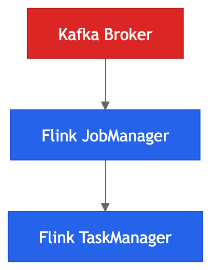
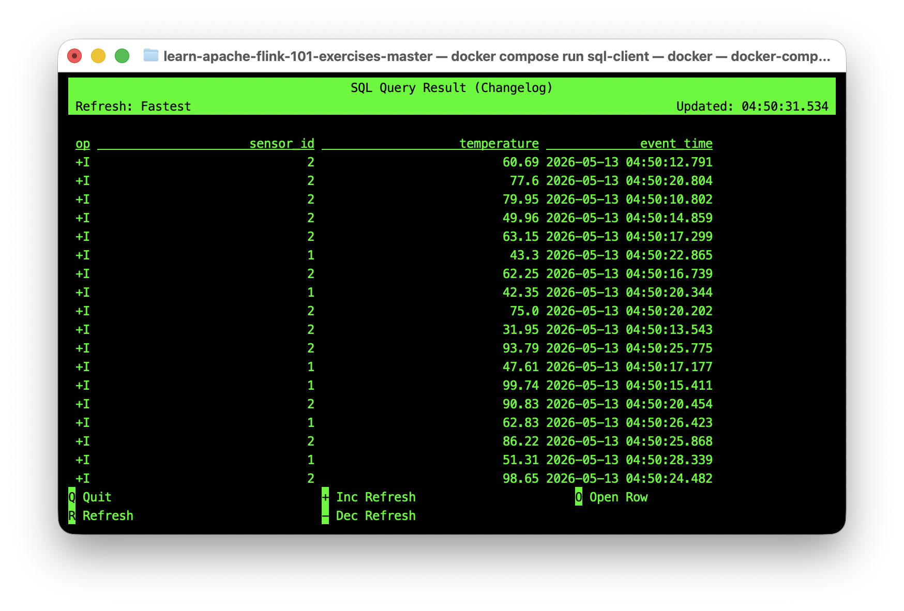
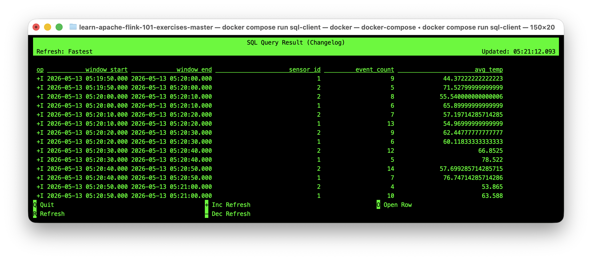

# Event-Time Hands-On Lab

## Overview

- Events arriving out of order
- Watermarks progressing
- Windows opening and closing
- Late data being handled
- State accumulating and being released


| Concept | Reality |
| --- | --- |
| Event-time order | Not the same as chronological order |
| Watermarks | Heuristic estimates, not guarantees |
| Late events | Common and expected, not edge cases |
| Window latency | A necessary cost of correctness |
| Processing-time windows | Simple but inaccurate |
| Event-time windows | Correct but operationally complex |
| State growth | A real production concern |
| Trade-offs | Correctness vs latency |

---

## Step 1: Start the Streaming Platform

Navigate to the Flink exercises directory:

```bash
cd learn-apache-flink-101-exercises-master
```

Start the containerised streaming platform:

```bash
docker compose up --build -d
```



This starts:

| Container | Role |
| --- | --- |
| `broker` | Kafka message broker |
| `jobmanager` | Flink coordinator |
| `taskmanager` | Flink worker nodes |
| `sql-client` | Interactive SQL CLI |


Verify all containers are running:

```bash
docker ps
```

4 containers should appear in the `Up` state.

---

## Step 2: Open the Flink SQL CLI

Enter the Flink SQL interactive environment:

```bash
docker compose run sql-client
```

The prompt appears as:

```
Flink SQL> 
```

Queries entered here execute as distributed stream jobs, not traditional database queries.

---

## Step 3: Create an Event-Time Source Table

Run this statement:

```sql
CREATE TABLE sensor_events (
    sensor_id STRING,
    temperature DOUBLE,
    event_time TIMESTAMP(3),
    WATERMARK FOR event_time AS event_time - INTERVAL '5' SECOND
) WITH (
    'connector' = 'faker',
    'fields.sensor_id.expression' = '#{Number.numberBetween ''1'',''3''}',
    'fields.temperature.expression' = '#{Number.randomDouble ''2'',''20'',''100''}',
    'fields.event_time.expression' = '#{date.past ''15'',''SECONDS''}',
    'rows-per-second' = '2'
);
```

### What This Does

This creates a **simulated event stream** with:

| Component | Purpose |
| --- | --- |
| `sensor_id` | Identifier (values 1-3) |
| `temperature` | Measurement payload |
| `event_time` | When the event actually occurred |
| `WATERMARK ... - INTERVAL '5' SECOND` | Allow events to arrive up to 5 seconds late |
| `'connector' = 'faker'` | Generate synthetic data |
| `'date.past ''15'',''SECONDS'''` | Events timestamped up to 15 seconds in the past |
| `'rows-per-second' = '2'` | Emit 2 events per second |

The watermark line is significant:

```sql
WATERMARK FOR event_time AS event_time - INTERVAL '5' SECOND
```

This does **not** mean:

```text
Wait 5 seconds after receiving each record
```

Instead, it means:

```text
Current watermark = latest observed event_time - 5 seconds
```

Watermarks are based on **event time**, not wall-clock processing time.

Flink continuously tracks the newest event timestamp it has seen. The watermark lags behind that timestamp by 5 seconds to allow slightly delayed events to still arrive before windows are finalised.

For example:

| Latest observed event_time | Current watermark |
| --- | --- |
| `10:00:15` | `10:00:10` |
| `10:00:20` | `10:00:15` |
| `10:00:35` | `10:00:30` |

This tells Flink:

```text
"I believe I have probably seen all events up to this watermark time."
```

### Why this matters

Suppose an event has:

```text
event_time = 10:00:09
```

but arrives later due to:

- network latency
- mobile buffering
- retries
- Kafka lag
- regional outages

If the watermark has already progressed past `10:00:09`, Flink may consider the event late.

This is the core trade-off:

| Priority | Result |
| --- | --- |
| Larger watermark delay | Better correctness, higher latency |
| Smaller watermark delay | Lower latency, more late-event risk |

Watermarks determine when Flink considers a window safe to close.

---

## Step 4: Observe Raw Events Arriving

Execute: `SET 'sql-client.execution.result-mode' = 'changelog';` to see changes as they happen.

Then run:

```sql
SELECT * FROM sensor_events;
```

Continuously arriving rows appear:




### Critical Observation

**Notice the timestamps are NOT in order.**

This is **out-of-order data**, the normal state of distributed systems. Events can arrive in any order. This is not a bug, it's a fundamental reality of real-world data.

### Why Distributed Systems Produce Disorder

| Source of Delay | Impact |
| --- | --- |
| Mobile connectivity | Device loses signal, buffers events, reconnects later |
| Network latency | Different paths from producer to broker |
| Retries | Failed send attempts delay delivery |
| Kafka lag | Consumer falls behind, batches catch up |
| Regional outages | Events from one region batch-delayed |
| Edge buffering | IoT devices queue events locally |
| Batch uploads | Periodic flush of cached data |

Streaming systems must tolerate this as the baseline, not the exception.

---

## Step 5: Create a Tumbling Event-Time Window

| Window type | Characteristics | Common use cases | Example |
| --- | --- | --- | --- |
| Tumbling | Fixed size, non-overlapping. Each event belongs to exactly one window. | Fixed-interval reporting, billing cycles | Count orders every 5 minutes: `[00:00–00:05)`, `[00:05–00:10)` |
| Sliding | Overlapping. One event can belong to multiple windows. Higher compute cost. | Moving averages, trend detection | Compute 10-minute average CPU usage, sliding every 1 minute |
| Session | Groups bursts of activity separated by inactivity gaps. Window size is dynamic. | Clickstream analytics, gaming sessions, mobile app behavior | Group all page views from a user until they are inactive for 30 minutes |

Window boundaries are:

```text
[start, end)
```

This means:

- window start is inclusive
- window end is exclusive

For example:

| Event time | Window |
| --- | --- |
| `10:00:00.000` | `[10:00:00 → 10:00:10)` |
| `10:00:09.999` | `[10:00:00 → 10:00:10)` |
| `10:00:10.000` | `[10:00:10 → 10:00:20)` |

Run a windowed aggregation:

```sql
SELECT
    window_start,
    window_end,
    sensor_id,
    COUNT(*) AS event_count,
    AVG(temperature) AS avg_temp
FROM TABLE(
    TUMBLE(
        TABLE sensor_events,
        DESCRIPTOR(event_time),
        INTERVAL '10' SECOND
    )
)
GROUP BY
    window_start,
    window_end,
    sensor_id;
```

This query groups sensor events into 10-second event-time windows. For each window and sensor, it counts events and calculates average temperature. Results are emitted only after the watermark advances past the window boundary.

Press Ctrl+C after 30 seconds.


### What This Query Does



| Clause | Meaning |
| --- | --- |
| `TUMBLE(..., INTERVAL '10' SECOND)` | Group events into non-overlapping 10-second windows |
| `DESCRIPTOR(event_time)` | Use the event-time column for windowing |
| `GROUP BY window_start, window_end, sensor_id` | Separate results per window and sensor |
| `COUNT(*), AVG(temperature)` | Aggregate within each window |

### What's Happening Internally

For each event, Flink:

1. **Extracts** the event timestamp (`event_time`)
2. **Determines** which window it belongs to
3. **Updates** that window's aggregate state
4. **Waits** for the watermark to pass the window end
5. **Emits** the final result when ready
6. **Cleans up** the window's state


## Step 6: Observe Window Latency

Windows do not emit immediately when their end time is reached. Window boundaries and watermark progression are two separate concepts.

### Important Distinction

| Concept | Purpose |
| --- | --- |
| Window size | Defines how events are grouped |
| Watermark | Determines when Flink believes a window is complete |

The query defines windows using:

```sql
INTERVAL '10' SECOND
```

This creates windows like:

```text
06:08:00 → 06:08:10
06:08:10 → 06:08:20
06:08:20 → 06:08:30
```

However, the watermark determines when those windows are allowed to emit results.

### The Window Closure Problem

Suppose Flink has a window:

```text
06:08:00 → 06:08:10
```

Emitting at the window boundary would be incorrect:

An event with:

```text
event_time = 06:08:09
```

might arrive later due to:

- network latency
- mobile buffering
- retries
- Kafka lag
- distributed system delays

If Flink closed the window immediately at `06:08:10`, it could miss valid events.

### The Watermark Solution

Flink waits until the watermark progresses beyond the window end before emitting.

With:

```sql
WATERMARK FOR event_time AS event_time - INTERVAL '5' SECOND
```

the watermark lags behind the newest observed event time by 5 seconds.

Example:

| Latest observed event_time | Watermark | Window `[06:08:00 → 06:08:10)` |
| --- | --- | --- |
| `06:08:05` | `06:08:00` | Open |
| `06:08:10` | `06:08:05` | Open |
| `06:08:15` | `06:08:10` | CLOSE & EMIT |

At this point, Flink believes:

```text
"I have probably seen all events up to 06:08:10."
```

So the window can safely emit.

### Extremely Important Realisation

Watermarks are based on:

```text
event-time progression
```

NOT:

```text
wall-clock time
```

This means Flink is tracking:

```text
latest observed event timestamps
```

rather than the actual system clock.

### Debugging Watermarks

Note the watermark time is currently set to `event_time <= current_watermark`, which means any event with an `event_time` earlier than the watermark is considered late.

Run this query to inspect watermark progression and determine whether events are considered late:

```sql
SELECT
    sensor_id,
    temperature,
    event_time,
    CURRENT_WATERMARK(event_time) AS current_watermark,
    CASE
        WHEN event_time <= CURRENT_WATERMARK(event_time)
        THEN 'LATE'
        ELSE 'ON TIME'
    END AS event_status
FROM sensor_events;
```

Example output:

```text
sensor_id temperature event_time              current_watermark       event_status
1         90.56       06:11:27.452            06:11:33.016           LATE
1         75.06       06:11:31.817            06:11:33.016           LATE
2         81.01       06:11:36.463            06:11:33.016           ON TIME
```

### How to interpret this

An event is considered late when:

```text
event_time <= current_watermark
```

This means the event belongs to a point in event time that Flink believes has already passed.

For example:

| event_time | current_watermark | Status | Meaning |
| --- | --- | --- | --- |
| `06:11:27.452` | `06:11:33.016` | `LATE` | Event time is older than the watermark |
| `06:11:31.817` | `06:11:33.016` | `LATE` | Event arrived behind Flink's event-time progress |
| `06:11:36.463` | `06:11:33.016` | `ON TIME` | Event is still ahead of the watermark |

The watermark represents how far Flink believes event time has progressed.

So if the watermark is:

```text
06:11:33.016
```

Flink is effectively saying:

```text
"I believe I have probably already seen all events up to 06:11:33.016."
```

Any event arriving with an earlier timestamp may now be considered late.

### The Trade-Off

| Priority | Approach | Cost |
| --- | --- | --- |
| Correctness | Conservative watermark (larger delay) | Higher latency |
| Lower latency | Aggressive watermark (smaller delay) | More late events |

Production systems typically prioritise correctness and accept the additional latency.


---

## Step 7: Compare Event-Time vs Processing-Time Windowing

The previous examples used `event_time`, meaning Flink grouped events based on when they actually occurred. This step compares that with `PROCTIME()`, which groups events based on when Flink received and processed them.

---

### Create a Processing-Time Table

Create the table:

```sql
CREATE TABLE processing_time_events (
    sensor_id STRING,
    temperature DOUBLE,
    proc_time AS PROCTIME()
) WITH (
    'connector' = 'faker',
    'fields.sensor_id.expression' = '#{Number.numberBetween ''1'',''3''}',
    'fields.temperature.expression' = '#{Number.randomDouble ''2'',''20'',''100''}',
    'rows-per-second' = '2'
);
```

Notice something important:

| Event-Time Table | Processing-Time Table |
| --- | --- |
| Has `event_time` column | No event timestamp |
| Has watermark definition | No watermark |
| Uses timestamps inside events | Uses Flink system clock |

Instead of event timestamps, this table creates:

```sql
proc_time AS PROCTIME()
```

This tells Flink:

```text
Assign time when the event is processed by Flink.
```

---

### Create a Processing-Time Window

Run:

```sql
SELECT
    window_start,
    window_end,
    sensor_id,
    COUNT(*) AS event_count
FROM TABLE(
    TUMBLE(
        TABLE processing_time_events,
        DESCRIPTOR(proc_time),
        INTERVAL '10' SECOND
    )
)
GROUP BY
    window_start,
    window_end,
    sensor_id;
```

Example output:

```text
op  window_start              window_end           sensor_id  event_count
+I  2026-05-13 06:32:20.000  2026-05-13 06:32:30.000  1          11
+I  2026-05-13 06:32:20.000  2026-05-13 06:32:30.000  2          7
+I  2026-05-13 06:32:30.000  2026-05-13 06:32:40.000  2          12
+I  2026-05-13 06:32:30.000  2026-05-13 06:32:40.000  1          8
```

These windows emit predictably every 10 seconds based on the machine clock.

No watermarks are involved.

---

### The Core Difference

Consider a mobile phone that loses connectivity for 30 seconds. Actions taken during the outage are buffered on the device and uploaded after reconnection.

---

### Event-Time Processing

Event-time processing cares about:

```text
When the event actually happened
```

Suppose the user clicked a button at:

```text
10:00:05
```

but the event does not arrive until:

```text
10:00:25
```

Event-time processing still places the event into:

```text
Window: 10:00:00 → 10:00:10
```

because that is when the event actually occurred. This produces more correct analytics.


### Processing-Time Processing

Processing-time processing cares about:

```text
When Flink received the event
```

The exact same delayed event arriving at:

```text
10:00:25
```

would instead be placed into:

```text
Window: 10:00:20 → 10:00:30
```

even though the event actually happened earlier.

This is simpler and lower latency, but less correct.


### Why Watermarks Matter

Event-time processing requires watermarks because Flink must decide:

```text
"When is it safe to finalise a window?"
```

Processing-time does not need watermarks because windows close directly based on wall-clock time.

This is why processing-time windows emit predictably every 10 seconds.

Event-time windows emit based on:

- watermark progression
- event arrival patterns
- out-of-order tolerance

---

### Key Differences

| Aspect | Event Time | Processing Time |
| --- | --- | --- |
| Measures | When the event actually happened | When Flink received the event |
| Time source | Event timestamp | System clock |
| Watermarks required | Yes | No |
| Handles delayed events | Yes | No |
| Output timing | Depends on watermark progression | Predictable wall-clock intervals |
| Correctness | Higher | Lower |
| Latency | Higher | Lower |
| Complexity | Higher | Simpler |

---

### When To Use Each

| Use Case | Best Choice | Why |
| --- | --- | --- |
| Billing systems | Event time | Financial correctness matters |
| Fraud detection | Event time | Delayed events still matter |
| User analytics | Event time | Behaviour should reflect actual user activity time |
| Real-time dashboards | Processing time | Fast updates matter more than perfect correctness |
| Infrastructure monitoring | Processing time | Simplicity and low latency preferred |

---

### Summary

Event time and processing time can produce completely different results from identical data. The time model chosen has a direct impact on correctness, latency, and operational complexity.


## Step 8: Observe Extreme Late Data

Create a stream where events are likely to arrive late:

```sql
CREATE TABLE delayed_events (
    sensor_id STRING,
    event_time TIMESTAMP(3),
    WATERMARK FOR event_time AS event_time - INTERVAL '2' SECOND
) WITH (
    'connector' = 'faker',
    'fields.sensor_id.expression' = '#{Number.numberBetween ''1'',''2''}',
    'fields.event_time.expression' = '#{date.past ''30'',''SECONDS''}',
    'rows-per-second' = '1'
);
```

### Why this creates late events

This table intentionally creates a mismatch between event delay and watermark tolerance.

| Setting | Meaning |
| --- | --- |
| `'date.past ''30'',''SECONDS'''` | Events can be timestamped up to 30 seconds in the past |
| `event_time - INTERVAL '2' SECOND` | Flink only waits 2 seconds behind the latest observed event time |
| Result | Many events will be older than the current watermark and treated as late |

Compared with the earlier `sensor_events` table:

| Parameter | `sensor_events` | `delayed_events` |
| --- | --- | --- |
| Max event age | 15 seconds | 30 seconds |
| Watermark tolerance | 5 seconds | 2 seconds |
| Late event likelihood | Lower | High |

### Run a windowed aggregation

First, run a 5-second tumbling window:

```sql
SELECT
    window_start,
    window_end,
    COUNT(*) AS cnt
FROM TABLE(
    TUMBLE(
        TABLE delayed_events,
        DESCRIPTOR(event_time),
        INTERVAL '5' SECOND
    )
)
GROUP BY
    window_start,
    window_end;
```

This shows emitted window results, but it does **not** clearly show which individual events were late. 

To directly observe late events, use the debug query below.

### Debug late events directly

Run:

```sql
SELECT
    sensor_id,
    event_time,
    CURRENT_WATERMARK(event_time) AS current_watermark,
    CASE
        WHEN event_time <= CURRENT_WATERMARK(event_time)
        THEN 'LATE'
        ELSE 'ON TIME'
    END AS event_status
FROM delayed_events;
```

Example output:

```text
op  sensor_id  event_time               current_watermark        event_status
+I  1          2026-05-13 07:06:54.586  2026-05-13 07:07:02.256  LATE
+I  1          2026-05-13 07:06:39.496  2026-05-13 07:07:02.256  LATE
+I  1          2026-05-13 07:07:04.540  2026-05-13 07:07:02.256  ON TIME
+I  1          2026-05-13 07:06:44.190  2026-05-13 07:07:02.540  LATE
```

### How to read this output

The watermark is currently at: `WATERMARK FOR event_time AS event_time - INTERVAL '2' SECOND`, which means Flink is allowing events to arrive up to 2 seconds late `Current watermark = latest observed event_time - 2 seconds`

An event is considered late when:

```text
event_time <= current_watermark
```

For example:

| event_time | current_watermark | Status | Meaning |
| --- | --- | --- | --- |
| `07:06:54.586` | `07:07:02.256` | `LATE` | The event time is older than the watermark |
| `07:06:39.496` | `07:07:02.256` | `LATE` | The event arrived far behind Flink's event-time progress |
| `07:07:04.540` | `07:07:02.256` | `ON TIME` | The event time is still ahead of the watermark |

The watermark represents how far Flink believes event time has progressed.

So when the watermark is:

```text
07:07:02.256
```

Flink is effectively saying:

```text
"I believe I have probably seen all events up to 07:07:02.256."
```

If a new event arrives with an `event_time` earlier than that, Flink treats it as late.

### Important observation

- The windowed aggregation shows final emitted window results.
- The debug query shows individual event lateness.

This distinction matters:

| Query | What it shows |
| --- | --- |
| Windowed aggregation | Final counts per window |
| Debug watermark query | Whether each event is late or on time |

### Why late data is hard

Late events are difficult because the window they belong to may already have emitted its result.

At that point, the system must decide what to do:

| Strategy | When to use | Trade-off |
| --- | --- | --- |
| Drop late events | Non-critical analytics | Fast, but loses data |
| Increase watermark delay | Known delay patterns | More correct, but slower results |
| Send to side output / dead-letter stream | Debugging and recovery | More operational complexity |
| Reprocess later | Critical reporting | More accurate, but delayed |
| Custom domain logic | Business-specific rules | More application complexity |

In production, late data should not be treated as an edge case. It is a normal part of distributed systems, particularly in pipelines dealing with mobile apps, IoT devices, retries, Kafka lag, and regional network delays.


## Step 9: Inspect the Flink Web UI

From a separate terminal (without exiting the SQL CLI), open:

```
http://localhost:8081
```

### What To Observe

| Section | What it shows |
| --- | --- |
| **Running Jobs** | Active SQL queries |
| **Operator Graph** | How the query is distributed across operators |
| **Task Execution** | Which nodes are processing data |
| **Checkpoints** | Fault tolerance snapshots |
| **Backpressure** | Whether downstream operators are slow |
| **Parallelism** | Number of parallel tasks per operator |

A SQL query submitted to Flink is not executed as a traditional query. It compiles into a distributed execution graph with multiple tasks coordinating across machines.

---

## Step 10: Understand State and Memory

Each open window maintains **state**:

```
Window [10:00-10:10] for sensor 1:
  count = 7
  sum_temp = 420.33
  
Window [10:00-10:10] for sensor 2:
  count = 5
  sum_temp = 380.22
```

Flink stores this in memory (or disk for large state).

### Why State Size Matters

| Factor | Impact |
| --- | --- |
| **Larger windows** | More state stored longer |
| **Higher lateness tolerance** | Windows stay open longer |
| **More parallelism** | Each task maintains separate state |
| **Memory limits** | State can exceed available heap |

State management is why window sizing is an **architectural decision**, not just a config parameter.

At production scale, a 10-minute window with millions of unique keys could consume terabytes.

---

## Step 11: Cleanup

Exit the SQL CLI:

```bash
quit;
```

Stop the containers:

```bash
docker compose down -v
```


### Core Mental Model

Streaming systems exist to answer one question:

> **How does a system produce correct results over unreliable, delayed, out-of-order distributed events?**

Event-time windowing and watermarks are Flink's answer. Together they allow a distributed system to reason about when events occurred—not just when they arrived—and make principled decisions about correctness, latency, and resource use under uncertainty.