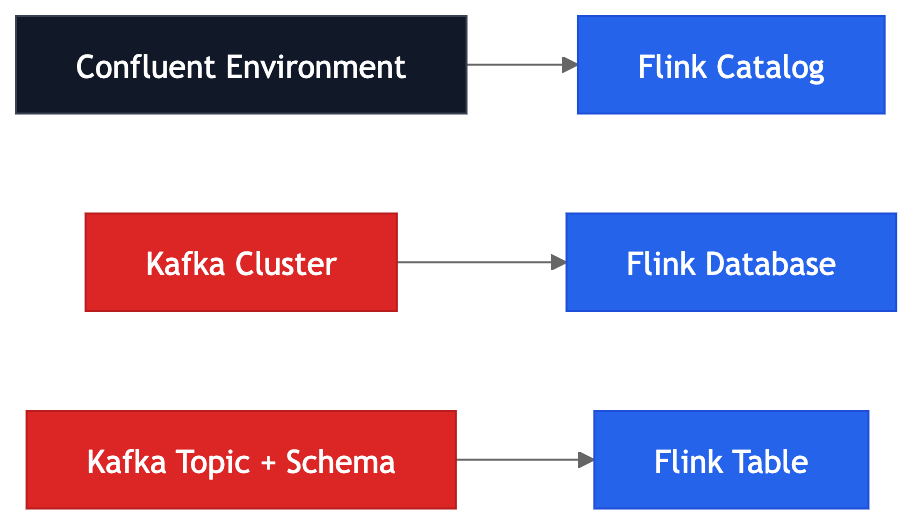

# Dynamic Tables, Changelog Streams, and Why Flink SQL Is Not Normal SQL

## Overview

In Flink SQL, a table is typically a continuously evolving abstraction over an event stream, not a fixed dataset scanned once and returned. This model is the foundation of dynamic tables and explains why streaming SQL behaves differently from traditional database SQL.

| Traditional SQL table | Flink dynamic table |
| --- | --- |
| Usually finite at query time | Potentially unbounded over time |
| Query execution completes | Query execution often runs continuously |
| Result is a final snapshot | Result evolves as new events arrive |

## Why Traditional SQL Intuition Breaks

A grouped aggregation in a database usually runs over finite data and returns a final result:

```sql
SELECT customer_id, COUNT(*)
FROM orders
GROUP BY customer_id;
```

In Flink SQL, if `orders` is backed by a stream, the same query becomes a long-running distributed computation. Counts continue to change as events continue to arrive.

## Dynamic Table Definition

A dynamic table is a logical table that evolves as changes are applied over time.

| Time | order_id | customer_id | amount |
| --- | --- | --- | --- |
| T1 | o1 | 101 | 50 |
| T2 | o1, o2 | 101, 102 | 50, 90 |
| T3 | o1, o2, o3 | 101, 102, 101 | 50, 90, 30 |

The representation appears relational, but the underlying source is a stream of events.

## Stream-Table Duality

Stream-table duality means stream and table are two views of the same system state:

| View | Interpretation |
| --- | --- |
| Stream | Sequence of change events |
| Table | Current state after applying those changes |

This duality enables SQL-based transformations over streaming data while preserving event semantics.

## Changelog Streams

When a dynamic table changes, Flink represents those changes as a changelog stream.

| Changelog event | Meaning |
| --- | --- |
| `+I` | Insert row |
| `-U` | Retract previous row version (update-before) |
| `+U` | Emit new row version (update-after) |
| `-D` | Delete row |

This event model allows mutable table state to be expressed on append-oriented transport layers.

### Example: Grouped Count Over Orders

```sql
SELECT customer_id, COUNT(*) AS order_count
FROM orders
GROUP BY customer_id;
```

If customer `101` receives successive orders, the output may evolve as:

| Event | customer_id | order_count |
| --- | --- | --- |
| `+I` | 101 | 1 |
| `-U` | 101 | 1 |
| `+U` | 101 | 2 |
| `-U` | 101 | 2 |
| `+U` | 101 | 3 |

## Append-Only vs Updating Results

Not all SQL queries produce the same output mode.

| Query pattern | Typical output mode | Reason |
| --- | --- | --- |
| Filter | Append-only | Each matching row emitted once |
| Projection | Append-only | Row shape changes, not row identity |
| Stateless enrichment | Usually append-only | Adds fields without revising prior outputs |
| Grouped aggregation | Updating | Result per key changes over time |
| Deduplication | Updating or append-only | Candidate row may be replaced |
| Join | Often updating | Late matches may revise prior results |
| Windowed aggregation | Often append-like after close | Final emission at window completion |

## Why State Is Required

Dynamic computations require state to track intermediate results.

| Operation | State required |
| --- | --- |
| `COUNT(*) BY key` | Current count per key |
| Windowed average | Running sum/count per active window |
| Stream join | Buffered unmatched records per side |

State locality also matters. If related keys are not co-located, network shuffles increase latency and operational complexity.

## Sink Compatibility

A sink is the destination where Flink writes query results.

Different sinks support different types of changes. Some sinks only support appending new rows, while others can also handle updates and deletions.

This matters because many Flink queries produce a changelog stream rather than a simple append-only stream. For example, aggregations and joins may continuously update previous results as new events arrive.

| Change type | Meaning |
| --- | --- |
| Insert (`+I`) | New row added |
| Update Before (`-U`) | Previous version of a row removed |
| Update After (`+U`) | Updated version of a row emitted |
| Delete (`-D`) | Row removed |

For example:

- Kafka topics are typically append-only sinks
- Databases may support updates and deletes
- Upsert Kafka sinks support keyed updates
  - Upsert means update if key exists, insert if not
- File sinks often prefer append-only output

Choosing the correct sink is important because the sink must be compatible with the type of stream your query produces.

A frequent production failure point is mismatch between query output mode and sink capability.

| Sink capability | Can handle |
| --- | --- |
| Insert-only sink | `+I` only |
| Upsert/changelog sink | `+I`, updates, and often deletes |

If an updating query writes to an insert-only sink, the pipeline may fail or silently produce incorrect downstream results.

## Why Primary Keys Matter

Updating sinks need a stable key to identify which row should be replaced.

| Sink type | Key usage |
| --- | --- |
| Upsert Kafka | Record key identifies logical row |
| JDBC | Primary key identifies row to update |
| Elasticsearch | Document ID identifies replacement target |
| Merge-based warehouse sink | Key identifies merge target |

Without keys, updates can degrade into duplicate inserts or undefined write behavior.

## Relationship Between Kafka Topics and Flink Tables

Kafka stores immutable records in partitioned logs. Flink interprets those records as structured rows using schema, format, and connector metadata.

| Layer | Responsibility |
| --- | --- |
| Kafka topic | Durable event storage |
| Schema/format | Record structure and parsing |
| Flink table | Relational abstraction over stream |

This distinction is central: Kafka does not store tables; Flink derives table semantics from event logs.

## Materialized Views in Streaming Architectures

A dynamic table is the live logical result; a materialized view is the physically maintained serving form in an external sink.

In other words, a materialized view is a snapshot of the dynamic table state at a point in time, continuously updated as the underlying dynamic table changes.

For example, a Flink SQL query may maintain an upsert Kafka topic as a materialized view of the dynamic table. The query continuously updates the topic as new events arrive and the dynamic table evolves.

Common pattern:

1. Ingest immutable raw events.
2. Apply continuous Flink SQL transformations.
3. Maintain serving tables/views through changelog-aware sinks.

## Why Changelog Outputs Are Hard Downstream

Many consumers are built for insert-only semantics and do not handle retractions correctly.

An API endpoint may expect one call per event. A file sink may expect append-only rows. A dashboard may expect stable results. A data lake table may require merge semantics to handle updates.

If the Flink query produces a changelog stream with updates and deletes, but the downstream consumer only supports inserts, you may see:

| Symptom | Typical cause |
| --- | --- |
| Duplicate rows | Updates appended as new facts |
| Incorrect aggregates | Retractions ignored |
| Dashboard instability | High-frequency updates shown directly |
| Sink errors | Sink rejects update/delete mode |

This is why real-time architecture is not only about Flink. It is about the contract between Flink and every downstream consumer.

## Planner and Runtime Behavior

Flink SQL execution pipeline:

1. Parse SQL.
2. Build logical plan.
3. Apply optimiser rules.
4. Build physical plan.
5. Execute distributed operators with state and checkpointing.

Simple SQL syntax can therefore imply non-trivial operational behavior at runtime.

## Confluent Cloud Mapping (Context)

In Confluent Cloud, Flink SQL operates over Kafka topics using managed infrastructure. The concepts remain the same, but the platform automates much of the operational setup.

Kafka environments map to Flink catalogs, Kafka clusters map to Flink databases, and Kafka topics with schemas map to Flink tables.





| Confluent construct | Flink construct |
| --- | --- |
| Environment | Catalog |
| Kafka Cluster | Flink Database |
| Kafka Topic + schema | Flink Table |

The conceptual model remains unchanged: Flink SQL operates over Kafka-backed dynamic tables.

## Common Misconceptions

| Misconception | Correction |
| --- | --- |
| "A Flink table stores data like a database table." | A Flink table is usually a logical view over external stream storage. This means it does not persist data itself but interprets the underlying stream. |
| "SQL results are always final." | Streaming results can be revised through changelog updates. |
| "Any sink can consume SQL output." | Sink must support the changelog mode produced by the query. |

## Core Mental Model

A Flink SQL table is a continuously maintained interpretation of a stream.

A Flink SQL query is a long-running distributed computation that may maintain state indefinitely and emit changelog updates over time.

## Final Architecture Model

1. Producers emit immutable events.
2. Kafka persists events in partitioned logs.
3. Schema and format metadata define row structure.
4. Flink exposes records as dynamic tables.
5. SQL transformations run continuously with state.
6. Results are emitted as append-only or changelog streams.
7. Sinks apply updates only if compatibility and key design are correct.