# Hands-On: Dynamic Tables and Changelog Streams

## Objective

This lab makes dynamic tables and changelog streams observable in practice. It focuses on one core distinction:

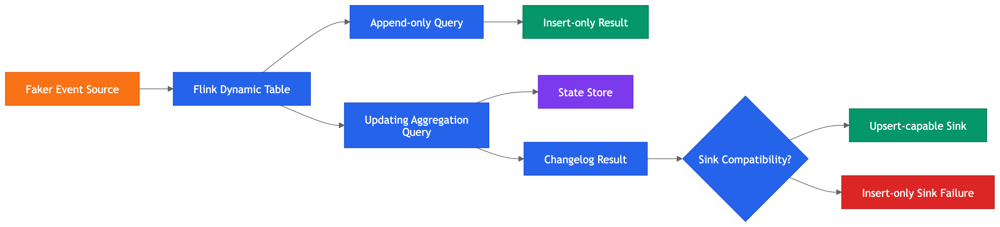

- Append-only query output
- Updating query output (changelog/upsert)


| Concept | Practical implication |
| --- | --- |
| Flink SQL over streams | Query runs continuously, not once |
| Dynamic table | Result can change as events arrive |
| Changelog output | Sinks must support updates/deletes when produced |

## Architecture Used

| Component | Role |
| --- | --- |
| Faker source | Generates synthetic order events |
| Flink table (`orders`) | Structured stream abstraction |
| Flink runtime | Executes SQL as distributed streaming jobs |
| State store | Maintains aggregation results |
| Kafka sinks | Receives append-only or upsert/changelog outputs |

## Step 1: Start Local Environment

```bash
cd learn-apache-flink-101-exercises-master
docker compose up --build -d
docker ps
```

Expected runtime includes Kafka broker, Flink JobManager, Flink TaskManager, and SQL client.

Open SQL client:

```bash
docker compose run sql-client
```

Expected prompt:

```text
Flink SQL>
```

## Step 2: Enable Changelog Result Mode

```sql
SET 'sql-client.execution.result-mode' = 'changelog';
```

This mode shows change records explicitly.

| Symbol | Meaning |
| --- | --- |
| `+I` | Insert |
| `-U` | Update-before (retract previous value) |
| `+U` | Update-after (emit new value) |
| `-D` | Delete |

## Step 3: Create Source Table (`orders`)


```sql
CREATE TABLE orders (
    order_id STRING,
    customer_id STRING,
    product_id STRING,
    amount DOUBLE,
    order_time TIMESTAMP(3)
) WITH (
    'connector' = 'faker',
    'fields.order_id.expression' = '#{Internet.uuid}',
    'fields.customer_id.expression' = '#{Number.numberBetween ''1'',''5''}',
    'fields.product_id.expression' = '#{Number.numberBetween ''100'',''105''}',
    'fields.amount.expression' = '#{Number.randomDouble ''2'',''10'',''500''}',
    'fields.order_time.expression' = '#{date.past ''10'',''SECONDS''}',
    'rows-per-second' = '2'
);
```

`orders` is a streaming source definition, not a persisted database table. It generates synthetic events that represent incoming orders. Each event is a new fact, and the table abstraction enables SQL queries over this stream.

Explaination of the table definition:
| Clause | Purpose |
| --- | --- |
| `CREATE TABLE orders` | Defines a new table abstraction named `orders`. |
| Column definitions | Specifies the schema of the table (order_id, customer_id, etc.).
| `WITH (...)` | Configures the table's connector and data generation logic. |
| `connector = 'faker'` | Uses the Faker connector to generate synthetic data. |
| `fields.order_id.expression` | Defines how to generate `order_id` values (UUIDs). |
| `fields.customer_id.expression` | Defines how to generate `customer_id` values (random numbers between 1 and 5). |
| `fields.product_id.expression` | Defines how to generate `product_id` values (random numbers between 100 and 105). |
| `fields.amount.expression` | Defines how to generate `amount` values (random doubles between 10 and 500). |
| `fields.order_time.expression` | Defines how to generate `order_time` values (timestamps within the past 10 seconds). |
| `rows-per-second` | Controls the rate of event generation (2 events per second). |

## Step 4: Observe Raw Stream Behavior (Append-Only)

```sql
SELECT *
FROM orders;
```

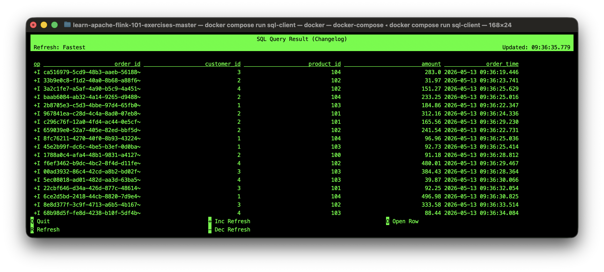

This query is append-only because every generated order is a new fact. Flink does not need to update previous results. It simply emits each event as an insert.

Stop query with `Ctrl+C`.

## Step 5: Run Stateless Projection (Still Append-Only)

This is still append-only.


Flink is only reshaping each incoming event. It is not remembering prior rows. It is not calculating a running total. It is not changing earlier results.

```sql
SELECT
    order_id,
    customer_id,
    amount
FROM orders;
```

Projection changes shape only; it does not revise prior output rows.

Stop query with `Ctrl+C`.

## Step 6: Run Stateless Filter (Still Append-Only)

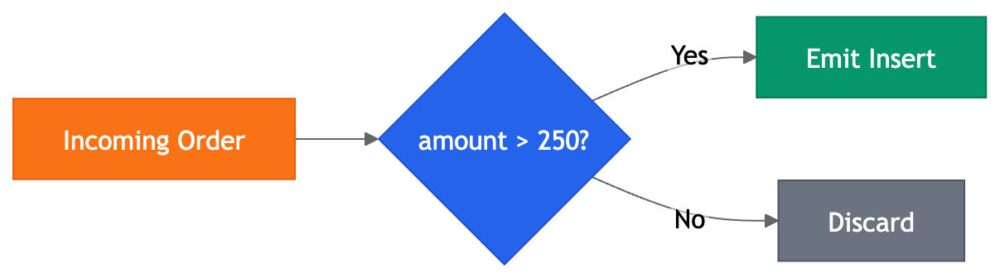

```sql
SELECT
    order_id,
    customer_id,
    amount
FROM orders
WHERE amount > 250;
```

Flink evaluates each event independently. If the amount is greater than 250, it emits the event. If not, it discards the event.

The important point is that Flink does not need to remember anything from previous events. It does not need to update or retract any prior results. Each output row is final and will not change.

Stop query with `Ctrl+C`.

## Step 7: Run Stateful Aggregation (Updating Output, not Append-Only)

```sql
SELECT
    customer_id,
    COUNT(*) AS order_count
FROM orders
GROUP BY customer_id;
```

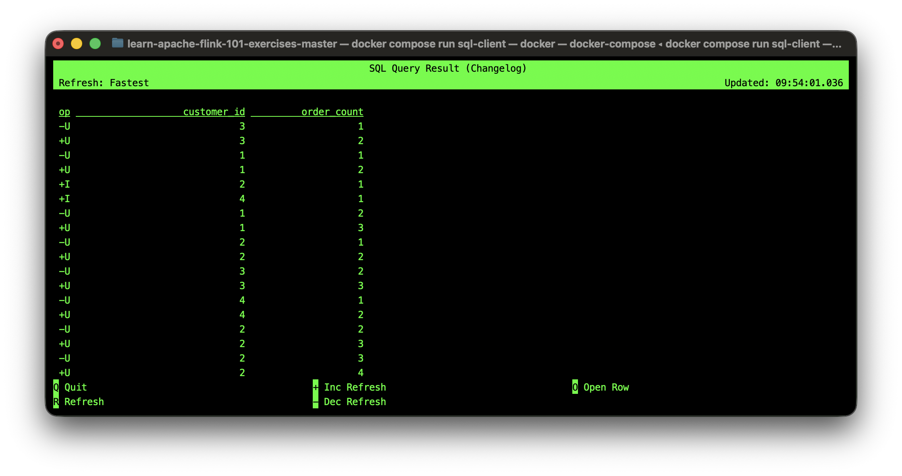

This query is not append-only because the count for each customer evolves as new orders arrive. Flink must maintain state to track the count per customer and emit updates when the count changes. Each output row represents the current count for a customer, and it can be revised multiple times as more orders come in.

Stop query with `Ctrl+C`.

## Step 8: Compare Query Runtime Modes

| Query | Output mode | Stateful | Reason |
| --- | --- | --- | --- |
| `SELECT * FROM orders` | Append-only | No | Emit each event once |
| `WHERE amount > 250` | Append-only | No | Stateless predicate filtering |
| `GROUP BY customer_id` | Updating changelog | Yes | Per-key results are revised |

## Step 9: Add Bounded Input for Easier Inspection

```sql
CREATE TABLE bounded_orders (
    order_id STRING,
    customer_id STRING,
    amount DOUBLE
) WITH (
    'connector' = 'faker',
    'fields.order_id.expression' = '#{Internet.uuid}',
    'fields.customer_id.expression' = '#{Number.numberBetween ''1'',''3''}',
    'fields.amount.expression' = '#{Number.randomDouble ''2'',''10'',''500''}',
    'rows-per-second' = '10',
    'number-of-rows' = '30'
);
```

| Option | Purpose |
| --- | --- |
| `connectors` | Defines the source of data (Faker in this case). |
| `fields.order_id.expression` | Specifies how to generate `order_id` values (UUIDs). |
| `fields.customer_id.expression` | Specifies how to generate `customer_id` values (random numbers between 1 and 3). |
| `fields.amount.expression` | Specifies how to generate `amount` values (random doubles between 10 and 500). |
| `number-of-rows` | Limits total generated events to 30, making it easier to observe the full lifecycle of the query results. |
| `rows-per-second` | Increases event generation rate to 10 per second for quicker testing. |

Then run:

```sql
SELECT
    customer_id,
    COUNT(*) AS order_count
FROM bounded_orders
GROUP BY customer_id;
```

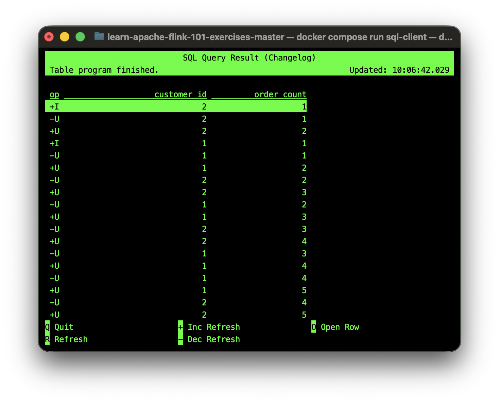


Bounded input still emits updates while aggregation is in progress. Once all 30 events are processed, the final counts are stable and no more updates occur. This makes the full evolution of results visible, from initial inserts to final stable output.

Because the data is bounded, the query is easier to reason about. Changelog behaviour is still visible, but the input eventually stops. The key lesson is that bounded input can still produce updating results while computation is in progress.

## Step 10: Compare SQL Client Display Modes

Set table mode:

```sql
SET 'sql-client.execution.result-mode' = 'table';
```

This shows only the current state of the result table, without explicit changelog events. The same final counts remain visible, but intermediate `+I/-U/+U` events are hidden. The client shows only the latest count per customer.

Example output:
| customer_id | order_count |
| --- | --- |
| 1 | 10 |
| 2 | 15 |
| 3 | 5 |

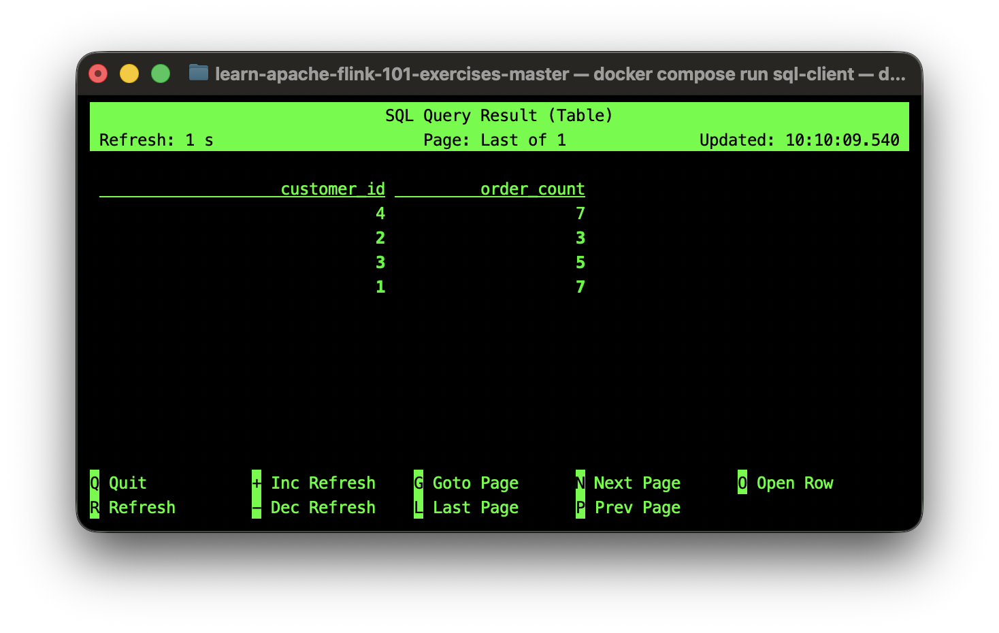

Run aggregation query and observe in-place table view.

Set changelog mode again:

```sql
SET 'sql-client.execution.result-mode' = 'changelog';
```

Run same query and observe explicit `+I/-U/+U` events.

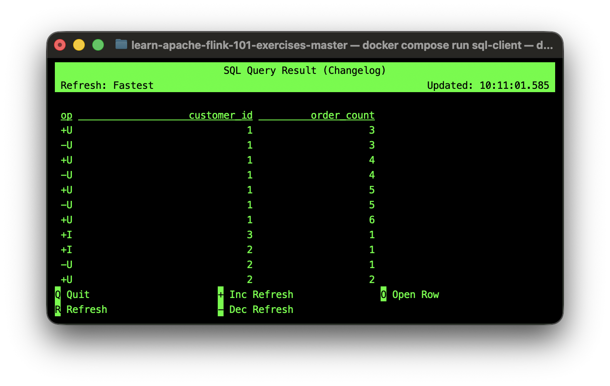

Note: execution semantics are unchanged; only client rendering differs.

## Step 11: Create Kafka Topic for Append-Only Output

In a second terminal:

```bash
docker exec -it broker bash
```

Create topic:

```bash
/opt/kafka/bin/kafka-topics.sh \
--create \
--topic high_value_orders \
--bootstrap-server localhost:9092 \
--partitions 3 \
--replication-factor 1
```

If topic exists:

```bash
/opt/kafka/bin/kafka-topics.sh \
--describe \
--topic high_value_orders \
--bootstrap-server localhost:9092
```

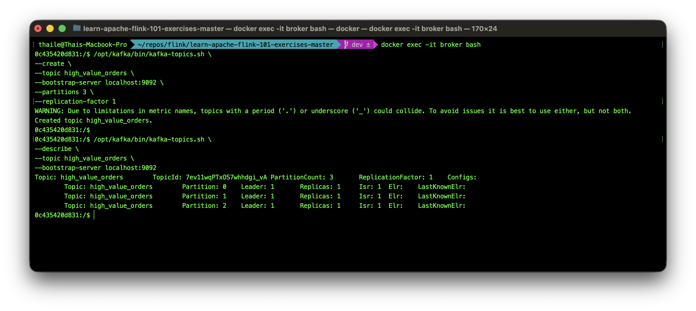

## Step 12: Define Kafka Sink Table (Insert-Only)

Back in Flink SQL client:

```sql
CREATE TABLE high_value_orders (
    order_id STRING,
    customer_id STRING,
    amount DOUBLE
) WITH (
    'connector' = 'kafka',
    'topic' = 'high_value_orders',
    'properties.bootstrap.servers' = 'broker:9092',
    'format' = 'json'
);
```

Connectors like Kafka can be configured to accept only insert records. This means they do not handle update or delete events correctly. If a changelog stream is written to an insert-only sink, duplicate rows or incorrect results may appear.


| Connector type | Typical capabilities |
| --- | --- |
| File sink | Append-only |
| Kafka sink (basic) | Append-only |
| Upsert Kafka sink | Supports updates via key-based semantics |
| JDBC sink | Supports updates if primary key is defined |

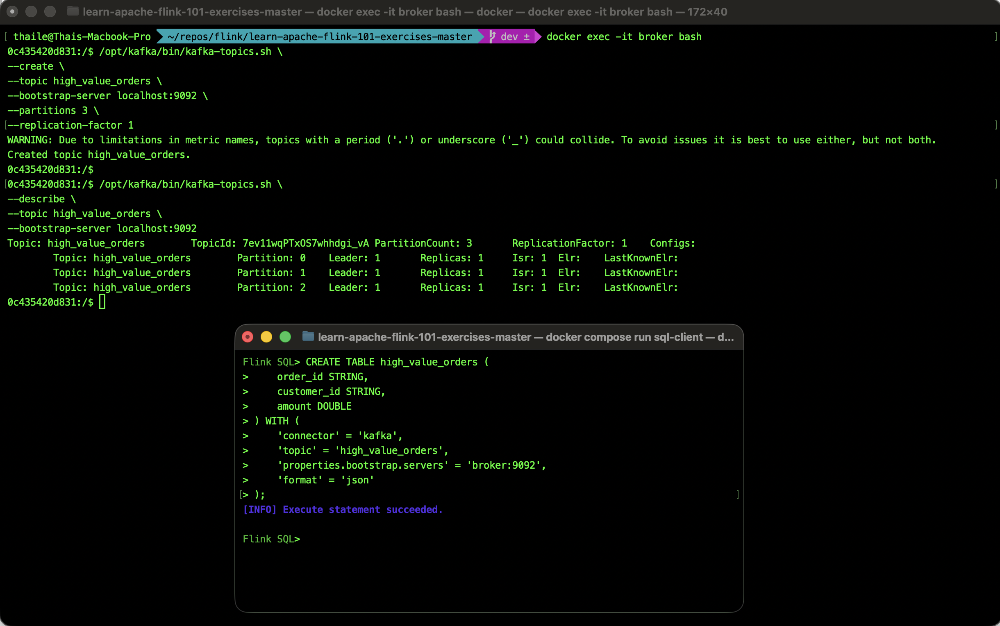


## Step 13: Write Append-Only Results to Kafka

In the Flink SQL client:

```sql
INSERT INTO high_value_orders
SELECT
    order_id,
    customer_id,
    amount
FROM orders
WHERE amount > 250;
```


This job runs continuously and emits insert records only. Each time a new order with amount > 250 arrives, it is emitted as a new record in the `high_value_orders` topic. There are no updates or deletes, so this sink is compatible with the append-only output of the query.

## Step 14: Verify Kafka Output

In broker shell:

```bash
/opt/kafka/bin/kafka-console-consumer.sh \
--topic high_value_orders \
--from-beginning \
--bootstrap-server localhost:9092
```

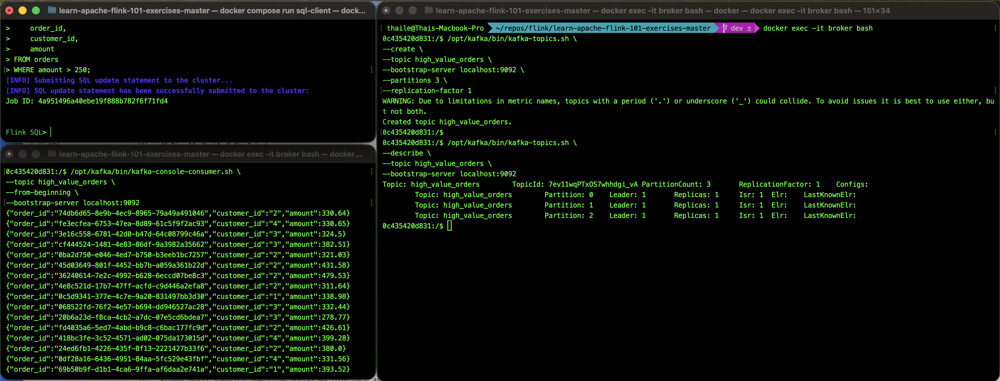

## Step 15: Why Aggregation Needs Upsert-Compatible Sink

Aggregation query output evolves per key:

```text
customer_id=1, count=1
customer_id=1, count=2
customer_id=1, count=3
```

Without upsert semantics, downstream systems may treat these as independent facts rather than revisions. This can lead to duplicate rows or incorrect results if the sink does not support updates. For example, an insert-only Kafka sink would just append each count as a new record, rather than replacing the previous count for that customer.

## Step 16: Create Upsert Topic and Sink

Create topic in broker shell:

```bash
/opt/kafka/bin/kafka-topics.sh \
--create \
--topic customer_order_counts \
--bootstrap-server localhost:9092 \
--partitions 3 \
--replication-factor 1
```

This topic is used for the aggregation query that produces updating results. An upsert sink in Flink SQL handles the changelog output of that aggregation query.

Create upsert sink in Flink SQL:

```sql
CREATE TABLE customer_order_counts (
    customer_id STRING,
    order_count BIGINT,
    PRIMARY KEY (customer_id) NOT ENFORCED
) WITH (
    'connector' = 'upsert-kafka',
    'topic' = 'customer_order_counts',
    'properties.bootstrap.servers' = 'broker:9092',
    'key.format' = 'json',
    'value.format' = 'json'
);
```

This sink is configured to handle updates based on the `customer_id` key. The `PRIMARY KEY (customer_id) NOT ENFORCED` clause provides metadata that allows the upsert Kafka connector to identify which records should be updated rather than inserted as new rows. This means that when the aggregation query emits updates for a customer, the sink will replace the previous count for that customer instead of appending a new record.

For example output in the `customer_order_counts` topic would look like:
| Key (customer_id) | Value (order_count) |
| --- | --- |
| 1 | 3 |
| 2 | 5 |
| 3 | 2 |


`PRIMARY KEY ... NOT ENFORCED` provides row identity metadata for upsert semantics.

## Step 17: Write Updating Aggregation to Upsert Sink

```sql
INSERT INTO customer_order_counts
SELECT
    customer_id,
    COUNT(*) AS order_count
FROM orders
GROUP BY customer_id;
```

This job continuously emits per-key updates.

## Step 18: Consume Upsert Topic

In broker shell:

```bash
/opt/kafka/bin/kafka-console-consumer.sh \
--topic customer_order_counts \
--from-beginning \
--property print.key=true \
--property key.separator=" | " \
--bootstrap-server localhost:9092
```

Output is keyed; each key represents an evolving logical row.

## Step 19: Compare Final Output Patterns

| Output topic | Query type | Output model | Interpretation |
| --- | --- | --- | --- |
| `high_value_orders` | Filter | Append-only | Stream of matching facts |
| `customer_order_counts` | Aggregation | Upsert changelog | Evolving per-customer state |

## Step 20: Inspect the Flink Runtime

Open the Flink Dashboard:

```text
http://localhost:8081
```

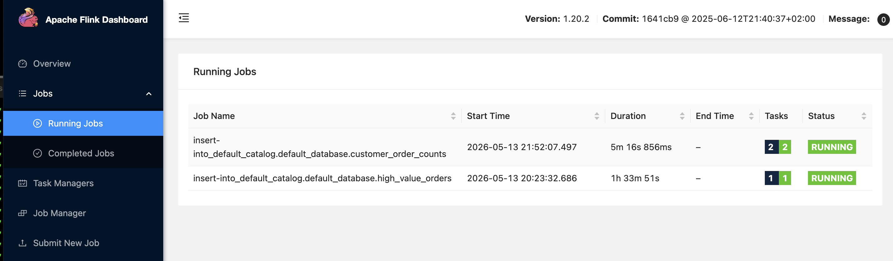

Running jobs should appear similar to:

| Job Name | Meaning |
| --- | --- |
| `insert-into_default_catalog.default_database.high_value_orders` | Continuous streaming insert into Kafka append-only sink |
| `insert-into_default_catalog.default_database.customer_order_counts` | Continuous stateful aggregation writing changelog updates |

Example dashboard view:

```text
Running Jobs
--------------------------------------------------------------
insert-into_default_catalog.default_database.high_value_orders
insert-into_default_catalog.default_database.customer_order_counts
```

### What this proves

This is one of the most important concepts in Flink.

These SQL queries do not execute like traditional database queries that run once and return a static result.

They have become:

```text
long-running distributed streaming jobs
```

The SQL statement is only the interface.

Underneath, Flink converts the SQL into a distributed execution graph composed of:

- runtime operators
- state stores
- network exchanges
- checkpoints
- sink writers
- parallel tasks

### What to observe in the dashboard

| Dashboard Area | What to look for | Why it matters |
| --- | --- | --- |
| Running Jobs | Queries remain continuously active | Streaming jobs do not terminate on unbounded streams |
| Job Duration | Jobs continue running indefinitely | Stream processing is continuous computation |
| Tasks | Runtime execution stages | Flink decomposes SQL into physical operators |
| Parallelism | Number of runtime task instances | Operators can scale horizontally |
| Operator Graph | Dataflow pipeline between operators | SQL becomes a distributed execution graph |
| Busy % | How active an operator currently is | Indicates operator workload |
| Backpressure % | Whether downstream operators are slowing upstream flow | Helps diagnose bottlenecks |
| Data Skew | Uneven workload distribution | Indicates partition/key imbalance |

### Click into a job

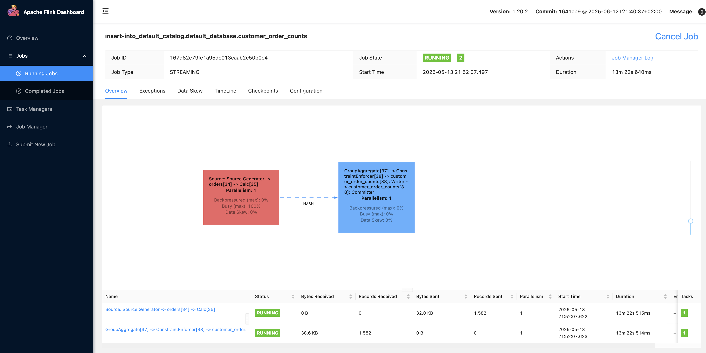

Click:

```text
insert-into_default_catalog.default_database.customer_order_counts
```

An operator graph similar to the following should appear:

```text
Source Generator -> orders -> Calc
↓
GroupAggregate -> ConstraintEnforcer -> Writer -> Committer
```

This is the actual physical execution plan Flink generated from the SQL query.

### Understanding the operator graph

The query:

```sql
SELECT
    customer_id,
    COUNT(*) AS order_count
FROM orders
GROUP BY customer_id;
```

was converted into a distributed streaming pipeline internally. The runtime graph represents the stages Flink executes continuously.

### What the first operator box means

This is the source operator that generates the input stream of events.

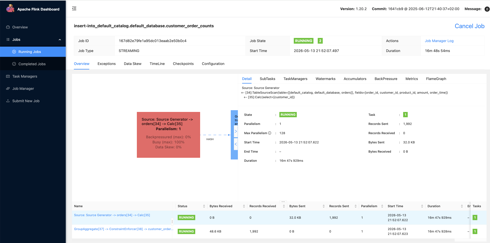

| Component | Purpose |
| --- | --- |
| `Source Generator` | Faker connector generating synthetic order events |
| `orders` | Internal runtime representation of the table |
| `Calc` | Lightweight projection/transformation operator |

This stage continuously generates and processes incoming stream records.

| Metric | Meaning |
| --- | --- |
| `Busy: 100%` | Operator is continuously processing incoming events |
| `Backpressured: 0%` | No downstream bottleneck currently exists |
| `Parallelism: 1` | One runtime task instance is executing this operator |

Because the Faker source continuously emits events, the source operator remains busy almost constantly.

### What the second operator box means

This is the stateful aggregation and sink pipeline. It maintains evolving state for the grouped counts and emits changelog updates to the sink. 

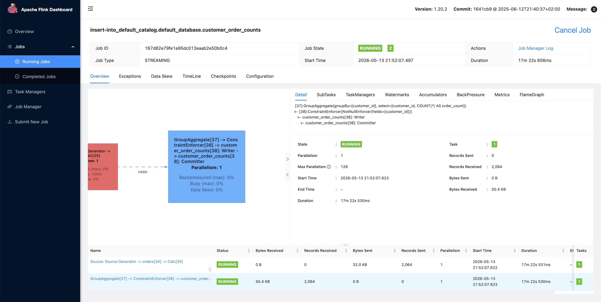

```text
GroupAggregate
-> ConstraintEnforcer
-> customer_order_counts: Writer
-> customer_order_counts: Committer
```

| Component | Purpose |
| --- | --- |
| `GroupAggregate` | Maintains running counts per customer |
| `ConstraintEnforcer` | Enforces upsert/primary-key semantics |
| `Writer` | Writes records to Kafka |
| `Committer` | Finalises sink writes |

This stage is more sophisticated because Flink must maintain evolving state internally.

For example, Flink may internally maintain state like:

| customer_id | current_count |
| --- | --- |
| 1 | 42 |
| 2 | 17 |
| 3 | 9 |

Every incoming order updates this state continuously.

### What the dotted arrow means

The dotted arrow between operator boxes represents continuous event flow between runtime stages.

```text
events stream continuously between operators
```

This is not batch processing. The operators remain alive and continuously exchange records as new events arrive.

### Important observation about parallelism

The dashboard currently shows:

```text
Parallelism: 1
```

This means:

- one source task
- one aggregation task
- one sink task

In production systems, parallelism is typically much higher.

Example:

| Operator | Parallelism |
| --- | --- |
| Kafka source | 12 |
| Aggregation | 24 |
| Sink | 12 |

This is how Flink scales horizontally across clusters.

### Compare the two running jobs

| Job | Behaviour |
| --- | --- |
| `high_value_orders` | Stateless append-only streaming pipeline |
| `customer_order_counts` | Stateful aggregation with changelog updates |

The aggregation job is more complex because Flink must:

- maintain keyed state
- continuously update aggregates
- emit changelog updates
- coordinate sink semantics

### Important architectural insight

Even a simple SQL query like:

```sql
SELECT
    customer_id,
    COUNT(*)
FROM orders
GROUP BY customer_id;
```

becomes a distributed stateful streaming application internally.

Flink automatically creates:

| Internal Runtime Component | Purpose |
| --- | --- |
| Source operator | Reads incoming events |
| Keyed state | Maintains counts per customer |
| Aggregation operator | Updates running totals |
| Network exchange | Redistributes records by key |
| Sink writer | Emits changelog updates |
| Runtime tasks | Execute operators continuously |

This is why Flink SQL is extremely powerful:

```text
Declarative SQL defines the intent.
Flink builds and operates the distributed streaming system underneath.
```

### Extremely Important Realisation

Traditional SQL databases and Flink SQL behave very differently.

| Traditional Database | Flink Streaming SQL |
| --- | --- |
| Query executes once | Query runs continuously |
| Result is static | Result continuously evolves |
| Finite execution | Persistent runtime |
| Minimal runtime visibility | Explicit operator graph |
| Database hides execution | Streaming runtime is observable |
| Limited state visibility | Stateful operators visible |

This is one of the biggest conceptual shifts in stream processing systems.

## Step 21: Cancel Running Jobs (Optional)

Use Flink UI to cancel long-running insert jobs when inspection is complete.

Unbounded streaming jobs are expected to run indefinitely unless cancelled.

## Step 22: Cleanup

Exit SQL client:

```bash
quit;
```

Exit broker shell if open:

```bash
exit
```

Stop environment:

```bash
docker compose down -v
```

`-v` removes local volumes (including local state/checkpoint data).

## Key Takeaway

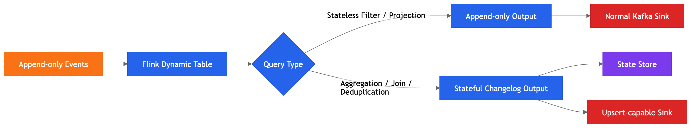

| Query class | Typical sink requirement |
| --- | --- |
| Stateless append-only query | Insert-only sink is usually sufficient |
| Stateful updating query | Changelog-aware/upsert-capable sink is usually required |

This rule is a core design principle for production Flink SQL pipelines.

